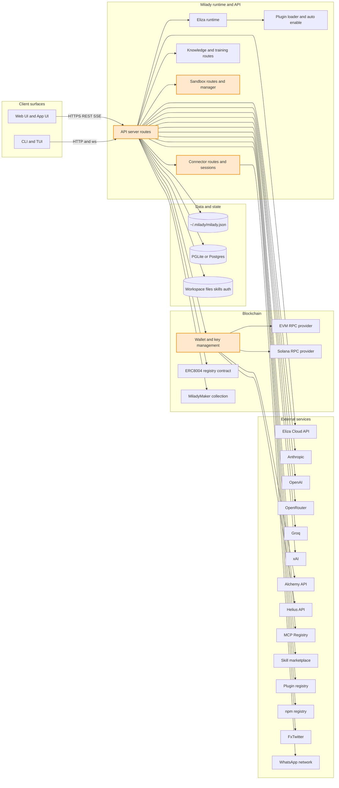
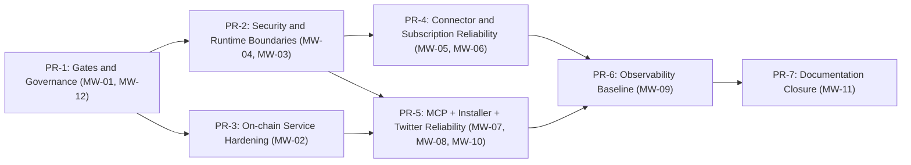

# Integration Map + Definition of Done (DoD)

Timestamp: 2026-02-22 04:14:09 UTC  
Repository: `milady-ai/milady`

## 1) Repo Facts

- Runtime/package manager baseline is Bun-first with Node 22+ fallback (`package.json`, `README.md`).
- Primary language is TypeScript with strict mode enabled (`tsconfig.json`).
- Lint/format is Biome (`biome.json`, scripts `lint`/`format` in `package.json`).
- Type-safety policy blocks explicit `any` in lint (`biome.json`: `noExplicitAny: "error"`).
- Test stack is Vitest for unit/e2e plus optional Playwright execution in app context (`vitest*.ts`, `test/scripts/test-parallel.mjs`).
- CI is GitHub Actions with explicit jobs for lint/format, typecheck, unit tests, coverage, build, and e2e variants (`.github/workflows/ci.yml`, `.github/workflows/test.yml`).
- API surface is primarily HTTP REST with SSE streaming endpoints and WebSocket auth boundary (`src/api/server.ts`, `src/api/server.websocket-auth.test.ts`).
- DB boundary supports PGLite and Postgres with validation and read-only SQL guards (`src/api/database.ts`, `src/api/database.security.test.ts`, `src/api/database.readonly-query-guard.test.ts`).
- Wallet/chain boundaries include EVM/Solana key handling, chain data APIs (Alchemy/Helius), and on-chain tx/registry/drop services (`src/api/wallet.ts`, `src/api/tx-service.ts`, `src/api/registry-service.ts`, `src/api/drop-service.ts`).
- Auth boundaries include cloud login flow and subscription OAuth/token setup (`src/cloud/auth.ts`, `src/api/cloud-routes.ts`, `src/api/subscription-routes.ts`).
- External registry/marketplace boundaries include plugin registry, skill marketplace, and MCP registry (`src/services/registry-client.ts`, `src/services/skill-marketplace.ts`, `src/services/mcp-marketplace.ts`).
- Connector ecosystem is plugin-driven with env/config auto-enable maps (`src/config/plugin-auto-enable.ts`, `src/config/schema.ts`).
- Security hardening exists for wallet export token, MCP config validation, websocket auth, DB host pinning, and URL safety checks (`src/api/server.wallet-export-auth.test.ts`, `src/api/server.mcp-config-validation.test.ts`, `src/api/server.websocket-auth.test.ts`, `src/api/database.ts`, `src/cloud/validate-url.ts`, `src/api/knowledge-routes.ts`).
- Coverage policy is inconsistent across repo docs/config:
  - Policy docs say 70% floor (`AGENTS.md`, `CONTRIBUTING.md`).
  - Enforced Vitest thresholds are currently 25/25/15/25 (`vitest.config.ts`).

---

## 2) Integration Inventory

| Name | Type | Entry points (files) | Critical path impact | Data touched (PII/secrets) | Envs required | Current test coverage | Observability |
|---|---|---|---|---|---|---|---|
| Eliza Cloud auth + bridge/proxy | External | `src/cloud/auth.ts`, `src/cloud/bridge-client.ts`, `src/cloud/cloud-manager.ts`, `src/api/cloud-routes.ts` | Cloud-mode onboarding/provider switching fails | API keys, session IDs, model provider settings | `ELIZAOS_CLOUD_API_KEY`, `ELIZAOS_CLOUD_BASE_URL` | Unit: `src/cloud/*.test.ts`, `src/api/cloud-routes.test.ts`; E2E: `test/cloud-providers.e2e.test.ts`, `test/cloud-persistence.e2e.test.ts`, `test/cloud-auth-state.e2e.test.ts` | Structured logger usage; no metrics/traces found |
| Subscription OAuth/setup-token (Anthropic/OpenAI) | External | `src/api/subscription-routes.ts`, `src/auth/*` | BYOK subscription login/exchange blocked | OAuth tokens, setup token, provider creds | Provider credentials/secrets in config/env | Unit: `src/api/subscription-routes.test.ts`; E2E: none explicit | Error logs in route handlers; no explicit metrics |
| Model provider BYOK routing (OpenAI/Anthropic/Groq/XAI/OpenRouter/Ollama/etc.) | External | `src/api/server.ts` provider switch + onboarding sections, `src/config/plugin-auto-enable.ts` | Chat/completions/model listing fails | API keys, model IDs, request payloads | provider env keys (`OPENAI_API_KEY`, `ANTHROPIC_API_KEY`, etc.) | Unit: plugin validation and provider-switch tests in `src/api/*.test.ts`; E2E: partial via onboarding/chat paths | Logging + validation; no provider-specific SLO metrics in repo |
| Wallet + chain data (EVM/Solana, Alchemy/Helius) | External | `src/api/wallet.ts`, `src/api/wallet-routes.ts` | Balances/NFTs/addresses unavailable; onboarding wallet flow broken | Private keys (high sensitivity), balances, addresses | `EVM_PRIVATE_KEY`, `SOLANA_PRIVATE_KEY`, `SOLANA_RPC_URL`, optional API keys (`ALCHEMY_API_KEY`, `HELIUS_API_KEY`) | Unit: `src/api/wallet.test.ts`, `src/api/wallet-routes.test.ts`; E2E: `test/wallet-api.e2e.test.ts`, `test/wallet-live.e2e.test.ts` | Logs/warnings for API failures; export-token guard test exists |
| On-chain registry + drop contracts (ERC-8004) | External | `src/api/tx-service.ts`, `src/api/registry-service.ts`, `src/api/drop-service.ts`, routes in `src/api/server.ts` (`/api/registry/*`, `/api/drop/*`) | Agent registration/minting/update unavailable | Wallet private keys, tx hashes, on-chain metadata URIs | `EVM_PRIVATE_KEY` + registry config (`mainnetRpc`, `registryAddress`, `collectionAddress`) | Unit: `src/api/registry-routes.test.ts`; service-level tests for `tx-service`/`registry-service`/`drop-service`: not found | Logger info/warn only; no metrics/traces |
| Twitter whitelist verification | External | `src/api/twitter-verify.ts`, whitelist endpoints in `src/api/server.ts` | Whitelist verification gate broken | Wallet address, tweet URL, handle | none mandatory | Unit: none dedicated for `twitter-verify.ts`; exercised by whitelist route paths: partial | Logs on verification and failures |
| Database provider boundary (PGLite/Postgres) | Internal + External | `src/api/database.ts`, DB routes in `src/api/server.ts` | Schema/table/query UI operations fail | DB creds, SQL text, table data (potential PII) | `POSTGRES_URL`/db config, `PGLITE_DATA_DIR` | Unit: `src/api/database.security.test.ts`, `src/api/database.readonly-query-guard.test.ts`; E2E: `test/database-api.e2e.test.ts` | Sanitized config response + logging; no metrics/traces |
| Knowledge URL ingestion/fetch | External | `src/api/knowledge-routes.ts` | URL import/search/add-doc flows fail | Imported content may include PII; outbound fetch targets | none mandatory | Unit: `src/api/knowledge-routes.test.ts`; E2E/live: `test/knowledge-live.e2e.test.ts` | Timeout handling + route errors logged |
| Training orchestration (fallback + optional import) | Internal + External | `src/api/training-routes.ts`, `src/services/fallback-training-service.ts`, `src/services/training-service.ts` | Training list/start/cancel/import unavailable | Training job metadata; possible model paths/URLs | optional Ollama URL/input params | Unit: `src/api/training-routes.test.ts`, `src/services/training-service.import-ollama.test.ts`; E2E: app client tests partial (`apps/app/test/app/training-api-client.test.ts`) | Event subscription in fallback service; no centralized metrics |
| Sandbox execution/container boundary | Internal system boundary | `src/api/sandbox-routes.ts`, `src/services/sandbox-engine.ts`, `src/services/sandbox-manager.ts` | Code execution/sandbox ops fail | Command payloads, sandbox logs, potential sensitive command output | Docker/Podman environment and runtime | Unit/integration: `src/api/__tests__/sandbox-routes.test.ts`, `src/services/__tests__/sandbox-engine*.test.ts`, `src/services/__tests__/sandbox-e2e.test.ts` | Security audit log support in `src/security/audit-log.ts`; no metrics exporter found |
| WhatsApp pairing/session auth | External | `src/api/whatsapp-routes.ts`, `src/services/whatsapp-pairing.ts` | WhatsApp connector onboarding unusable | QR/login session artifacts, account IDs | connector/session config | Unit: `src/api/__tests__/whatsapp-routes.test.ts`, `src/services/__tests__/whatsapp-pairing.test.ts`; E2E: none dedicated | Route/service warnings and status events |
| Skills marketplace (search/install/uninstall) | External | `src/services/skill-marketplace.ts`, routes in `src/api/server.ts` (`/api/skills/marketplace/*`) | Skill discovery/install pipeline breaks | API key, repo URLs, filesystem writes | `SKILLSMP_API_KEY`, `SKILLS_REGISTRY`/`SKILLS_MARKETPLACE_URL` | Unit: `src/services/skill-marketplace.test.ts`; E2E: none dedicated | Validation + warnings + install logs |
| Skill catalog local/remote source | Internal + External | `src/services/skill-catalog-client.ts`, `/api/skills/catalog*` in `src/api/server.ts` | Catalog browsing/search unavailable | catalog metadata | `MILADY_SKILLS_CATALOG` optional | Unit: `src/services/skill-catalog-client.test.ts`; E2E: none dedicated | Basic debug/warn logging |
| Plugin registry + installer | External + Internal | `src/services/registry-client*.ts`, `src/services/plugin-installer.ts`, plugin routes in `src/api/server.ts` | Plugin search/install/uninstall/eject/sync broken | package specs, install paths, optional secrets | optional registry URLs | Unit: `src/services/registry-client.test.ts`, `src/services/plugin-installer*.test.ts`; E2E: no dedicated flow test in root suite | Installer/registry warnings + info logs |
| MCP marketplace + MCP config execution boundary | External + Internal | `src/services/mcp-marketplace.ts`, MCP routes + config guards in `src/api/server.ts` | MCP server discovery/config/runtime server attachment fails | MCP headers/env (secrets), remote URLs, command args | per-server env; optional registry access | Unit: `src/services/mcp-marketplace.test.ts`, `src/api/server.mcp-config-validation.test.ts`; E2E: none dedicated | Validation + route errors/logging |
| Update checker/notifier | External | `src/services/update-checker.ts`, `src/services/update-notifier.ts`, `/api/update/*` routes in `src/api/server.ts` | Update status/channel UX stale/broken | version/channel metadata | `MILADY_UPDATE_CHANNEL` optional | Unit: `src/services/update-checker.test.ts`, `src/services/update-notifier.test.ts`; E2E: none dedicated | Warning/info logs; no metrics |
| Media provider boundary | External | `src/providers/media-provider.ts`, `src/actions/media.ts` | Media generation/vision analysis features fail | Media prompts/assets, provider keys | provider-specific keys (varies) | Unit: `src/providers/media-provider.test.ts`, `src/actions/__tests__/media.test.ts`; Real integration (opt-in): `src/providers/media-provider.real.test.ts`; E2E signal: `test/plugin-lifecycle.e2e.test.ts`, `test/e2e-validation.e2e.test.ts` | Provider-level logging/console outputs; no metrics/traces contract found |
| Connector plugin auto-enable layer (Discord/Telegram/Slack/etc.) | Internal + External | `src/config/plugin-auto-enable.ts`, `src/config/schema.ts`, runtime plugin collection in `src/runtime/eliza.ts` + API connectors routes in `src/api/server.ts` | Connectors may not auto-load or may drift from schema/runtime maps | bot tokens, connector message payloads | connector tokens (`DISCORD_BOT_TOKEN`, `TELEGRAM_BOT_TOKEN`, etc.) | Unit: `src/config/plugin-auto-enable.test.ts`, `src/services/plugin-stability.test.ts`; connector-specific e2e uneven | Logging plus config validation; no common connector metrics |
| x402 payment integration | External | `src/runtime/eliza.ts`, `src/config/plugin-auto-enable.ts`, `src/config/types.milady.ts` | x402 payment tools/features unavailable | Payment metadata, optional x402 key material | `X402_ENABLED`, `X402_BASE_URL`, `X402_API_KEY`, optional `X402_PRIVATE_KEY` | Unit: indirect only (`src/runtime/eliza.test.ts` env-forwarding denylist); Integration/E2E: no dedicated x402 tests found | No dedicated x402 log/metric contract found |
| CUA integration | External | `src/runtime/eliza.ts`, `src/runtime/core-plugins.ts`, `src/config/plugin-auto-enable.ts`, `src/config/types.milady.ts` | CUA plugin-driven computer-use flows unavailable | API key, sandbox host/name, interaction payloads | `CUA_API_KEY`, `CUA_HOST`, `CUA_SANDBOX_NAME` | Unit: `src/runtime/eliza.test.ts` (cua short-id normalization), `src/runtime/computeruse-integration.test.ts`; Integration/E2E: benchmark routes exist in `src/benchmark/cua-routes.ts` but no dedicated CI CUA e2e job | Benchmark status endpoints and runtime logs only; no dedicated metrics contract |

---

## 3) Integration Graph



Trust boundaries:
- Boundary A: Public API ingress to `src/api/server.ts` (auth, input validation, rate/abuse concerns).
- Boundary B: Secret material transitions (`process.env`, config file, auth records, wallet keys).
- Boundary C: Outbound network calls to third-party APIs and registries.
- Boundary D: Local command/container execution (`sandbox-engine`, plugin install tooling).

---

## 4) Definition of Done - Global

Global DoD applies to every integration-facing PR and feature slice.

- [ ] Typecheck passes with strict TS: `bun run typecheck` (`tsconfig.json`).
- [ ] Lint and format checks pass: `bun run lint` and `bun run format` (`package.json`, `.github/workflows/ci.yml`).
- [ ] Unit tests pass for touched areas: `bunx vitest run --config vitest.unit.config.ts`.
- [ ] E2E or equivalent integration tests pass for affected boundary: `bunx vitest run --config vitest.e2e.config.ts` plus targeted specs.
- [ ] Build passes: `bun run build`.
- [ ] No dead code introduced and no duplicate implementations; existing shared utilities reused.
- [ ] No new explicit `any` unless isolated and justified in code comments plus review note (`biome.json`).
- [ ] Error handling is explicit and typed at boundary layers; failures map to deterministic HTTP/service outcomes.
- [ ] Timeout and retry policy exists for outbound calls or is explicitly justified as not applicable.
- [ ] Structured logging exists for success/failure at integration boundaries.
- [ ] Secrets are never logged; response payloads sanitize credentials where applicable.
- [ ] Authn/authz controls are present on sensitive endpoints (wallet export, websocket upgrade, config mutation, mcp config mutation).
- [ ] Docs are updated when integration behavior/config/env contract changes (`docs/rest/*`, `docs/guides/*`, `README.md`).
- [ ] CI-representative checks are runnable locally and included in PR evidence.

### Done means

Done means all of the following are true, simultaneously:

- A changed integration has proven happy-path and failure-path behavior through tests or executable checks.
- All relevant CI gates pass locally with the same commands used in workflows.
- Security boundaries are proven by tests or guards in code (not by assumptions).
- Type safety, linting, and build are green.
- Operational docs/config expectations are updated and match runtime behavior.
- No unresolved UNKNOWN remains for modified scope.

If one item above is missing, work is not done.

---

## 5) Definition of Done - Per Integration Template

Use this template for each integration change.

### Integration: <name>

- Contract boundaries:
  - Inputs schema/types:
  - Outputs schema/types:
  - Config/env contract:
- Failure modes:
  - Known errors mapped to user-facing status codes:
  - Timeout policy:
  - Retry/backoff policy:
- Idempotency:
  - Request dedupe or safe replay behavior:
- Observability:
  - Required log fields:
  - Metrics/traces required (or explicit N/A):
- Security:
  - Authn/authz requirement:
  - Secret handling/redaction:
  - Input validation:
- Test strategy:
  - Unit tests:
  - Integration tests:
  - E2E/contract tests:
- Verification commands:
- Evidence files:

---

## 6) Definition of Done - Per Integration (Filled)

### Eliza Cloud auth + bridge/proxy
- Contract boundaries:
  - HTTP session create/status exchange and cloud base URL validation (`src/cloud/auth.ts`, `src/api/cloud-routes.ts`, `src/cloud/validate-url.ts`).
- Failure modes:
  - Timeout and poll expiry handled (`AbortSignal.timeout`, deadline logic).
  - Non-OK responses converted to explicit route errors.
- Observability:
  - Logger entries for session creation, auth completion, and persistence failures.
- Security:
  - URL validation and controlled credential persistence.
- Test strategy:
  - Unit: cloud route + client/auth tests.
  - E2E: cloud providers/persistence/auth-state tests.

### Subscription OAuth/setup-token
- Contract boundaries:
  - Start and exchange endpoints for Anthropic/OpenAI flows (`src/api/subscription-routes.ts`).
- Failure modes:
  - Missing code/no-active-flow checks, exchange error mapping.
- Observability:
  - Error logging on flow failures.
- Security:
  - setup-token format validation, provider-scoped credential storage.
- Test strategy:
  - Unit route tests exist.
  - E2E is currently missing.

### Wallet + chain data
- Contract boundaries:
  - Key generation/import/validation and balance/NFT fetch contracts (`src/api/wallet.ts`, `src/api/wallet-routes.ts`).
- Failure modes:
  - External API failures downgraded to warnings; partial response behavior present.
  - Outbound requests use timeouts.
- Observability:
  - Warnings and info logs for key events/failures.
- Security:
  - Key validation, wallet export token gate (`src/api/server.wallet-export-auth.test.ts`).
- Test strategy:
  - Strong unit coverage + API e2e/live tests.

### On-chain registry/drop
- Contract boundaries:
  - `TxService`, `RegistryService`, `DropService` route usage (`src/api/tx-service.ts`, `src/api/registry-service.ts`, `src/api/drop-service.ts`).
- Failure modes:
  - Tx wait timeout exists in `TxService`.
  - Retry/backoff behavior around on-chain transient failures is not explicit.
- Observability:
  - Info logs for tx submission/completion.
- Security:
  - Requires wallet key and configured registry addresses.
- Test strategy:
  - Route test exists; service-level unit/e2e tests are missing.

### Database boundary
- Contract boundaries:
  - Provider config set/test and guarded query endpoints (`src/api/database.ts`).
- Failure modes:
  - Host/IP validation and pinned-host logic; read-only multi-statement guard.
- Observability:
  - Sanitized config return and logs for provider changes/errors.
- Security:
  - Password/connection string masking + SSRF-resistant host checks.
- Test strategy:
  - Unit security tests + e2e API test present.

### Knowledge URL ingestion
- Contract boundaries:
  - URL-based import and knowledge search routes (`src/api/knowledge-routes.ts`).
- Failure modes:
  - Service-load timeout, URL fetch timeout, safety rejection on blocked URLs.
- Observability:
  - Error mapping and warnings.
- Security:
  - URL safety rejection + timeout-bound fetch helper.
- Test strategy:
  - Unit route tests + live e2e test present.

### Training orchestration
- Contract boundaries:
  - Training list/start/cancel/import interfaces (`src/api/training-routes.ts`, `src/services/fallback-training-service.ts`).
- Failure modes:
  - Input validation with explicit 4xx/404 mapping.
- Observability:
  - In-memory event subscription support in fallback service.
- Security:
  - URL/input checks on import path.
- Test strategy:
  - Unit tests present; full runtime e2e coverage partial.

### Sandbox boundary
- Contract boundaries:
  - Sandbox engine/manager and API command execution contract (`src/services/sandbox-engine.ts`, `src/api/sandbox-routes.ts`).
- Failure modes:
  - Widespread command and process timeouts; kill on timeout behavior.
- Observability:
  - Security audit log module + sandbox event log.
- Security:
  - Runtime capabilities checks and constrained command execution flows.
- Test strategy:
  - Multiple unit/integration-style tests including sandbox e2e module tests.

### WhatsApp pairing
- Contract boundaries:
  - Pairing start/status/stop/disconnect routes + account ID sanitization.
- Failure modes:
  - Session timeout state; reconnect/restart logic with non-fatal QR retries.
- Observability:
  - Status events and warnings.
- Security:
  - Account ID sanitization to prevent path traversal.
- Test strategy:
  - Route and service unit tests present; dedicated e2e missing.

### Skill marketplace
- Contract boundaries:
  - Search/install/uninstall operations and safe path/ref validation.
- Failure modes:
  - Network timeout handling and fetch failure mapping.
- Observability:
  - Marketplace/install logs.
- Security:
  - Git ref validation, path sanitization, package content checks.
- Test strategy:
  - Strong unit tests; e2e missing.

### Plugin registry + installer
- Contract boundaries:
  - Registry fetch/fallback and plugin install/uninstall shell boundaries.
- Failure modes:
  - Fallback registry sources and package manager fallback (`npm` retry) are implemented.
- Observability:
  - Info/warn logs on install and fallback behavior.
- Security:
  - Spec validation and serial install lock to reduce corruption/race risk.
- Test strategy:
  - Unit tests exist; e2e install workflow missing.

### MCP marketplace + MCP config
- Contract boundaries:
  - MCP registry search/details + config mutation and validation in API server.
- Failure modes:
  - Timeout option in marketplace fetch; config reject paths for invalid commands/hosts/env keys.
- Observability:
  - Route-level errors and status endpoint.
- Security:
  - Strict allowed command/type/env key checks in server + dedicated validation tests.
- Test strategy:
  - Unit tests for marketplace and server validation; no e2e flow test.

### Update checker/notifier
- Contract boundaries:
  - npm registry version checks and channel notification logic.
- Failure modes:
  - Abort-controller timeout and graceful fallback on fetch issues.
- Observability:
  - Warning/info logs.
- Security:
  - No secret-heavy inputs; low-risk boundary.
- Test strategy:
  - Unit tests present; e2e not needed for core logic.

### Connector auto-enable layer
- Contract boundaries:
  - Env/config to plugin mapping (`CONNECTOR_PLUGINS`, `AUTH_PROVIDER_PLUGINS`) and schema-defined connector IDs.
- Failure modes:
  - Mapping drift can silently create partial runtime behavior.
- Observability:
  - Validation/test-level only.
- Security:
  - Connector token validation tested in plugin validation paths.
- Test strategy:
  - Unit tests exist; cross-map parity tests are incomplete.

### x402 payment integration
- Contract boundaries:
  - `x402` config typing in `src/config/types.milady.ts`, feature-to-plugin mapping in `src/runtime/eliza.ts` and `src/config/plugin-auto-enable.ts`, and env propagation via `applyX402ConfigToEnv`.
- Failure modes:
  - If `x402.enabled` is unset or plugin not resolvable, x402 capability does not load.
  - Dedicated runtime/request failure-path tests are missing.
- Observability:
  - No x402-specific metrics/traces surfaced in repo.
- Security:
  - Env forwarding denylist blocks `X402_PRIVATE_KEY` in `src/runtime/eliza.test.ts`.
- Test strategy:
  - Indirect unit coverage exists; x402-specific route/service/e2e coverage is missing.

### CUA integration
- Contract boundaries:
  - `cua` config typing in `src/config/types.milady.ts`, env/feature map in `src/config/plugin-auto-enable.ts`, optional core plugin registration in `src/runtime/core-plugins.ts`, and plugin selection via `src/runtime/eliza.ts`.
- Failure modes:
  - If plugin is unavailable or disabled, CUA capability is not attached to runtime.
  - Benchmark CUA routes exist (`src/benchmark/cua-routes.ts`) but are not part of default CI gates.
- Observability:
  - Benchmark status routes and runtime logs only.
- Security:
  - Permission feature coupling exists in `src/permissions/registry.ts`; no dedicated CUA authz test suite found.
- Test strategy:
  - Unit coverage for plugin loading/normalization exists (`src/runtime/eliza.test.ts`, `src/runtime/computeruse-integration.test.ts`); no dedicated CUA e2e in CI.

---

## 7) Integration DoD Coverage Matrix

Legend:  
- `✅` done with evidence  
- `⚠️` partial; missing artifact called out  
- `❌` missing  
- `❓` unknown

| Integration | Types present | Unit tests | Integration tests | E2E tests | Mocks/fixtures | Error handling | Retries/timeouts | Observability | Security review notes | Docs | CI enforcement | Proof command |
|---|---|---|---|---|---|---|---|---|---|---|---|---|
| Cloud auth/bridge | ✅ `src/cloud/*.ts` | ✅ `src/cloud/*.test.ts`, `src/api/cloud-routes.test.ts` | ⚠️ route-level only | ✅ `test/cloud-providers.e2e.test.ts` | ✅ in tests | ✅ explicit route mapping | ✅ `AbortSignal.timeout` | ⚠️ logs only | ⚠️ URL validation + key persistence; no signed-request hardening tests | ✅ `docs/rest/cloud.md`, `docs/guides/cloud.md` | ✅ `test.yml` cloud-live job (secret-gated) | `bunx vitest run src/api/cloud-routes.test.ts src/cloud/bridge-client.test.ts && bunx vitest run --config vitest.e2e.config.ts test/cloud-providers.e2e.test.ts` |
| Subscription OAuth | ✅ `src/api/subscription-routes.ts` | ✅ `src/api/subscription-routes.test.ts` | ⚠️ none beyond route tests | ❌ missing dedicated e2e | ✅ route mocks | ✅ explicit 4xx/5xx mapping | ⚠️ no explicit retry/backoff policy | ⚠️ logs only | ⚠️ token format checks exist; full flow hardening incomplete | ✅ `docs/rest/subscriptions.md` | ⚠️ covered indirectly by unit jobs only | `bunx vitest run src/api/subscription-routes.test.ts` |
| Provider BYOK routing | ⚠️ typed config + dynamic provider map | ✅ `src/api/plugin-validation.test.ts` and runtime plugin-map tests | ⚠️ partial | ⚠️ covered indirectly by onboarding/chat flows | ✅ | ✅ provider switch guards | ⚠️ provider policy not centralized | ⚠️ logs only | ⚠️ secrets clearing logic exists; no unified checklist test | ⚠️ provider docs mostly in README/config docs | ⚠️ indirect coverage via core suites | `bunx vitest run src/api/plugin-validation.test.ts src/runtime/eliza.test.ts` |
| Wallet and chain data | ✅ `src/api/wallet.ts` types | ✅ `src/api/wallet.test.ts`, `src/api/wallet-routes.test.ts` | ⚠️ API-level integration partial | ✅ `test/wallet-api.e2e.test.ts`, `test/wallet-live.e2e.test.ts` | ✅ | ✅ validation + guarded export paths | ✅ fetch timeouts in wallet fetchers | ⚠️ logs only | ✅ export-token auth + key validation (`src/api/server.wallet-export-auth.test.ts`) | ⚠️ docs are partial for ops failure modes | ✅ e2e present in `test.yml` | `bunx vitest run src/api/wallet.test.ts src/api/wallet-routes.test.ts && bunx vitest run --config vitest.e2e.config.ts test/wallet-api.e2e.test.ts` |
| Registry/drop contracts | ⚠️ service types exist | ⚠️ route-level test only (`src/api/registry-routes.test.ts`) | ❌ missing service integration tests | ❌ missing chain e2e | ⚠️ minimal | ⚠️ basic throw/log behavior | ⚠️ tx timeout only | ⚠️ logs only | ⚠️ key requirements enforced but no threat tests | ❌ missing focused docs | ⚠️ indirect only | `bunx vitest run src/api/registry-routes.test.ts` |
| Twitter verify whitelist | ⚠️ typed helper output | ❌ no dedicated `twitter-verify` unit tests | ❌ missing | ❌ missing | ❌ missing | ⚠️ basic error handling in helper | ✅ 15s timeout in `src/api/twitter-verify.ts` | ⚠️ logs only | ⚠️ URL parse + message checks only | ❌ missing focused docs | ❌ not directly enforced in CI | `rg -n "twitter-verify" src/api && bunx vitest run src/api/registry-routes.test.ts` |
| Database boundary | ✅ typed DB contracts | ✅ `src/api/database.security.test.ts`, `src/api/database.readonly-query-guard.test.ts` | ✅ route security tests | ✅ `test/database-api.e2e.test.ts` | ✅ | ✅ strong guards + explicit errors | ⚠️ retries N/A; timeout policy uneven | ⚠️ logs only | ✅ host pinning, masking, readonly guards | ⚠️ deep operational docs are partial | ✅ in workflows (`ci.yml`, `test.yml`) | `bunx vitest run src/api/database.security.test.ts src/api/database.readonly-query-guard.test.ts && bunx vitest run --config vitest.e2e.config.ts test/database-api.e2e.test.ts` |
| Knowledge ingestion | ✅ route and request types | ✅ `src/api/knowledge-routes.test.ts` | ⚠️ route-level only | ✅ `test/knowledge-live.e2e.test.ts` | ✅ | ✅ explicit 4xx/5xx mapping | ✅ fetch timeout helper + service load timeout | ⚠️ logs only | ✅ URL safety + controlled fetch helper | ✅ `docs/rest/knowledge.md`, `docs/guides/knowledge.md` | ⚠️ live checks are not always run in default path | `bunx vitest run src/api/knowledge-routes.test.ts && bunx vitest run --config vitest.e2e.config.ts test/knowledge-live.e2e.test.ts` |
| Training orchestration | ✅ route/service types | ✅ `src/api/training-routes.test.ts`, `src/services/training-service.import-ollama.test.ts` | ⚠️ partial | ⚠️ app-client tests only (`apps/app/test/app/training-api-client.test.ts`) | ✅ | ✅ explicit error mapping | ⚠️ retry/timeout policy limited | ⚠️ event stream only; no metrics | ⚠️ basic input checks | ✅ `docs/rest/training.md`, `docs/guides/training.md` | ⚠️ indirect | `bunx vitest run src/api/training-routes.test.ts src/services/training-service.import-ollama.test.ts` |
| Sandbox boundary | ✅ typed options + manager state | ✅ multiple tests in `src/api/__tests__` and `src/services/__tests__` | ✅ engine/manager integration-style tests | ⚠️ no full docker e2e in default suite | ✅ | ✅ explicit command error handling | ✅ extensive timeout coverage | ⚠️ audit/event logs only; no metrics | ⚠️ controls exist but no consolidated threat suite | ✅ `docs/rest/sandbox.md`, `docs/guides/sandbox.md` | ⚠️ mostly unit/integration; docker e2e separate scripts | `bunx vitest run src/api/__tests__/sandbox-routes.test.ts src/services/__tests__/sandbox-engine.test.ts src/services/__tests__/sandbox-e2e.test.ts` |
| WhatsApp pairing | ✅ typed session/status models | ✅ route + service tests | ⚠️ partial | ❌ missing connector e2e | ✅ | ✅ status/error path handling | ✅ timeout + reconnect logic | ⚠️ status logs/events only | ✅ account ID sanitization + auth file handling | ✅ `docs/guides/whatsapp.md` | ⚠️ indirect | `bunx vitest run src/api/__tests__/whatsapp-routes.test.ts src/services/__tests__/whatsapp-pairing.test.ts` |
| Skills marketplace | ✅ typed request/record shapes | ✅ `src/services/skill-marketplace.test.ts` | ⚠️ service-level only | ❌ missing | ✅ | ✅ explicit error mapping | ✅ fetch + git timeouts | ⚠️ info/warn only | ✅ path + git-ref sanitization checks | ⚠️ docs partial (mostly MCP docs) | ⚠️ indirect | `bunx vitest run src/services/skill-marketplace.test.ts` |
| Skill catalog | ✅ typed catalog schema | ✅ `src/services/skill-catalog-client.test.ts` | ⚠️ partial | ❌ missing | ✅ | ✅ basic errors | ⚠️ no explicit retry policy | ⚠️ minimal logs | ⚠️ low-risk metadata boundary | ❌ missing dedicated docs | ❌ not explicitly enforced | `bunx vitest run src/services/skill-catalog-client.test.ts` |
| Plugin registry + installer | ✅ typed registry/install contracts | ✅ `src/services/registry-client.test.ts`, `src/services/plugin-installer.test.ts` | ⚠️ partial | ❌ missing | ✅ | ✅ explicit fallback/failure handling | ✅ installer retry + command timeout behavior | ⚠️ info/warn only | ⚠️ spec validation exists; no attack-simulation tests | ⚠️ docs partial | ⚠️ indirect | `bunx vitest run src/services/registry-client.test.ts src/services/plugin-installer.test.ts` |
| MCP marketplace + config | ✅ typed marketplace + config structures | ✅ `src/services/mcp-marketplace.test.ts`, `src/api/server.mcp-config-validation.test.ts` | ⚠️ route-level | ❌ missing dedicated e2e | ✅ | ✅ strong validation reject paths | ✅ timeout option + blocked command/env/host guards | ⚠️ logs/status only | ✅ hardened config validation paths | ✅ `docs/rest/mcp.md`, `docs/guides/mcp-marketplace.md` | ⚠️ indirect | `bunx vitest run src/services/mcp-marketplace.test.ts src/api/server.mcp-config-validation.test.ts` |
| Update checker/notifier | ✅ typed release/check structs | ✅ `src/services/update-checker.test.ts`, `src/services/update-notifier.test.ts` | ⚠️ service-only | ❌ missing | ✅ | ✅ graceful fallback behavior | ✅ abort timeout in checker | ⚠️ logs only | ⚠️ low-risk path, no secret-heavy boundary | ❌ no dedicated ops runbook doc | ❌ not explicitly enforced | `bunx vitest run src/services/update-checker.test.ts src/services/update-notifier.test.ts` |
| Media provider | ✅ typed media config/provider contracts | ✅ `src/providers/media-provider.test.ts`, `src/actions/__tests__/media.test.ts` | ⚠️ real API variant exists but opt-in (`src/providers/media-provider.real.test.ts`) | ⚠️ indirect e2e via plugin lifecycle/validation suites | ✅ mocked fetch fixtures in provider tests | ✅ API failure-path tests exist in provider suite | ⚠️ provider-specific timeout coverage is uneven | ⚠️ console/log outputs only; no metrics contract | ⚠️ key-handling redaction tests not explicit | ⚠️ config docs exist, dedicated ops guide missing | ⚠️ unit enforced; real API tests not CI default | `bunx vitest run src/providers/media-provider.test.ts src/actions/__tests__/media.test.ts && bunx vitest run --config vitest.e2e.config.ts test/plugin-lifecycle.e2e.test.ts` |
| Connector auto-enable map | ✅ typed config + mapping constants | ✅ `src/config/plugin-auto-enable.test.ts`, `src/runtime/eliza.test.ts` | ⚠️ parity validation incomplete | ❌ connector-specific e2e uneven | ✅ | ⚠️ map drift can bypass expected behavior | ❌ no explicit schema/runtime drift detector | ⚠️ logs only | ⚠️ token validation is partial via plugin-validation paths | ⚠️ connector docs uneven | ⚠️ indirect | `bunx vitest run src/config/plugin-auto-enable.test.ts src/runtime/eliza.test.ts` |
| x402 integration | ✅ `X402Config` + runtime mapping (`src/config/types.milady.ts`, `src/runtime/eliza.ts`) | ⚠️ indirect only (`src/runtime/eliza.test.ts` denylist path) | ❌ missing dedicated x402 integration tests | ❌ missing dedicated e2e | ❌ missing | ⚠️ config-gating path exists; runtime error taxonomy untested | ❌ no explicit timeout/retry policy evidenced | ❌ no dedicated x402 telemetry contract | ⚠️ `X402_PRIVATE_KEY` forwarding blocked; no x402-specific auth tests | ✅ `docs/config-schema.mdx`, `docs/configuration.mdx`, `docs/runtime/services.md` | ❌ no x402-targeted CI check | `rg -n "x402" src/runtime/eliza.ts src/config/plugin-auto-enable.ts docs/config-schema.mdx && bunx vitest run src/runtime/eliza.test.ts` |
| CUA integration | ✅ `CuaConfig` + runtime mapping (`src/config/types.milady.ts`, `src/runtime/eliza.ts`, `src/runtime/core-plugins.ts`) | ⚠️ plugin loading coverage exists (`src/runtime/eliza.test.ts`, `src/runtime/computeruse-integration.test.ts`) | ⚠️ benchmark route coverage exists outside core CI (`src/benchmark/cua-routes.ts`) | ❌ missing dedicated CUA e2e in CI workflows | ❌ missing dedicated fixtures | ⚠️ plugin enable/disable behavior covered; route/service errors not fully tested | ❌ no explicit retry/backoff policy evidenced | ⚠️ benchmark status + logs only | ⚠️ permission coupling exists; no dedicated CUA authz suite | ⚠️ config/runtime docs exist; CUA-specific operations doc missing | ❌ no dedicated CUA CI job | `bunx vitest run src/runtime/eliza.test.ts src/runtime/computeruse-integration.test.ts && rg -n "cua" src/benchmark` |

---

## 8) Missing Worklist (Prioritized)

Prioritization order applied: correctness/security first, then reliability/observability, then maintainability/type-safety, then polish.

| ID | Priority | Area | Owner | Integration | Missing item | Acceptance criteria | Verification command(s) | Suggested file locations | Risk if not done |
|---|---|---|---|---|---|---|---|---|---|
| MW-01 | P0 | DX/Tooling | DX/Tooling | Coverage policy governance | Coverage threshold drift (70% policy vs 25/15 enforced) | One canonical threshold decision; docs and `vitest.config.ts` match; CI fails on non-compliance | `bun run test:coverage` | `vitest.config.ts`, `AGENTS.md`, `CONTRIBUTING.md`, `docs/guides/contribution-guide.md` | False confidence and inconsistent review standards |
| MW-02 | P0 | Blockchain | Blockchain | Wallet/registry/drop | Missing direct tests for `tx-service`, `registry-service`, `drop-service` | Add deterministic unit tests for tx timeout, nonce/retry behavior, and route->service failure mapping | `bunx vitest run src/api/tx-service.test.ts src/api/registry-service.test.ts src/api/drop-service.test.ts` | `src/api/tx-service.test.ts`, `src/api/registry-service.test.ts`, `src/api/drop-service.test.ts` | On-chain failures/regressions can ship undetected |
| MW-03 | P0 | Runtime | Runtime | x402 and CUA boundaries | Missing runtime-focused tests and explicit security assertions for both integrations | Add explicit x402 + CUA route/service tests, runtime mapping assertions, and docs-backed verify commands | `rg -n "x402|cua" src docs && bunx vitest run <new-tests>` | `src/runtime/eliza.ts`, `src/config/plugin-auto-enable.ts`, new tests under `src/runtime/` and `src/api/` | Payment/sandbox integrations remain under-verified in production path |
| MW-04 | P0 | Security | Security | Websocket/auth surfaces | Ensure all sensitive ingress endpoints have explicit auth tests | Add/extend auth tests for config mutation, secrets update, connector mutation, MCP mutation | `bunx vitest run src/api/server.websocket-auth.test.ts src/api/server.mcp-config-validation.test.ts src/api/server.wallet-export-auth.test.ts` | `src/api/server.*.test.ts` | Unauthorized access vectors |
| MW-05 | P1 | Runtime | Runtime | Connector mapping consistency | Drift between auto-enable connector list and schema/runtime support | Add parity test asserting connector IDs across `plugin-auto-enable`, schema `CONNECTOR_IDS`, and runtime connector map | `bunx vitest run src/config/plugin-auto-enable.test.ts src/runtime/eliza.test.ts` | `src/config/plugin-auto-enable.ts`, `src/config/schema.ts`, `src/runtime/eliza.ts` | Silent connector misconfiguration and broken onboarding |
| MW-06 | P1 | API | API | Subscription OAuth reliability | No dedicated e2e coverage for OAuth flow behavior | Add deterministic e2e/contract tests for start->exchange->credential persistence and failure paths | `bunx vitest run --config vitest.e2e.config.ts test/subscription-auth.e2e.test.ts` | `test/subscription-auth.e2e.test.ts` | Login regressions caught late |
| MW-07 | P1 | API | API | MCP operations | Missing end-to-end MCP config + runtime server-attach validation | Add integration test that writes MCP config, validates reject paths, and verifies status endpoint behavior | `bunx vitest run --config vitest.e2e.config.ts test/mcp-config.e2e.test.ts` | `test/mcp-config.e2e.test.ts` | Unsafe or broken MCP server execution |
| MW-08 | P1 | API | API | Skills/plugin installer flows | Missing e2e install/uninstall workflow tests | Add sandboxed integration tests with fixture registry and install/uninstall assertions | `bunx vitest run --config vitest.e2e.config.ts test/plugin-install.e2e.test.ts test/skills-marketplace.e2e.test.ts` | `test/plugin-install.e2e.test.ts`, `test/skills-marketplace.e2e.test.ts` | Runtime install path regressions |
| MW-09 | P1 | DX/Tooling | DX/Tooling | Observability baseline | No standardized metrics/traces for integration boundaries | Define minimal metrics contract (success/failure/latency) for cloud, wallet, marketplace, and MCP boundaries | `bun run typecheck && bunx vitest run <observability-tests>` | `src/services/*`, `src/api/*`, optional `src/diagnostics/*` | Hard incident triage and SLO blind spots |
| MW-10 | P2 | API | API | Twitter whitelist | No dedicated tests for `twitter-verify.ts` parser/error cases | Add table-driven unit tests for URL parse, timeout/fetch fail, and message mismatch | `bunx vitest run src/api/twitter-verify.test.ts` | `src/api/twitter-verify.test.ts` | Verification false positives/negatives |
| MW-11 | P2 | Docs | Docs | Docs completeness | Missing or partial docs for registry/drop, skill catalog, media provider runbooks, connector specifics, and CUA operations | Add setup + failure-mode + verification sections per integration boundary | `bun run docs:build` | `docs/rest/*`, `docs/guides/*`, `README.md` | Slower onboarding and misconfigurations |
| MW-12 | P2 | DX/Tooling | DX/Tooling | Migration checks | No explicit DB migration verification command surfaced in scripts | Define and add minimal migration check script or explicit N/A policy | `bun run db:check` (proposed) | `package.json`, `scripts/` | Schema drift not caught early |

---

## 9) GitHub Issue Drafts

### MW-01
- Title: `Align coverage policy docs with enforced Vitest thresholds`
- Labels: `priority:P0`, `area:DX/Tooling`
- Owner: `DX/Tooling`
- Acceptance criteria:
  - Coverage threshold policy is singular across docs and `vitest.config.ts`.
  - CI fails when coverage falls below the chosen floor.
- Verification commands:
  - `bun run test:coverage`
- Risk:
  - False confidence in quality gates and inconsistent review decisions.
- Source:
  - `INTEGRATION_DOD_MAP.md:457`

### MW-02
- Title: `Add direct tx/registry/drop service tests for on-chain paths`
- Labels: `priority:P0`, `area:Blockchain`
- Owner: `Blockchain`
- Acceptance criteria:
  - Deterministic tests cover timeout, nonce/retry, and route->service failure mapping for tx/registry/drop services.
- Verification commands:
  - `bunx vitest run src/api/tx-service.test.ts src/api/registry-service.test.ts src/api/drop-service.test.ts`
- Risk:
  - On-chain regressions can ship undetected.
- Source:
  - `INTEGRATION_DOD_MAP.md:458`

### MW-03
- Title: `Harden x402 and CUA runtime boundaries with explicit tests`
- Labels: `priority:P0`, `area:Runtime`
- Owner: `Runtime`
- Acceptance criteria:
  - x402 and CUA runtime mappings are covered by dedicated tests.
  - Security assumptions (key handling/auth behavior) are explicitly validated.
- Verification commands:
  - `rg -n "x402|cua" src docs`
  - `bunx vitest run <new-tests>`
- Risk:
  - Payment and sandbox features remain under-verified in production.
- Source:
  - `INTEGRATION_DOD_MAP.md:459`

### MW-04
- Title: `Close auth test gaps on sensitive websocket/config ingress`
- Labels: `priority:P0`, `area:Security`
- Owner: `Security`
- Acceptance criteria:
  - Sensitive ingress paths require auth tests for both success and rejection paths.
- Verification commands:
  - `bunx vitest run src/api/server.websocket-auth.test.ts src/api/server.mcp-config-validation.test.ts src/api/server.wallet-export-auth.test.ts`
- Risk:
  - Unauthorized mutation/access vectors persist.
- Source:
  - `INTEGRATION_DOD_MAP.md:460`

### MW-05
- Title: `Add connector parity test across schema/runtime/auto-enable maps`
- Labels: `priority:P1`, `area:Runtime`
- Owner: `Runtime`
- Acceptance criteria:
  - Connector IDs match across schema, runtime map, and auto-enable map.
  - Drift is detected by test failures.
- Verification commands:
  - `bunx vitest run src/config/plugin-auto-enable.test.ts src/runtime/eliza.test.ts`
- Risk:
  - Silent connector onboarding/config breakage.
- Source:
  - `INTEGRATION_DOD_MAP.md:461`

### MW-06
- Title: `Add dedicated subscription OAuth e2e flow coverage`
- Labels: `priority:P1`, `area:API`
- Owner: `API`
- Acceptance criteria:
  - E2E tests cover OAuth start, exchange, credential persistence, and expected failure paths.
- Verification commands:
  - `bunx vitest run --config vitest.e2e.config.ts test/subscription-auth.e2e.test.ts`
- Risk:
  - Login regressions are found late.
- Source:
  - `INTEGRATION_DOD_MAP.md:462`

### MW-07
- Title: `Add MCP config-to-runtime attach e2e validation`
- Labels: `priority:P1`, `area:API`
- Owner: `API`
- Acceptance criteria:
  - E2E validates MCP config write path, reject-path guards, and runtime status behavior.
- Verification commands:
  - `bunx vitest run --config vitest.e2e.config.ts test/mcp-config.e2e.test.ts`
- Risk:
  - Broken or unsafe MCP execution paths.
- Source:
  - `INTEGRATION_DOD_MAP.md:463`

### MW-08
- Title: `Add e2e coverage for skills/plugin install lifecycle`
- Labels: `priority:P1`, `area:API`
- Owner: `API`
- Acceptance criteria:
  - E2E tests validate install, uninstall, and rollback behavior with fixture registries.
- Verification commands:
  - `bunx vitest run --config vitest.e2e.config.ts test/plugin-install.e2e.test.ts test/skills-marketplace.e2e.test.ts`
- Risk:
  - Runtime install regressions in marketplace/registry flows.
- Source:
  - `INTEGRATION_DOD_MAP.md:464`

### MW-09
- Title: `Define integration observability contract and enforce it`
- Labels: `priority:P1`, `area:DX/Tooling`
- Owner: `DX/Tooling`
- Acceptance criteria:
  - Minimal metric fields (success/failure/latency) are defined and tested for major boundaries.
- Verification commands:
  - `bun run typecheck`
  - `bunx vitest run <observability-tests>`
- Risk:
  - Slow incident triage and no measurable reliability baseline.
- Source:
  - `INTEGRATION_DOD_MAP.md:465`

### MW-10
- Title: `Create dedicated twitter-verify unit suite`
- Labels: `priority:P2`, `area:API`
- Owner: `API`
- Acceptance criteria:
  - Table-driven tests cover parse, timeout/fetch failure, and message mismatch.
- Verification commands:
  - `bunx vitest run src/api/twitter-verify.test.ts`
- Risk:
  - False positive/negative whitelist verification behavior.
- Source:
  - `INTEGRATION_DOD_MAP.md:466`

### MW-11
- Title: `Close docs/runbook gaps for high-risk integrations`
- Labels: `priority:P2`, `area:Docs`
- Owner: `Docs`
- Acceptance criteria:
  - Registry/drop, skill catalog, media provider, connector specifics, and CUA operations have setup, failure, and verify guidance.
- Verification commands:
  - `bun run docs:build`
- Risk:
  - Slower onboarding and repeated configuration mistakes.
- Source:
  - `INTEGRATION_DOD_MAP.md:467`

### MW-12
- Title: `Add explicit DB migration check command or N/A policy`
- Labels: `priority:P2`, `area:DX/Tooling`
- Owner: `DX/Tooling`
- Acceptance criteria:
  - `db:check` (or documented explicit N/A policy) exists and is enforced in docs/workflow.
- Verification commands:
  - `bun run db:check` (proposed)
- Risk:
  - Schema/migration drift discovered too late.
- Source:
  - `INTEGRATION_DOD_MAP.md:468`

---

## 10) Verification Commands (Copy/Paste)

### Baseline install and repo setup

```bash
bun install
bun run postinstall
```

### Static quality gates

```bash
bun run lint
bun run format
bun run typecheck
```

### Tests

```bash
# CI unit suite
bunx vitest run --config vitest.unit.config.ts

# Coverage
bun run test:coverage

# Main e2e suite
bunx vitest run --config vitest.e2e.config.ts \
  --exclude test/anvil-contracts.e2e.test.ts \
  --exclude test/apps-e2e.e2e.test.ts

# App startup onboarding e2e (CI job equivalent)
bunx vitest run --config apps/app/vitest.config.ts \
  apps/app/test/electron/electron-startup.e2e.test.ts \
  apps/app/test/electron/electron-plugin-entrypoints.e2e.test.ts \
  apps/app/test/app/startup-chat.e2e.test.ts \
  apps/app/test/app/startup-onboarding.e2e.test.ts

# End-to-end validation suite from CI
bunx vitest run --config vitest.e2e.config.ts test/e2e-validation.e2e.test.ts
```

### Build

```bash
bun run build
```

### Cloud live checks (optional; requires secrets)

```bash
MILADY_LIVE_TEST=1 \
ELIZAOS_CLOUD_API_KEY=... \
ELIZAOS_CLOUD_BASE_URL=... \
bunx vitest run --config vitest.e2e.config.ts test/cloud-providers.e2e.test.ts
```

### CI-equivalent local run (ordered)

```bash
bun install && bun run postinstall && \
bun run lint && bun run format && bun run typecheck && \
bunx vitest run --config vitest.unit.config.ts && \
bun run test:coverage && \
bun run build && \
bunx vitest run --config vitest.e2e.config.ts --exclude test/anvil-contracts.e2e.test.ts --exclude test/apps-e2e.e2e.test.ts && \
bunx vitest run --config vitest.e2e.config.ts test/e2e-validation.e2e.test.ts
```

### Migration checks

- Current state: no explicit migration command found in `package.json` scripts.
- Minimal script to add (proposed, not implemented in this task):
  - `db:check` -> run a deterministic schema/migration health check for Postgres/PGLite startup compatibility.

---

## 11) Unknowns / Questions

- Required branch protection checks for `main`/`develop` are UNKNOWN from repository files alone.
- Standardized metrics/tracing backend for integration boundaries is UNKNOWN (logs are present, metrics contract not evident).

---

## 12) PR Grouping Plan (From MW Issues)

This converts `MW-01` through `MW-12` into mergeable PR groups, ordered by risk and dependency.

### PR dependency graph



### Grouped PRs in execution order

| Order | PR Group | Included MW IDs | Why grouped | Suggested scope/files | Verification commands | Done criteria |
|---|---|---|---|---|---|---|
| 1 | PR-1: Gates and Governance | `MW-01`, `MW-12` | Establishes one quality baseline and migration-check policy before adding more tests | `vitest.config.ts`, `package.json`, `scripts/*`, `AGENTS.md`, `CONTRIBUTING.md`, `docs/guides/contribution-guide.md` | `bun run test:coverage`<br>`bun run typecheck` | Coverage policy + enforced thresholds are aligned across config/docs; migration-check command or explicit N/A policy is documented and wired |
| 2 | PR-2: Security and Runtime Boundaries | `MW-04`, `MW-03` | Highest risk: auth ingress and x402/CUA runtime boundaries | `src/api/server.*.test.ts`, `src/runtime/eliza.ts`, `src/runtime/eliza.test.ts`, `src/config/plugin-auto-enable.ts`, new tests under `src/runtime/` and `src/api/` | `bunx vitest run src/api/server.websocket-auth.test.ts src/api/server.mcp-config-validation.test.ts src/api/server.wallet-export-auth.test.ts`<br>`bunx vitest run src/runtime/eliza.test.ts src/runtime/computeruse-integration.test.ts` | Sensitive ingress paths have explicit auth tests; x402/CUA mappings and failure paths are covered by deterministic tests |
| 3 | PR-3: On-chain Service Hardening | `MW-02` | Isolated blockchain-risk work; keep chain behavior changes reviewable and bounded | `src/api/tx-service.test.ts`, `src/api/registry-service.test.ts`, `src/api/drop-service.test.ts` | `bunx vitest run src/api/tx-service.test.ts src/api/registry-service.test.ts src/api/drop-service.test.ts` | Deterministic tests cover timeout, retry/nonce behavior, and route->service failure mapping |
| 4 | PR-4: Connector and Subscription Reliability | `MW-05`, `MW-06` | Both are config/runtime parity + auth-flow reliability and share runtime/API test surfaces | `src/config/plugin-auto-enable.ts`, `src/config/schema.ts`, `src/runtime/eliza.ts`, `test/subscription-auth.e2e.test.ts` | `bunx vitest run src/config/plugin-auto-enable.test.ts src/runtime/eliza.test.ts`<br>`bunx vitest run --config vitest.e2e.config.ts test/subscription-auth.e2e.test.ts` | Connector ID parity is enforced by tests; subscription OAuth start/exchange/persistence/failure e2e coverage exists |
| 5 | PR-5: MCP + Installer + Twitter Reliability | `MW-07`, `MW-08`, `MW-10` | API integration hardening bundle; all are workflow-level reliability tests | `test/mcp-config.e2e.test.ts`, `test/plugin-install.e2e.test.ts`, `test/skills-marketplace.e2e.test.ts`, `src/api/twitter-verify.test.ts` | `bunx vitest run --config vitest.e2e.config.ts test/mcp-config.e2e.test.ts`<br>`bunx vitest run --config vitest.e2e.config.ts test/plugin-install.e2e.test.ts test/skills-marketplace.e2e.test.ts`<br>`bunx vitest run src/api/twitter-verify.test.ts` | MCP config/runtime attach path is validated; installer lifecycle has e2e coverage; twitter verification parser/errors are table-tested |
| 6 | PR-6: Observability Baseline | `MW-09` | Cross-cutting instrumentation after core correctness/reliability tests are in place | `src/api/*`, `src/services/*`, optional `src/diagnostics/*`, observability tests | `bun run typecheck`<br>`bunx vitest run <observability-tests>` | Minimal metric contract (success/failure/latency) is implemented and test-enforced for key boundaries |
| 7 | PR-7: Documentation Closure | `MW-11` | Final documentation pass after behavior/tests settle to avoid churn | `docs/rest/*`, `docs/guides/*`, `README.md` | `bun run docs:build` | Registry/drop, skill catalog, media provider, connector specifics, and CUA operations have setup/failure/verification docs aligned to merged behavior |

### PR size and merge policy

- Target PR size: one group per PR, minimal unrelated churn, no drive-by refactors.
- Merge gate for each PR:
  - all group-specific verification commands pass
  - `bun run lint`, `bun run typecheck`, `bun run test:once` pass on final PR revision
- Do not start `PR-7` until all earlier dependent PRs are merged.
