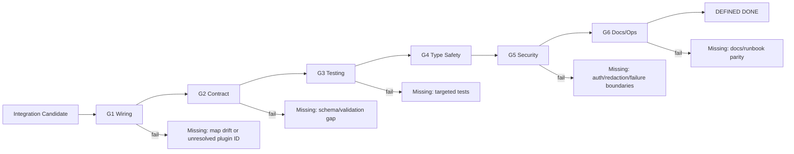
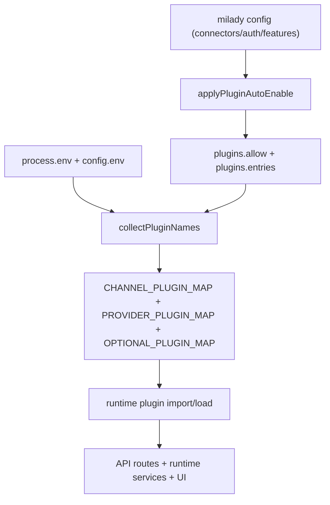

# Integration Definition-of-Done Graph (Baseline)

Last updated: 2026-02-22
Scope: connector/provider/plugin integration readiness across runtime, config, tests, and docs.

## 1) Definition-of-Done Gates

An integration is "Defined Done" only when all gates are green:

| Gate | Description | Evidence |
|---|---|---|
| G1 Wiring | Canonical ID resolves from config -> auto-enable -> runtime plugin package | `applyPluginAutoEnable()` + `collectPluginNames()` parity tests |
| G2 Contract | Typed config schema + runtime validation + redaction of sensitive fields | Zod schemas, API validation tests |
| G3 Testing | Targeted unit tests + e2e behavior tests (not only load smoke) | `*.test.ts` and `*.e2e.test.ts` coverage per integration |
| G4 Type Safety | `strict` TS + no unsafe bypass for new integration paths | `tsconfig.json` + lint/typecheck gates |
| G5 Security | Secret handling, auth checks, safe failure boundaries | route auth tests, config guard tests, redaction tests |
| G6 Docs/Ops | Correct docs + runbook + troubleshooting path | docs pages and REST docs aligned with runtime |



## 2) Current Integration Topology



## 3) Inventory Snapshot

| Surface | Count | Source |
|---|---:|---|
| Bundled plugin registry entries | 98 | `plugins.json` |
| Registry categories | 5 (`connector`, `feature`, `ai-provider`, `app`, `database`) | `plugins.json` |
| Runtime connector map entries | 11 | `src/runtime/eliza.ts` (`CHANNEL_PLUGIN_MAP`) |
| Auto-enable connector map entries | 17 | `src/config/plugin-auto-enable.ts` (`CONNECTOR_PLUGINS`) |
| Runtime provider env-key map entries | 14 keys -> 10 plugin packages | `src/runtime/eliza.ts` (`PROVIDER_PLUGIN_MAP`) |
| Auto-enable provider IDs | 18 | `src/config/plugin-auto-enable.ts` (`PROVIDER_PLUGINS`) |

## 4) Connector Readiness Matrix

Status codes:
- `Y` = implemented/covered
- `P` = partial (smoke-only, indirect coverage, or outdated docs)
- `N` = missing

| Connector | Runtime Map | Auto-Enable | Typed Schema | Docs | Targeted Tests | Gap Summary |
|---|---|---|---|---|---|---|
| `discord` | Y | Y | Y | Y | Y | Mature |
| `telegram` | Y | Y | Y | Y | P | No dedicated connector e2e; mostly runtime/plugin-load coverage |
| `slack` | Y | Y | Y | Y | P | No dedicated connector e2e; mostly runtime/plugin-load coverage |
| `twitter` | Y | Y | Y | Y | N | No dedicated integration/e2e tests |
| `whatsapp` | Y | Y | Y | P | Y | Docs package naming drift (`@elizaos` vs runtime `@milady`) |
| `signal` | Y | Y | Y | N | Y | Missing connector docs page |
| `imessage` | Y | Y | Y | N | P | Missing docs + no targeted integration tests |
| `bluebubbles` | Y | Y | Y | N | P | Missing docs + no targeted integration tests |
| `msteams` | Y | Y | Y | N | P | Missing docs + smoke-only coverage |
| `mattermost` | Y | Y | N | N | P | Runtime mapped but no explicit typed connector schema and no docs |
| `googlechat` | Y | Y | Y | N | N | Missing docs + targeted tests |
| `farcaster` | N | Y | N | P | N | Auto-enable mapping exists but runtime connector map missing |
| `lens` | N | Y | N | N | N | Auto-enable mapping exists but runtime connector map missing |
| `feishu` | N | Y | N | N | N | Auto-enable mapping exists but runtime connector map missing |
| `matrix` | N | Y | N | N | N | Auto-enable mapping exists but runtime connector map missing |
| `nostr` | N | Y | N | N | N | Auto-enable mapping exists but runtime connector map missing |
| `retake` | N | Y | N | N | P | Auto-enabled as connector but unresolved in runtime mapping path |

## 5) Provider Readiness (High-Level)

### Runtime env-key mapped provider plugins (10 packages)

`@elizaos/plugin-anthropic`, `@elizaos/plugin-openai`, `@elizaos/plugin-google-genai`, `@elizaos/plugin-groq`, `@elizaos/plugin-xai`, `@elizaos/plugin-openrouter`, `@elizaos/plugin-ollama`, `@elizaos/plugin-vercel-ai-gateway`, `@homunculuslabs/plugin-zai`, `@elizaos/plugin-elizacloud`.

### Auto-enable provider IDs not in runtime provider env map

`google-antigravity`, `google-gemini`, `pi-ai`, `qwen`, `minimax`, `deepseek`, `together`, `mistral`, `cohere`, `perplexity`.

Current risk: ID normalization/parity is incomplete between auto-enable IDs and runtime allow-list resolution.

## 6) Verified Gaps (Executable Evidence)

### Gap A: Provider auto-enable -> runtime load ID mismatch

When auto-enable adds short IDs (example: `openai`) to `plugins.allow`, runtime currently keeps raw IDs instead of canonical package names.

Observed:

```bash
node --import tsx -e 'import { applyPluginAutoEnable } from "./src/config/plugin-auto-enable.ts"; import type { MiladyConfig } from "./src/config/types.milady.ts"; import { collectPluginNames } from "./src/runtime/eliza.ts"; const { config } = applyPluginAutoEnable({ config: { auth: { profiles: { main: { provider: "openai", mode: "api_key" }}}}, env: {} }); const names = collectPluginNames(config as MiladyConfig); console.log(config.plugins?.allow, names.has("openai"), names.has("@elizaos/plugin-openai"));'
# -> [ 'openai' ] true false
```

### Gap B: Connector auto-enable map drift vs runtime connector map

`CONNECTOR_PLUGINS` includes connectors not in runtime `CHANNEL_PLUGIN_MAP` (`farcaster`, `lens`, `feishu`, `matrix`, `nostr`, `retake`), which leads to unresolved raw IDs in the load set.

### Gap C: WhatsApp package naming drift across source of truth

Runtime map uses `@milady/plugin-whatsapp`, while multiple docs and CLI normalization still point to `@elizaos/plugin-whatsapp`.

## 7) Missing for "Defined Done" (Prioritized)

### P0 - Wiring correctness
1. Create one canonical integration registry (connectors/providers/features) used by:
   - `applyPluginAutoEnable`
   - `collectPluginNames`
   - CLI plugin name normalization
   - docs generation
2. Add parity tests that assert every auto-enabled ID resolves to a loadable package name.
3. Fix provider short-ID and connector short-ID normalization in runtime allow-list path.

### P1 - Contract and docs parity
1. Align WhatsApp package naming everywhere (`runtime`, `docs`, `CLI`, plugin registry docs).
2. Add explicit typed schema support for runtime-mapped connectors missing in Zod (starting with `mattermost`).
3. Add connector docs pages for runtime-supported connectors lacking docs (`signal`, `imessage`, `bluebubbles`, `msteams`, `mattermost`, `googlechat`).

### P2 - Testing depth and quality gates
1. Add targeted connector integration/e2e tests for `twitter`, `googlechat`, and smoke-only connectors.
2. Add dedicated tests for the currently unmapped auto-enable connectors or remove unsupported entries.
3. Resolve policy drift on coverage thresholds (repo policy docs call for 70%, current Vitest config enforces 25/15).

## 8) Recommended DoD Checklist Template (Per Integration PR)

Use this as merge criteria for each integration:

1. Wiring parity tests pass (auto-enable ID -> runtime package name).
2. Config schema + validation + redaction tests exist.
3. Unit tests cover happy path + failure path.
4. E2E test validates real route/runtime behavior (not only import/load smoke).
5. Docs include setup + auth + troubleshooting + rollback.
6. Security checks include secret handling and auth boundary coverage.
7. `bun run check` and targeted integration tests pass.
