# Alice Facial Animation Architecture Review

Date: 2026-03-29

Commit baseline for current Milady app snapshot:
- `0fdf7271` `feat: checkpoint alice operator and speech runtime`

## Purpose

This document is for external technical review of Alice facial animation and talking-head integration.

It is grounded in:
- the current Milady codebase
- the historical `555stream` implementation recovered from `regular-server`
- current upstream open-source projects and official docs

It is not a product pitch. It is a system review and architecture investigation.

## Executive Summary

The current Milady app can:
- play TTS audio
- drive a scalar mouth-open signal
- drive an Alice-specific body speech clip (`talk.glb.gz`)
- preserve rich VRM stage behavior such as camera orbit, zoom, blink, look-at, manual emotes, and operator actions

The current Milady app cannot yet:
- drive rich facial expressions for Alice while speaking
- use the dormant advanced face-frame contract already present in the repo
- consume any GPU-backed talking-head service

The historical `555stream` stack had two different speech-rendering branches:
- a `MuseTalk` portrait-video branch
- a `TalkingHead3DAvatar` branch that consumed visemes and word timings

This matters because it proves the old system did **not** use MuseTalk to drive a 3D face rig. MuseTalk was the portrait/video path. The 3D path was a timed viseme path.

That means the correct architecture for Milady's current VRM stage is **not** "replace the face with MuseTalk video". Doing that would regress the existing 3D runtime.

The correct architecture is:
- keep current TTS ownership
- tee speech output into a separate facial-analysis pipeline
- emit normalized face frames
- apply those face frames additively in the current VRM renderer
- keep body animation, camera, zoom, look-at, blink, and manual emotes intact

MuseTalk may still be useful, but only as:
- a reference implementation
- a 2D portrait/video mode
- a source of ideas or components inside a new brokered service

It is not the right primary render contract for the current VRM stage.

## Review Questions

External reviewers should answer:

1. Is the target runtime contract correct: normalized facial coefficients / face frames rather than generated portrait video?
2. Is the current Milady VRM renderer the right place to compose face and body layers?
3. Should the GPU service be built around:
   - blendshape / viseme / expression outputs, or
   - a video generator like MuseTalk with a separate retarget stage?
4. Which open-source base is most defensible for Phase 1:
   - a new coefficient-oriented service
   - NVIDIA Audio2Face-3D style integration
   - a custom adapter that combines existing tools
5. How should custom user avatars declare facial capability so the platform is not Alice-only?

## Evidence Base

### Current Milady code inspected

- TTS and speaking lifecycle:
  - `packages/app-core/src/hooks/useVoiceChat.ts`
- speech event publishing:
  - `packages/app-core/src/hooks/useChatAvatarVoice.ts`
  - `packages/app-core/src/events/index.ts`
- app WebSocket ingestion:
  - `packages/app-core/src/state/AppContext.tsx`
- dormant local face-frame runtime:
  - `packages/app-core/src/utils/app-avatar-face-runtime.ts`
- VRM render and animation stack:
  - `packages/app-core/src/components/avatar/VrmViewer.tsx`
  - `packages/app-core/src/components/avatar/VrmEngine.ts`
- avatar speech capability typing:
  - `packages/shared/src/contracts/avatar-speech.ts`
  - `packages/shared/src/onboarding-presets.ts`
- desktop/native speech bridge:
  - `apps/app/plugins/talkmode/src/definitions.ts`
  - `apps/app/plugins/talkmode/electrobun/src/index.ts`

### Historical 555stream code inspected on `regular-server`

- control-plane speech route:
  - `/home/deploy/555stream/services/control-plane/src/routes/agent/show.js`
- HeadTTS provider:
  - `/home/deploy/555stream/services/control-plane/src/services/tts/providers/headtts.js`
- portrait MuseTalk frontend:
  - `/home/deploy/555stream/services/agent-show/src/components/MuseTalkAvatar.tsx`
- 3D avatar frontend:
  - `/home/deploy/555stream/services/agent-show/src/components/TalkingHead3DAvatar.tsx`
- MuseTalk deployment:
  - `/home/deploy/555stream/k8s/base/musetalk.yaml`
- MuseTalk server wrapper:
  - `/home/deploy/555stream/docker/musetalk-server.py`

### Operational investigation

- `gpu-server` currently has no live MuseTalk / Wav2Lip / LivePortrait / SadTalker / Audio2Face-class service running.
- The historical MuseTalk deployment existed in the old `555stream` repo, but no active service is currently present on the GPU box.

### Upstream projects reviewed

- MuseTalk:
  - <https://github.com/TMElyralab/MuseTalk>
- TalkingHead:
  - <https://github.com/met4citizen/talkinghead>
- HeadTTS:
  - <https://github.com/met4citizen/HeadTTS>
- VRM expression presets:
  - <https://vrm.dev/en/vrm/how_to_make_vrm/vrm_behavior_confirmation/>
  - <https://pixiv.github.io/three-vrm/docs/variables/three-vrm.VRMExpressionPresetName.html>
- NVIDIA Audio2Face-3D:
  - <https://docs.nvidia.com/ace/audio2face-3d-microservice/latest/text/architecture/audio2face-ms.html>
  - <https://github.com/NVIDIA/Audio2Face-3D>
- 3D speech-driven face research:
  - VOCA: <https://github.com/TimoBolkart/voca>
  - EmoVOCA: <https://github.com/miccunifi/EmoVOCA>

## Current Milady Runtime

### What is live today

Current Milady speech path:

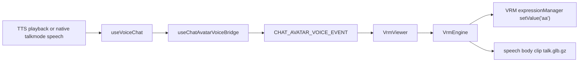

Important live behavior:
- `useVoiceChat` owns speaking lifecycle and mouth amplitude
- `useChatAvatarVoiceBridge` publishes `{ mouthOpen, isSpeaking }`
- `VrmViewer` listens to `CHAT_AVATAR_VOICE_EVENT`
- `VrmEngine` drives:
  - `aa` mouth weight
  - blink
  - look-at
  - body animation stack
  - Alice speech motion clip

### What the renderer preserves today

The current VRM stage is not just "a talking model". It already supports:
- camera orbit and companion zoom
- look-at and eye-tracking behavior
- blink controller
- idle animation
- manual emotes
- operator body actions
- speech body clip layered below manual emotes

That existing runtime is valuable and should not be replaced by a portrait-video overlay.

### Current state machine

Current speech behavior in the Milady app is roughly:

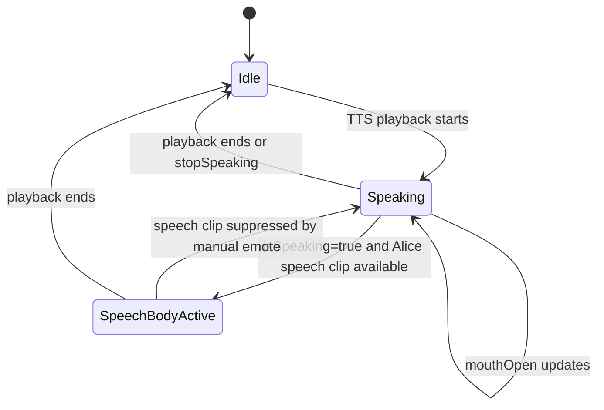

### The most important current limitation

The renderer still applies only:
- a scalar `mouthOpen` signal to `aa`

Evidence:
- `VrmEngine.applyMouthToVrm(...)` currently calls only `manager.setValue("aa", ...)`
- `VrmViewer` currently listens only to `CHAT_AVATAR_VOICE_EVENT`
- the face-frame path is present in types and transport, but not consumed by the renderer

## Dormant Face-Frame Architecture Already in Repo

The current repo already contains a partial advanced face architecture:

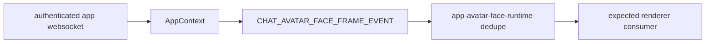

But it is not complete.

### What already exists

- shared type:
  - `AvatarFaceFrame` in `packages/shared/src/contracts/avatar-speech.ts`
- transport event:
  - `CHAT_AVATAR_FACE_FRAME_EVENT` in `packages/app-core/src/events/index.ts`
- ws forwarding:
  - `avatar-face-frame` handling in `packages/agent/src/api/server.ts`
- app ingestion:
  - `normalizeAvatarFaceFrame(...)` and ws dispatch in `packages/app-core/src/state/AppContext.tsx`
- local echo dedupe:
  - `packages/app-core/src/utils/app-avatar-face-runtime.ts`

### What is still stubbed or disabled

- `useVoiceChat` returns `advancedFaceFramesEnabled: false`
- `VrmViewer` does not subscribe to `CHAT_AVATAR_FACE_FRAME_EVENT`
- `VrmEngine.setAvatarFaceFrame(...)` is currently a no-op
- `getDetectedSpeechCapabilities()` hard-codes `advancedFaceDriver: false`

So the repo contains a **real seam**, not a real implementation.

## Historical 555stream Runtime

### What the old speech route actually did

Recovered `show.js` behavior:

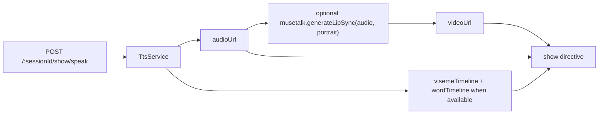

Important historical point:
- the same speech request could yield both:
  - `videoUrl`
  - `visemeTimeline`

That means MuseTalk and 3D viseme driving were **parallel outputs**, not the same renderer.

### Historical MuseTalk branch

Recovered `MuseTalkAvatar.tsx` behavior:

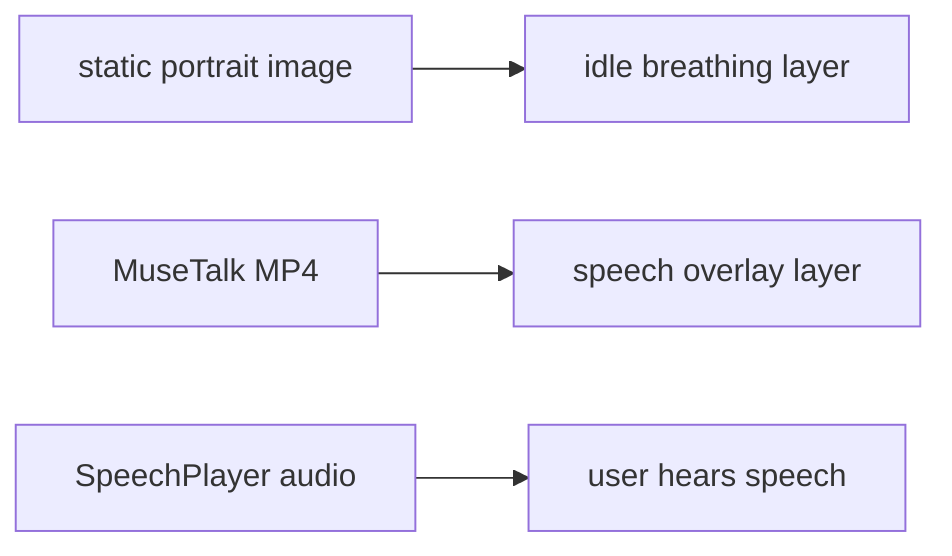

Properties of that branch:
- static portrait image remains visible when not speaking
- speech video fades in only during speech
- this is a portrait/video compositor, not a 3D rig driver

### Historical 3D branch

Recovered `TalkingHead3DAvatar.tsx` behavior:

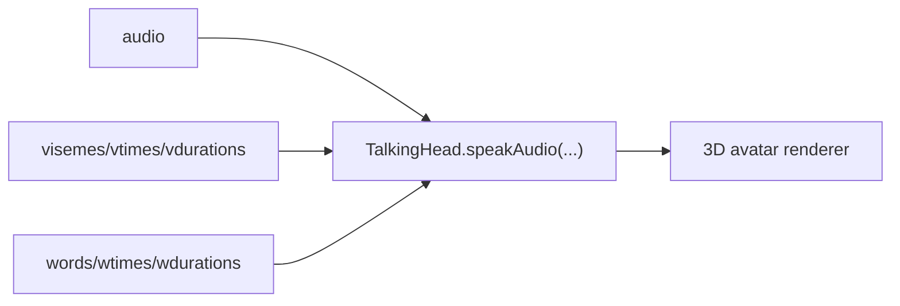

Properties of that branch:
- consumes viseme timeline directly
- supports deterministic, phoneme-aligned lip sync
- remains a real 3D avatar runtime

## What MuseTalk Actually Is

The upstream `MuseTalk` project is a real-time lip-syncing model that modifies a face region in video.

Recovered historical deployment and wrapper confirm that old Milady/555stream used MuseTalk as:
- portrait image + audio in
- MP4 video out

Recovered deployment setup:
- K8s `Deployment` named `musetalk`
- GPU-only scheduling
- FastAPI service on port `8890`
- `POST /v1/lipsync`

Recovered server behavior:
- loads MuseTalk models into GPU memory
- accepts portrait image and audio wav
- returns base64-encoded MP4

This is valuable, but it is a **video generator**, not a VRM facial coefficient service.

## Architectural Options

### Option A: scalar mouth + speech body clip only

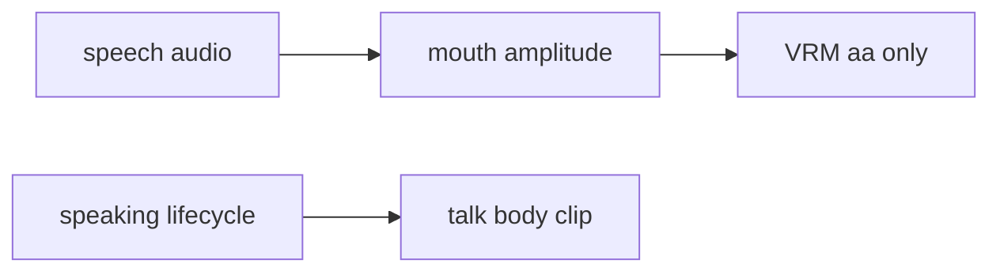

Pros:
- simple
- stable
- low risk

Cons:
- not enough for Alice
- does not solve facial expression richness
- not compelling for future humanoid avatars

Status:
- this is close to what exists today

### Option B: direct MuseTalk overlay on top of VRM stage

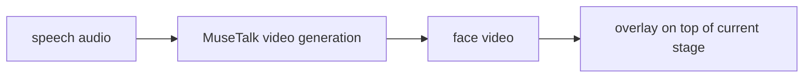

Pros:
- can produce rich visible facial motion
- may look better than mouth-only in a narrow portrait context

Cons:
- regresses the current VRM stage model
- conflicts with orbit, zoom, and head pose
- creates a compositing problem instead of a rig-driving solution
- does not generalize well to arbitrary humanoid 3D avatars
- likely breaks manual body/emote coherence

Status:
- rejected as the primary architecture for the current stage

### Option C: face-driver service that outputs normalized face frames

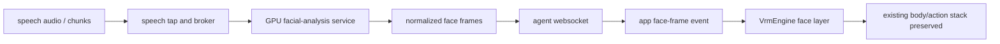

Pros:
- preserves current VRM stage
- scales to Alice and future humanoid avatars
- cleanly separates body and face
- works with current camera and interaction model
- uses the dormant face-frame seam already present in the repo

Cons:
- more engineering work
- requires a GPU-side service and retarget mapping
- must define a durable face-frame contract

Status:
- recommended

## Recommendation

Recommendation: **build a coefficient-oriented face-driver service and integrate it into the current VRM renderer.**

Not:
- pure viseme-only final solution
- direct MuseTalk overlay replacing the current 3D stage

### Why this is the right architecture

It preserves:
- current VRM stage rendering
- zoom and orbit
- look-at and blink
- body actions and operator emotes
- idle and speech body clip layering

It adds:
- richer facial performance
- reusable support for future humanoid avatars
- a GPU-backed path without rewriting the player

## Proposed Target System

### Deployment schematic

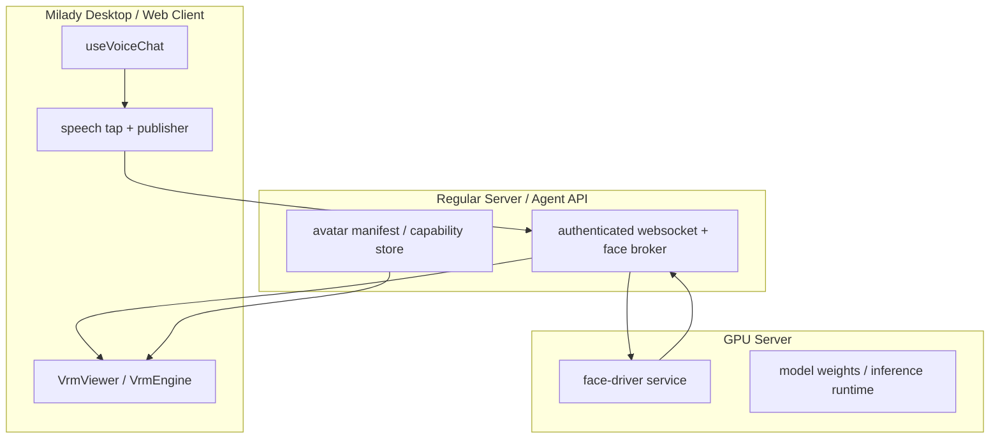

### Target data contract

The existing `AvatarFaceFrame` type is the right starting point:
- `sessionId`
- `avatarKey`
- `speaking`
- `ended`
- `mouthOpen`
- `visemes`
- `expressions`
- `sequence`

But the renderer must actually consume it.

### Body and face composition model

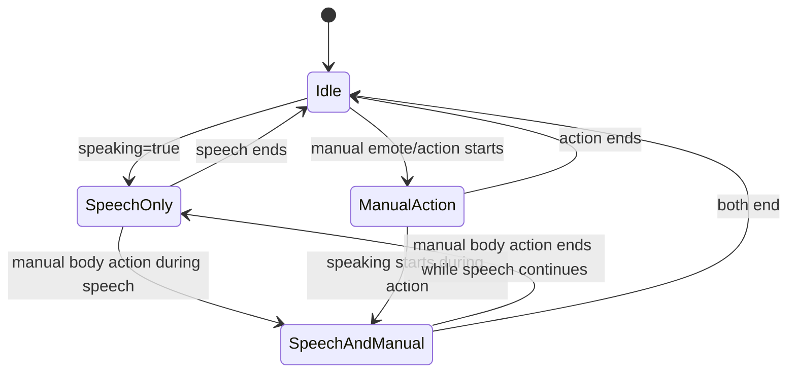

Interpretation:
- body lane:
  - manual action > speech body clip > idle
- face lane:
  - advanced face frame if available
  - otherwise local fallback mouth signal
- face lane remains active while body lane changes

## Detailed State Model

### Speech session lifecycle

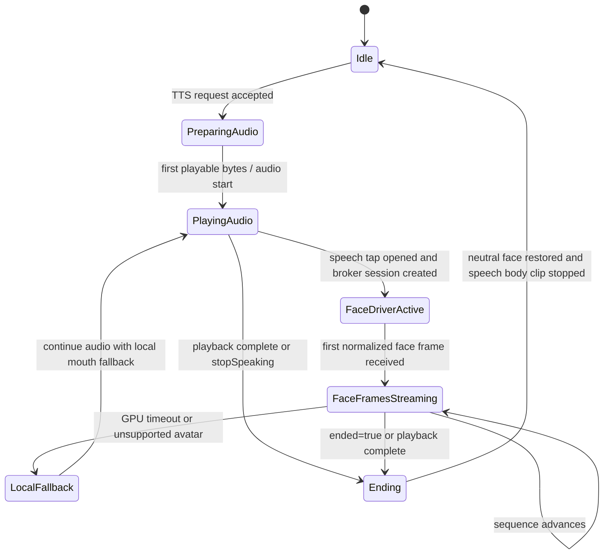

### Renderer state ownership

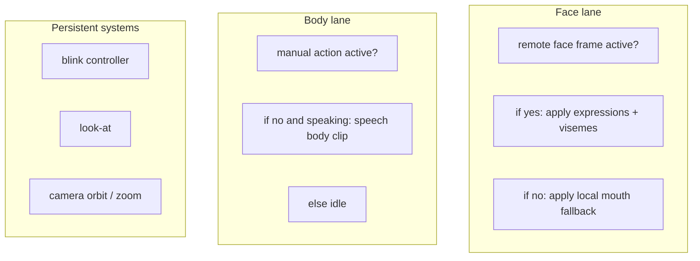

Rules:
- face lane and body lane must be independent
- blink and look-at remain local and persistent
- camera behavior must not depend on talking-head mode

## Required Code Changes

### 1. Finish the existing face-frame renderer path

Current gaps:
- `VrmViewer` must subscribe to `CHAT_AVATAR_FACE_FRAME_EVENT`
- `VrmEngine.setAvatarFaceFrame(...)` must stop being a stub
- `VrmEngine` must apply:
  - supported viseme weights
  - supported expression weights
  - fallback logic when no frame is active

Needed behavior:
- when a face frame is active, suppress the current scalar-only `aa` fallback
- when no frame is active, preserve current mouth-only behavior

### 2. Add a speech tap in current TTS paths

Current good seam:
- browser/web audio playback is already centralized in `useVoiceChat`
- native talkmode already exposes a normalized `speechLevel` event type in `apps/app/plugins/talkmode/src/definitions.ts`

Needed addition:
- tee speech output into a broker request without changing playback ownership

That means:
- keep current TTS playback in client
- send audio bytes or stream chunks to the broker for analysis
- do not make the broker own playback

### 3. Build a broker on the regular server

Broker responsibilities:
- authenticate speech session requests
- associate session with current `avatarKey`
- forward speech chunks or speech asset references to GPU service
- normalize GPU output into `AvatarFaceFrame`
- rebroadcast frames over existing authenticated WebSocket

### 4. Stand up a GPU face-driver service

Service responsibilities:
- receive audio stream or buffered audio
- output normalized facial coefficients / visemes / expressions over time
- support:
  - start
  - stream frames
  - end / clear

The service contract should not expose MuseTalk-specific internals to the client.

### 5. Add per-avatar speech capability and retarget mapping

Current repo already has:
- `speechCapabilities`

This must be extended operationally so each avatar can declare:
- supported visemes
- supported facial expressions
- optional speech body clip
- advanced face-driver support
- retarget profile / mapping profile

This is mandatory for:
- bundled Alice
- future bundled humanoids
- custom user-uploaded humanoid VRMs

## Proposed Service API

This is a proposed contract for review, not yet implemented.

### Broker-facing API

```text
POST /v1/face-sessions
  -> { faceSessionId }

POST /v1/face-sessions/:id/chunks
  body: audio chunk or signed speech asset reference

POST /v1/face-sessions/:id/end
  -> closes stream
```

### GPU internal API

Preferred transport:
- bidirectional streaming gRPC or WebSocket

Reason:
- face frames are time-series outputs
- polling HTTP is the wrong fit

### Client event contract

Keep using `avatar-face-frame` over the existing authenticated app WebSocket.

## Open-Source Integration Paths

### MuseTalk path

MuseTalk is viable if:
- we want a portrait/video surface
- we want a separate talking-head mode outside the current VRM stage

MuseTalk is not sufficient by itself if:
- we want to preserve current VRM stage behavior
- we need additive facial driving on top of 3D body animation
- we need generic support for future user-uploaded humanoid avatars

### TalkingHead / HeadTTS path

Historical evidence suggests this family was the correct 3D path before:
- timed visemes
- word timing
- 3D rig consumption

It still matters as a reference architecture even if Milady does not literally embed TalkingHead.

### Audio2Face-style path

This is the closest upstream architectural match for Milady's needs:
- audio in
- blendshape / emotion style outputs
- streaming transport
- 3D avatar target

The risk is complexity and integration cost.

### Hybrid path

The most realistic near-term engineering path may be:
- keep current VRM runtime
- borrow ideas or components from MuseTalk and related projects only on the GPU service side
- expose a normalized face-frame output
- let Milady own all avatar rendering

This avoids coupling the app to one model family's output format.

## Risks

### Product and runtime risks

- Replacing the current VRM stage with a portrait-video overlay would regress:
  - orbit / zoom
  - head pose coherence
  - body-action coherence
  - future custom avatar support

- Mixing face and body responsibilities in one animation lane would regress:
  - operator actions
  - emote priority
  - speech body clip behavior

### Engineering risks

- Under-specified face-frame contract leads to one-off Alice hacks
- No retarget profile means custom humanoid avatars will fail unpredictably
- GPU service latency could cause facial lag relative to local audio playback
- Browser `speechSynthesis` fallback has no raw audio stream, so it needs a fallback mode

### Infrastructure risks

- `gpu-server` currently has no running face service
- any new GPU service needs:
  - deployment recipe
  - model weight management
  - health checks
  - session cleanup
  - observability

## Suggested Investigation and Build Order

### Phase 0 - architecture review

- validate this document externally
- decide whether the GPU service should be:
  - coefficient-native from the start, or
  - a temporary adapter around another open-source model

### Phase 1 - finish local renderer contract

- wire face-frame events into `VrmViewer`
- implement `VrmEngine.setAvatarFaceFrame(...)`
- preserve all current body and stage features
- no GPU dependency yet

### Phase 2 - broker and local synthetic frame testing

- stand up broker path on regular server
- push synthetic face frames end to end
- verify no regression to stage behavior

### Phase 3 - GPU service bootstrap

- deploy a new service on `gpu-server`
- feed audio in
- emit normalized face frames
- test Alice first

### Phase 4 - avatar capability generalization

- add manifest-driven retarget support
- support bundled humanoids and custom uploads

## Explicit Recommendation for External Review

Reviewers should evaluate whether Milady should:

1. finish the existing dormant face-frame architecture and build a new GPU service around it
2. adapt an existing coefficient-oriented system such as Audio2Face-3D style output
3. use MuseTalk only as a portrait/video mode or service-side experimental component, not as the primary VRM runtime

## Conclusion

The repo and historical evidence support a clear conclusion:

- The current Milady VRM stage is worth preserving.
- MuseTalk was historically a portrait/video branch, not the 3D rig driver.
- The repo already contains the start of a reusable face-frame architecture.
- The correct next system is a GPU-backed face-driver that emits normalized facial frames into the existing VRM renderer.

That is the architecture most likely to satisfy:
- Alice richness
- preservation of current stage functionality
- future humanoid-avatar support
- clean technical ownership boundaries

## Appendix A - Concrete Code Seams

### Current live voice and avatar seam

- `packages/app-core/src/hooks/useVoiceChat.ts`
- `packages/app-core/src/hooks/useChatAvatarVoice.ts`
- `packages/app-core/src/components/avatar/VrmViewer.tsx`
- `packages/app-core/src/components/avatar/VrmEngine.ts`

### Existing but unfinished advanced-face seam

- `packages/shared/src/contracts/avatar-speech.ts`
- `packages/app-core/src/events/index.ts`
- `packages/app-core/src/utils/app-avatar-face-runtime.ts`
- `packages/app-core/src/state/AppContext.tsx`
- `packages/agent/src/api/server.ts`

### Historical 555stream proof of split architecture

- `/home/deploy/555stream/services/control-plane/src/routes/agent/show.js`
- `/home/deploy/555stream/services/control-plane/src/services/tts/providers/headtts.js`
- `/home/deploy/555stream/services/agent-show/src/components/MuseTalkAvatar.tsx`
- `/home/deploy/555stream/services/agent-show/src/components/TalkingHead3DAvatar.tsx`
- `/home/deploy/555stream/k8s/base/musetalk.yaml`
- `/home/deploy/555stream/docker/musetalk-server.py`

## Appendix B - Upstream Reference Notes

- MuseTalk:
  - optimized for lip-sync video generation on a face region
  - strong candidate for portrait/video mode
  - wrong primary contract for VRM renderer

- TalkingHead:
  - accepts audio plus timed visemes and words
  - demonstrates a proper 3D avatar speech architecture

- HeadTTS:
  - emits audio plus visemes and timings
  - useful reference for deterministic lip-sync output contracts

- Audio2Face-3D:
  - strongest conceptual match for a GPU facial driver feeding a 3D avatar rig

## Annex A - Current Milady Runtime

### A1. Runtime ownership

The current Milady runtime keeps these responsibilities separate:

| Subsystem | Current owner | Current status |
|---|---|---|
| Speech lifecycle and playback | `packages/app-core/src/hooks/useVoiceChat.ts` | Live |
| Speech event publishing | `packages/app-core/src/hooks/useChatAvatarVoice.ts` | Live |
| Avatar event transport | `packages/app-core/src/events/index.ts` and `packages/app-core/src/state/AppContext.tsx` | Live |
| VRM composition and animation | `packages/app-core/src/components/avatar/VrmViewer.tsx` and `packages/app-core/src/components/avatar/VrmEngine.ts` | Live |
| Advanced face-frame contract | `packages/shared/src/contracts/avatar-speech.ts` | Present but unfinished |
| GPU facial service | none | Not deployed |

### A2. Current speech and render path

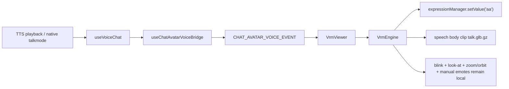

### A3. Face/body precedence rules in the current runtime

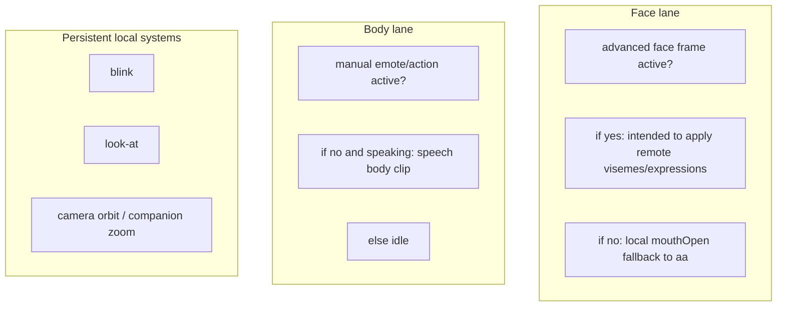

### A4. Dormant advanced-face seam

The current repo already contains the beginning of an advanced face pipeline:

- `AvatarFaceFrame` exists in `packages/shared/src/contracts/avatar-speech.ts`
- face-frame window transport exists in `packages/app-core/src/events/index.ts`
- WebSocket forwarding exists in `packages/agent/src/api/server.ts`
- local dedupe runtime exists in `packages/app-core/src/utils/app-avatar-face-runtime.ts`

But the seam is not complete:

- `VrmViewer` does not subscribe to the face-frame event path
- `VrmEngine.setAvatarFaceFrame(...)` is unfinished
- the live renderer still behaves as a scalar-mouth fallback
- advanced face driving is not enabled for live speech

### A5. Current-state invariants that must not regress

Any implementation must preserve:

- companion orbit and zoom behavior
- blink and look-at controllers
- manual emotes and operator body actions
- speech body clip behavior for Alice
- local fallback speech when GPU or broker functionality is unavailable

## Annex B - Historical 555stream Proof

### B1. Historical split between portrait and 3D branches

Recovered historical evidence shows two distinct output branches:

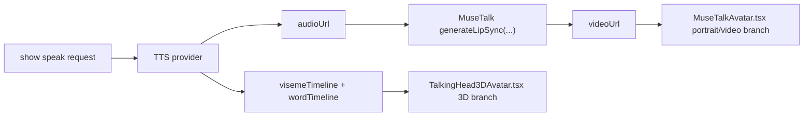

### B2. Historical source packet

The recovered files that establish this split are:

- `/home/deploy/555stream/services/control-plane/src/routes/agent/show.js`
- `/home/deploy/555stream/services/control-plane/src/services/tts/providers/headtts.js`
- `/home/deploy/555stream/services/agent-show/src/components/MuseTalkAvatar.tsx`
- `/home/deploy/555stream/services/agent-show/src/components/TalkingHead3DAvatar.tsx`
- `/home/deploy/555stream/k8s/base/musetalk.yaml`
- `/home/deploy/555stream/docker/musetalk-server.py`

### B3. Architectural implication

This historical record proves:

- MuseTalk was used as a portrait/video renderer
- timed visemes and word timings powered the 3D branch
- the old stack did not use MuseTalk as the 3D rig driver

That is the decisive reason the current Milady VRM stage should not be replaced with a portrait-video overlay.

## Annex C - Target Architecture

### C1. Target deployment schematic

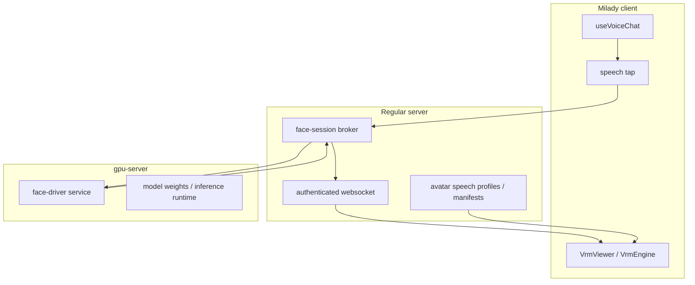

### C2. Target contract

The durable runtime contract is:

- client keeps TTS ownership and playback
- speech tap opens a brokered face session
- broker forwards supported speech input to the GPU service
- GPU service emits normalized face frames
- face frames return over the authenticated app WebSocket
- renderer applies face frames additively over the existing body stack

The client must not depend on:

- portrait video output
- MuseTalk-specific payloads
- direct browser-to-GPU communication

### C3. Target `AvatarFaceFrame` responsibilities

`AvatarFaceFrame` must remain the renderer-facing normalized shape. It should carry:

- session identity
- avatar identity
- sequence ordering
- speaking lifecycle
- ended / neutral-reset marker
- mouth openness
- normalized viseme weights
- normalized expression weights

The renderer should only consume this normalized contract, not a model-specific wire shape.

### C4. Target body/face composition

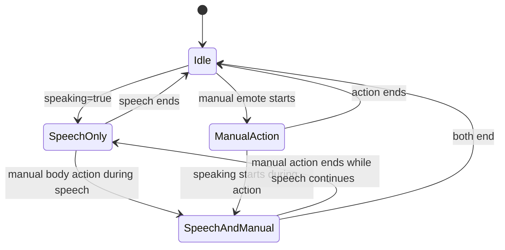

Composition rules:

- body lane: manual action > speech body clip > idle
- face lane: remote face frame > local mouth fallback
- blink, look-at, zoom, and orbit remain independent local systems

## Annex D - State Models

### D1. Speech-session lifecycle

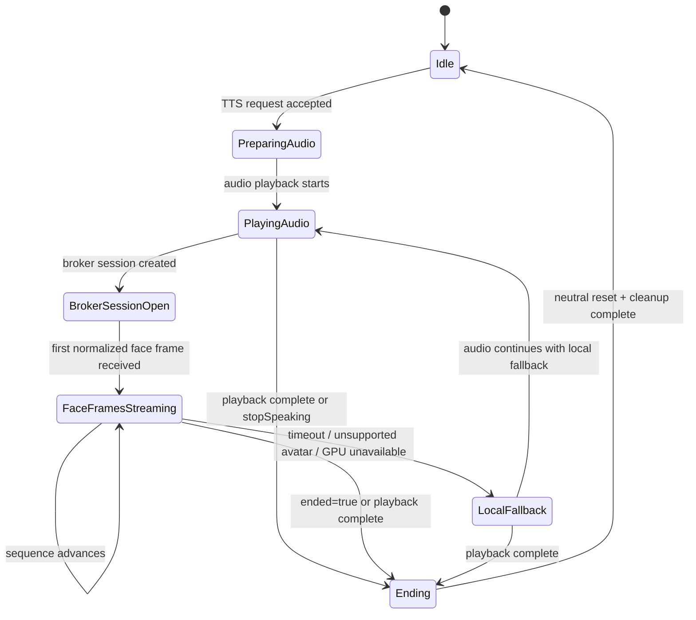

### D2. Failure and fallback rules

Failure handling must be explicit:

- unsupported speech source: stay on current local fallback
- unsupported avatar capability: stay on current local fallback
- broker timeout: revert to local fallback without interrupting audio
- GPU disconnect: revert to local fallback, clear stale remote face state
- end-of-speech: restore neutral face state and clear any active remote frame state

### D3. Cleanup and neutral reset

A face session is only considered closed when all of the following are true:

- speech playback has ended or been cancelled
- a final `ended` frame has been processed, or timeout fallback has neutralized the face
- remote-frame timers are cleared
- renderer state is back to neutral or local idle

## Annex E - Delivery Packet

### E1. Board and repo conventions

- Board: `Render-Network-OS / 555 Unified Kanban` (`Project #1`)
- Issue home: `rndrntwrk/milaidy`
- Project field defaults:
  - `Priority`: `P0`
  - `Status`: `Ready` for the gate issue and first unblockers, `Backlog` for the rest
  - `Repository`: `rndrntwrk/milaidy`
- Branching:
  - branch from `develop`
  - use `feature/alice-face-<ticket-id>-<slug>`
  - use `fix/alice-face-<ticket-id>-<slug>` only for regressions
  - PR target is `develop`

### E2. Dependency graph

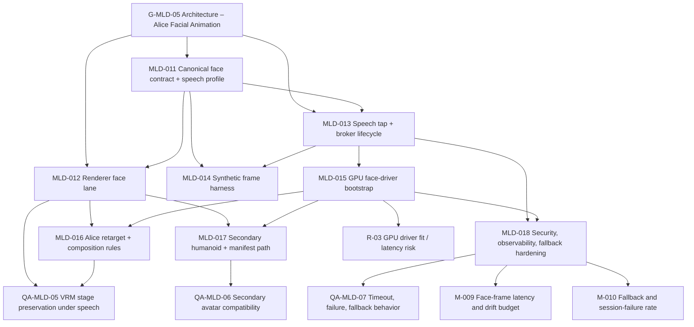

### E3. Ticket matrix

| Ticket | Status | Size | Branch | Blocked By | Unblocks | Acceptance summary |
|---|---|---:|---|---|---|---|
| `G-MLD-05` | Ready | S | `feature/alice-face-g-mld-05-architecture-gate` | none | `MLD-011`, `MLD-012`, `MLD-013` | Annex-backed architecture gate published with repo seams and historical proof. |
| `MLD-011` | Ready | M | `feature/alice-face-mld-011-face-contract` | `G-MLD-05` | `MLD-012`, `MLD-013`, `MLD-014` | Canonical face contract and avatar speech profile are versioned and implementation-safe. |
| `MLD-012` | Ready | L | `feature/alice-face-mld-012-renderer-face-lane` | `MLD-011` | `MLD-016`, `MLD-017`, `QA-MLD-05` | Renderer consumes face frames without regressing zoom, orbit, emotes, or body clips. |
| `MLD-013` | Ready | L | `feature/alice-face-mld-013-speech-broker` | `MLD-011` | `MLD-014`, `MLD-015`, `MLD-018` | Speech tap and broker lifecycle are explicit and playback ownership stays in the client. |
| `MLD-014` | Backlog | M | `feature/alice-face-mld-014-synthetic-frame-harness` | `MLD-011`, `MLD-013` | `QA-MLD-05` | Synthetic face frames drive end-to-end renderer validation before GPU inference is live. |
| `MLD-015` | Backlog | XL | `feature/alice-face-mld-015-gpu-face-driver` | `MLD-013` | `MLD-016`, `MLD-017`, `MLD-018`, `R-03` | GPU face-driver emits normalized face frames behind the broker, not portrait/video output. |
| `MLD-016` | Backlog | L | `feature/alice-face-mld-016-alice-retarget` | `MLD-012`, `MLD-015` | `QA-MLD-05` | Alice retarget profile preserves body behavior while adding richer facial motion. |
| `MLD-017` | Backlog | L | `feature/alice-face-mld-017-secondary-avatar` | `MLD-012`, `MLD-015` | `QA-MLD-06` | One secondary humanoid proves the system is not Alice-only. |
| `MLD-018` | Backlog | M | `feature/alice-face-mld-018-hardening` | `MLD-013`, `MLD-015` | `QA-MLD-07`, `M-009`, `M-010` | Observability, security, fallback, and cleanup behavior are explicit and measurable. |
| `QA-MLD-05` | Backlog | M | `feature/alice-face-qa-mld-05-stage-preservation` | `MLD-012`, `MLD-016` | release evidence | Advanced speech preserves the current VRM stage. |
| `QA-MLD-06` | Backlog | M | `feature/alice-face-qa-mld-06-avatar-compatibility` | `MLD-017` | release evidence | Secondary-avatar and unsupported-avatar behavior are both verified. |
| `QA-MLD-07` | Backlog | M | `feature/alice-face-qa-mld-07-fallback` | `MLD-018` | release evidence | GPU outage, timeout, and disconnect fall back safely. |
| `R-03` | Backlog | S | `feature/alice-face-r-03-gpu-fit` | `MLD-015` | rollout decision | GPU fit, latency, and kill-switch thresholds are documented before rollout. |
| `M-009` | Backlog | S | `feature/alice-face-m-009-latency-drift` | `MLD-018` | release evidence | Face-frame latency and audio-face drift budgets are instrumented. |
| `M-010` | Backlog | S | `feature/alice-face-m-010-fallback-rate` | `MLD-018` | release evidence | Fallback and session-failure rates are instrumented. |

### E4. Acceptance matrix

| Layer | Required proof |
|---|---|
| Architecture | current-state and target-state diagrams, source packet, no renderer-contract ambiguity |
| Renderer | `VrmEngine.setAvatarFaceFrame(...)` implemented, local fallback preserved |
| Broker | explicit session open/stream/end/timeout semantics |
| GPU service | normalized face-frame output under health-checked deployment |
| Avatar support | Alice-first retarget plus one secondary humanoid |
| QA | stage-preservation, avatar-compatibility, timeout/fallback scenarios |
| Metrics | latency/drift and fallback/session-failure visibility |

### E5. External review checklist

External reviewers should explicitly confirm:

1. normalized face frames are the correct runtime contract
2. the current VRM stage should remain the primary renderer
3. MuseTalk should remain a portrait/video reference or optional side mode, not the primary VRM runtime
4. the brokered GPU-service model is the right operational boundary
5. the manifest-driven avatar capability model is sufficient for future humanoid avatars

### E6. Live GitHub issue references

Program board:
- Unified board: <https://github.com/orgs/Render-Network-OS/projects/1>

Issue set:
- `G-MLD-05`: <https://github.com/rndrntwrk/milaidy/issues/39>
- `MLD-011`: <https://github.com/rndrntwrk/milaidy/issues/40>
- `MLD-012`: <https://github.com/rndrntwrk/milaidy/issues/41>
- `MLD-013`: <https://github.com/rndrntwrk/milaidy/issues/42>
- `MLD-014`: <https://github.com/rndrntwrk/milaidy/issues/43>
- `MLD-015`: <https://github.com/rndrntwrk/milaidy/issues/44>
- `MLD-016`: <https://github.com/rndrntwrk/milaidy/issues/45>
- `MLD-017`: <https://github.com/rndrntwrk/milaidy/issues/46>
- `MLD-018`: <https://github.com/rndrntwrk/milaidy/issues/47>
- `QA-MLD-05`: <https://github.com/rndrntwrk/milaidy/issues/48>
- `QA-MLD-06`: <https://github.com/rndrntwrk/milaidy/issues/49>
- `QA-MLD-07`: <https://github.com/rndrntwrk/milaidy/issues/50>
- `R-03`: <https://github.com/rndrntwrk/milaidy/issues/51>
- `M-009`: <https://github.com/rndrntwrk/milaidy/issues/52>
- `M-010`: <https://github.com/rndrntwrk/milaidy/issues/53>
