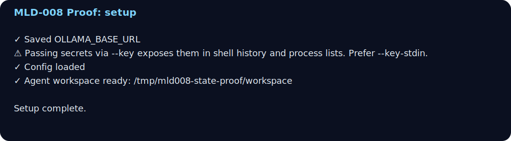
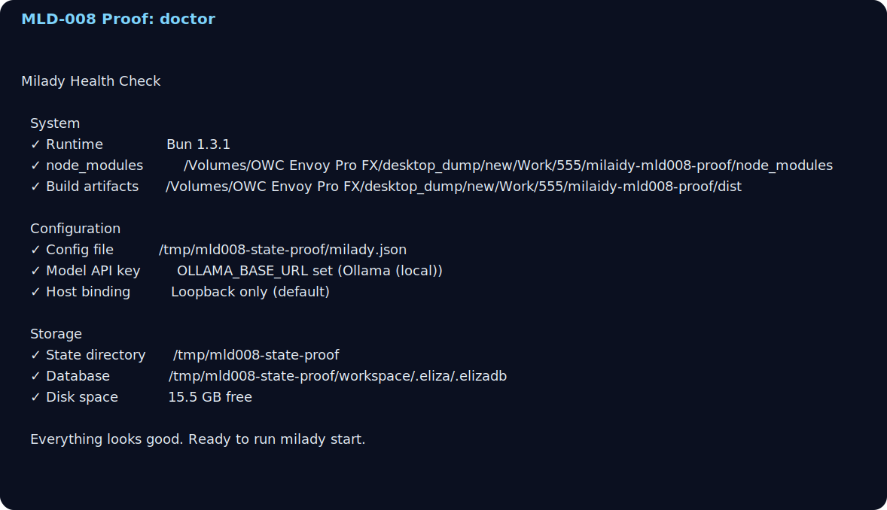
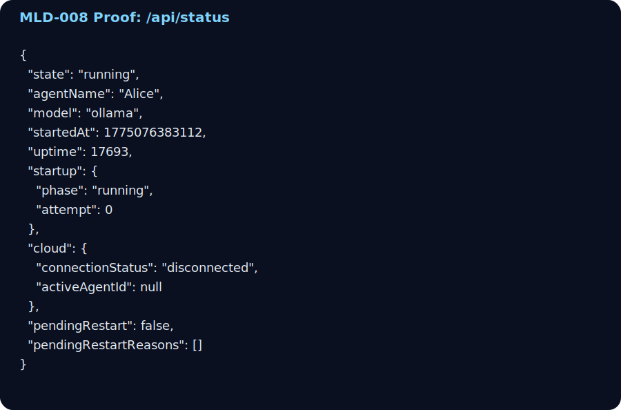
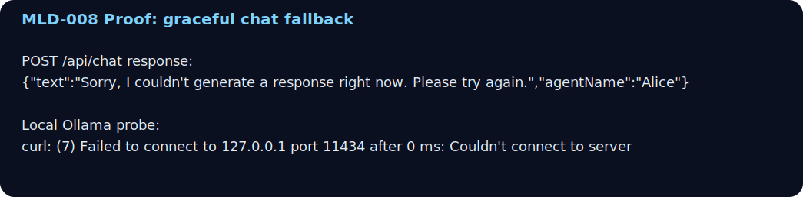

# Alice Operator Proof: 2026-04-01

This proof run validates the current Alice operator path on the `rndrntwrk/milaidy` fork from a clean source checkout. The goal was to verify the install, configure, health-check, startup, and troubleshooting path end to end without relying on undocumented steps.

## Scope

- repo: `rndrntwrk/milaidy`
- verification date: `2026-04-01`
- verification mode: isolated state dir + explicit workspace
- runtime path exercised: source checkout via `bun scripts/run-node.mjs`

## Docs Exercised

- `/installation`
- `/quickstart`
- `/configuration`
- `/cli/setup`
- `/cli/doctor`
- `/cli/models`
- `/operators/alice-operator-bootstrap`
- `/guides/knowledge`

## Environment

The proof used an isolated profile rooted at `/tmp/mld008-state-proof` with workspace `/tmp/mld008-state-proof/workspace`. The config was seeded with:

- `agents.list[0].name = "Alice"`
- `agents.defaults.workspace = "/tmp/mld008-state-proof/workspace"`
- `env.OLLAMA_BASE_URL = "http://localhost:11434"`

The explicit workspace path matters here: `MILADY_STATE_DIR` changes the config location, but `setup` still resolves workspace independently unless you pass `--workspace` or preconfigure `agents.defaults.workspace`.

## Commands Run

```bash
export MILADY_STATE_DIR=/tmp/mld008-state-proof
export MILADY_CONFIG_PATH=/tmp/mld008-state-proof/milady.json
export MILADY_PROJECT_ROOT=/path/to/milaidy

bun scripts/run-node.mjs setup \
  --provider ollama \
  --key http://localhost:11434 \
  --no-wizard \
  --workspace /tmp/mld008-state-proof/workspace

bun scripts/run-node.mjs doctor --no-ports
bun scripts/run-node.mjs models
bun scripts/run-node.mjs start
curl http://127.0.0.1:2138/api/status
curl -X POST http://127.0.0.1:2138/api/chat \
  -H 'Content-Type: application/json' \
  -d '{"text":"Hello, what can you do?"}'
```

## Outcome

| Step | Result | Notes |
|------|--------|-------|
| Setup | Pass | Config and workspace bootstrapped successfully |
| Doctor | Pass | Runtime, config, storage, and database checks passed |
| Models | Pass | `Ollama (local)` registered as configured |
| Start | Pass | API/UI bound to `http://127.0.0.1:2138` |
| Status probe | Pass | `/api/status` returned `state: "running"` |
| Chat request | Pass with graceful fallback | Request completed cleanly; inference degraded because local Ollama was unreachable |

## Evidence

### Setup



### Doctor



### API Status



### Chat Fallback / Troubleshooting Boundary



## Key Findings

1. `milady doctor` is implemented and usable now. The old “planned / unknown command” documentation was stale.
2. `POST /api/chat` expects a `text` field, not `message`. The public API examples using `message` were stale and produced a `{"error":"text is required"}` response until corrected.
3. `setup` alone does not establish the agent identity. If `agents.list[].name` is absent, the first `start` re-enters onboarding.
4. In isolated environments, pass `--workspace` explicitly and keep `agents.defaults.workspace` aligned with it so setup, doctor, and runtime state agree.
5. The current degraded path is safe: when Ollama is configured but unreachable, the runtime remains up and `/api/chat` returns a fallback message instead of crashing.

## What This Proof Does Not Claim

- It does not claim successful real-model inference from Ollama on this machine. No local Ollama instance was reachable at `127.0.0.1:11434`.
- It does not validate production Alice deployment. That remains owned by `555-bot`.

## Close Condition Mapping

This proof satisfies the remaining documentation acceptance for:

- screenshot-backed walkthrough evidence
- dry-run verification of the install/configure/start/troubleshoot path

The remaining operator responsibility after this point is provider-specific: point Milady at a reachable model backend before expecting a real first-response from the chat surface.
