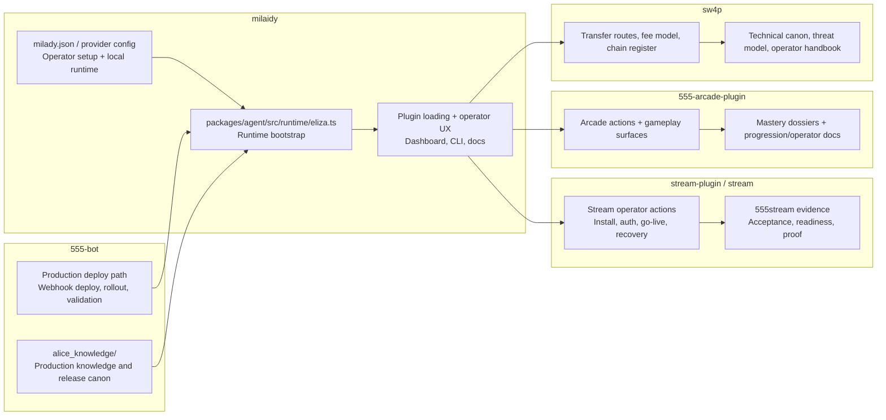

# Alice System Boundary

## Purpose

Make the Alice boundary explicit across Milady, `555-bot`, stream, arcade, and
SW4P so operators and maintainers can tell where truth and responsibility live.

## Boundary diagram

## Ownership map

| Surface | Canonical owner | What it owns | What it does not own |
| --- | --- | --- | --- |
| Milady host/runtime | `milaidy` | local install, `milady.json`, runtime bootstrap, plugin loading, operator UX, provider setup | production Alice deploy orchestration |
| Alice production deployer | `555-bot` | release assembly, webhook deploy, runtime validation gates, deploy/recovery canon | general Milady install flow |
| Stream operator surface | `stream-plugin` and `Render-Network-OS/stream` | stream actions, auth/session model, go-live path, stream recovery, stream evidence | Milady runtime bootstrap |
| Arcade operator surface | `555-arcade-plugin` | gameplay control, progression/admin actions, mastery docs, operator examples | Alice deployment |
| SW4P technical/economic rail | `sw4p-pro` / `sw4p` | routes, wallets, fees, chains, bridge truth, SW4P operator docs | stream/arcade UI control |

## Code anchors

- `packages/agent/src/runtime/eliza.ts`
  Milady runtime bootstrap and initialization order.
- `packages/app-core/src/runtime/core-plugins.ts`
  core plugin lists and loading assumptions.
- `packages/app-core/src/services/plugin-installer.ts`
  installed and dynamic plugin behavior.
- `plugins.json`
  plugin registry surface.
- `Render-Network-OS/555-bot: docs/ALICE_DEPLOYMENT_DOCS_INDEX.md`
  deploy canon and evidence hierarchy.

## Operator rules

- If the question is about install, config, runtime lifecycle, or plugin
  loading, start in `milaidy`.
- If the question is about Alice production rollout or recovery, defer to
  `555-bot`.
- If the question is about stream or arcade actions, use the plugin repo docs
  first and treat Milady as the host, not the canonical feature owner.
- If the question is about chains, routes, fees, or transfer troubleshooting,
  use `sw4p`.
