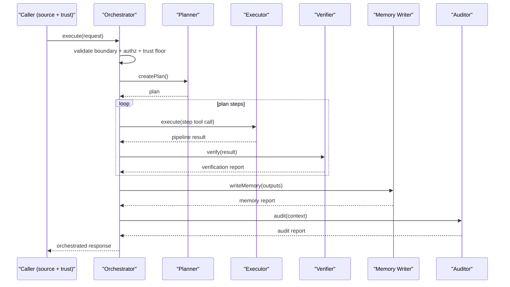
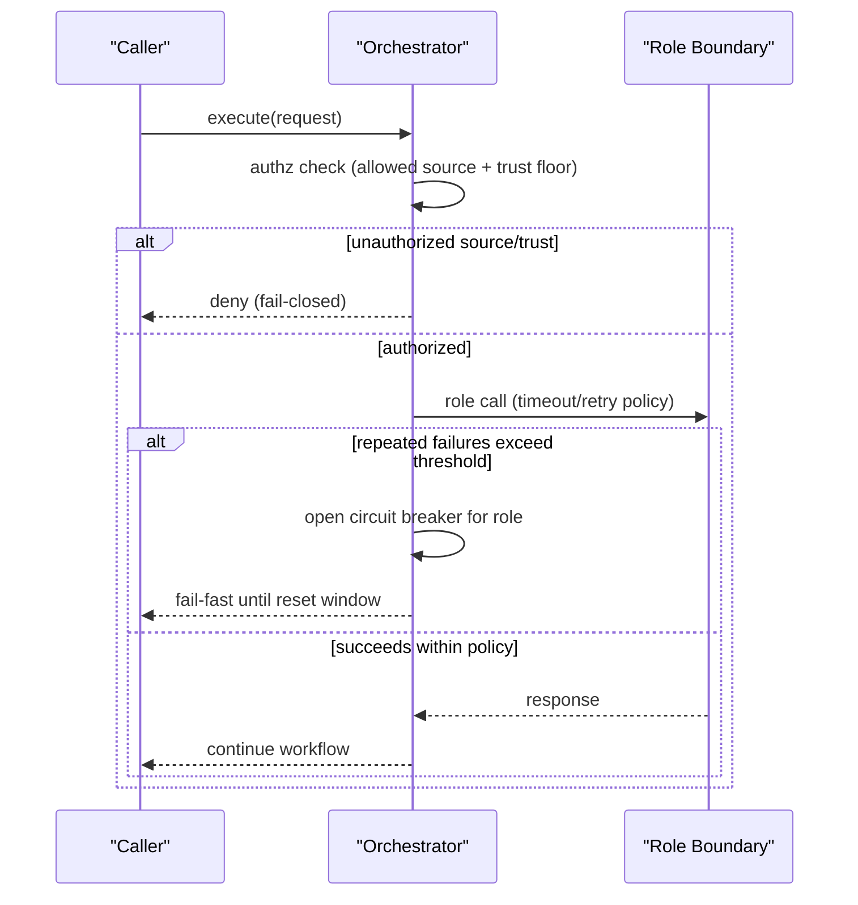

# Phase 3 Role Authz, Backpressure, and Interaction Spec (2026-02-17)

Checklist targets: `P3-003`, `P3-004`, `P3-005`

## Role Authn/Authz Model and Trust Boundaries (`P3-003`)

Role-call trust boundaries are enforced at the orchestrator boundary:

- **Boundary schema validation (fail-closed)**
  - request/response parsing enforced via `src/autonomy/roles/schemas.ts`
- **Source allowlist + minimum trust floor**
  - policy knobs in `src/autonomy/config.ts`:
    - `autonomy.roles.orchestrator.allowedSources`
    - `autonomy.roles.orchestrator.minSourceTrust`
  - enforced at call-site authorization in `src/autonomy/roles/orchestrator.ts` (`assertRoleCallAuthorized`)
- **Tool-level authorization**
  - executor path still flows through schema validation, approval gate, and invariants via pipeline wiring in `src/autonomy/workflow/execution-pipeline.ts`

Trust boundary model:

- `system` source: highest trust, internal kernel-originated calls
- `user` / `llm` / `plugin` sources: constrained by allowlist and trust floor
- any call outside policy: denied before role execution

## Rate Limiting and Backpressure Strategy (`P3-004`)

Role-call resilience and backpressure controls are defined and enforced in orchestrator policy:

- `timeoutMs`: per-role-call execution timeout
- `maxRetries`: bounded retry budget after initial attempt
- `backoffMs`: linear retry backoff
- `circuitBreakerThreshold`: failures before opening role circuit
- `circuitBreakerResetMs`: circuit cooldown before re-entry

Implementation references:

- policy defaults + config merge: `src/autonomy/roles/orchestrator.ts`
- config schema + guardrail validation: `src/autonomy/config.ts`
- timeout/retry/circuit logic: `src/autonomy/roles/orchestrator.ts` (`callRoleWithResilience`, `callRoleWithTimeout`, circuit state helpers)
- validation coverage: `src/autonomy/roles/orchestrator.test.ts`, `src/autonomy/roles/orchestrator-concurrency.test.ts`, `src/autonomy/roles/orchestrator-authz.test.ts`

Operational behavior:

- repeated failures open circuit and shed load for impacted role boundary
- retries are bounded and timeboxed to avoid unbounded queue growth
- denied auth calls fail immediately without entering downstream role execution

## Role Interaction Sequence Diagrams (`P3-005`)

### Nominal Lifecycle

### Denial / Backpressure Path

