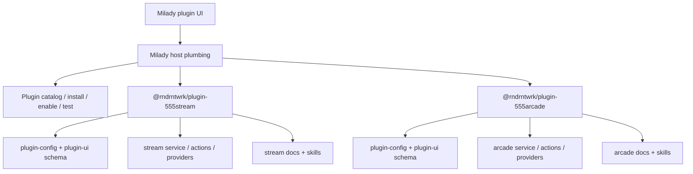

# First-Party Public Plugin Standard

This page defines how Milady should host first-party public plugins, with `555 Stream` and `555 Arcade` as the current reference implementations.

## Scope

Current first-party public plugins:

- `@rndrntwrk/plugin-555stream`
- `@rndrntwrk/plugin-555arcade`

These plugins are package-owned. Milady is the host application.

The canonical public entry should live in the Milady docs site. Repo-local docs remain reference material for contributors and maintainers.

## Host and package boundaries

Milady should own:

- install, enable, and test plumbing
- generic plugin rendering
- generic lifecycle badges
- plugin catalog exposure

First-party plugin packages should own:

- `plugin-config.schema.json`
- `plugin-ui.schema.json`
- domain wording
- action grouping
- readiness semantics
- public docs and skills

Milady should not hardcode domain-specific setup logic when package-owned schema can express it.

## Canonical user-facing names

Use these names in Milady surfaces:

- `555 Stream`
- `555 Arcade`

Do not surface legacy `STREAM555_*` or `FIVE55_*` naming as separate plugin cards. Legacy action aliases may remain for compatibility, but public UI should present only the canonical plugin names.

## Required lifecycle tokens

Milady should present the same core lifecycle vocabulary for all first-party public plugins:

| Token | Meaning |
| --- | --- |
| `installed` | package is present |
| `enabled` | host policy allows loading |
| `loaded` | service/provider layer initialized |
| `authenticated` | auth is valid |
| `ready` | the plugin can complete its primary operator flow |
| `degraded` | the plugin is available but one or more dependencies are impaired |

Plugins may add secondary readiness signals, but should not replace the lifecycle above.

Examples:

- `555 Stream`: `sessionBound`, `channelsSaved`, `channelsEnabled`, `channelsReady`
- `555 Arcade`: `sessionBootstrapped`, `catalogReachable`, `scorePipelineReachable`, `leaderboardReachable`, `questsReachable`

## Operator-first setup model

The primary Milady experience should be action-first, not env-first.

Default flow:

1. install the plugin
2. enable the plugin
3. authenticate
4. bootstrap or bind the session
5. perform the primary domain action

For `555 Stream`, the primary domain action is:

- configure channels
- sync
- go live

For `555 Arcade`, the primary domain action is:

- fetch catalog
- play / switch / stop
- observe score, leaderboard, and quest sync

## Public setup expectations

First-party public plugins should each ship:

- `README.md`
- `config/plugin-config.schema.json`
- `config/plugin-ui.schema.json`
- `docs/GET_STARTED.md`
- `docs/INSTALL_AND_AUTH.md`
- `docs/ACTIONS_REFERENCE.md`
- `docs/STATES_AND_TRANSITIONS.md`
- `docs/COMPLEX_FLOWS.md`
- `docs/EDGE_CASES_AND_RECOVERY.md`
- `docs/COVERAGE_AND_GAPS.md`
- `docs/PUBLIC_RELEASE_CHECKLIST.md`
- `docs/WIP_TODO.md`
- `docs/QUICKSTART_3_STEPS.md`
- `docs/OPERATOR_SETUP_MATRIX.md`
- `docs/MILAIDY_WEB_ACCESS.md`
- one operator skill
- one OpenClaw-facing skill when OpenClaw is supported

## Architecture reference

## Release gate

A first-party public plugin is not ready for general release unless:

- the primary operator flow has been smoke-tested
- the canonical docs and skills are current
- the lifecycle/state model is coherent in Milady
- known gaps are documented honestly
- package-owned schema is the source of truth for domain setup semantics

## Current guidance for 555 plugins

- `555 Stream` should own stream auth, channels, go-live, and ad operations.
- `555 Arcade` should own arcade auth, session bootstrap, games, scores, leaderboard, and quests.
- Alice-only mastery should remain out of the GA `555 Arcade` operator setup surface until it is intentionally promoted.

## Related pages

- [Local Plugin Development](/plugins/local-plugins)
- [Plugin Development](/plugins/development)
- [Plugin Schemas](/plugins/schemas)
- [Publish a Plugin](/plugins/publish)
