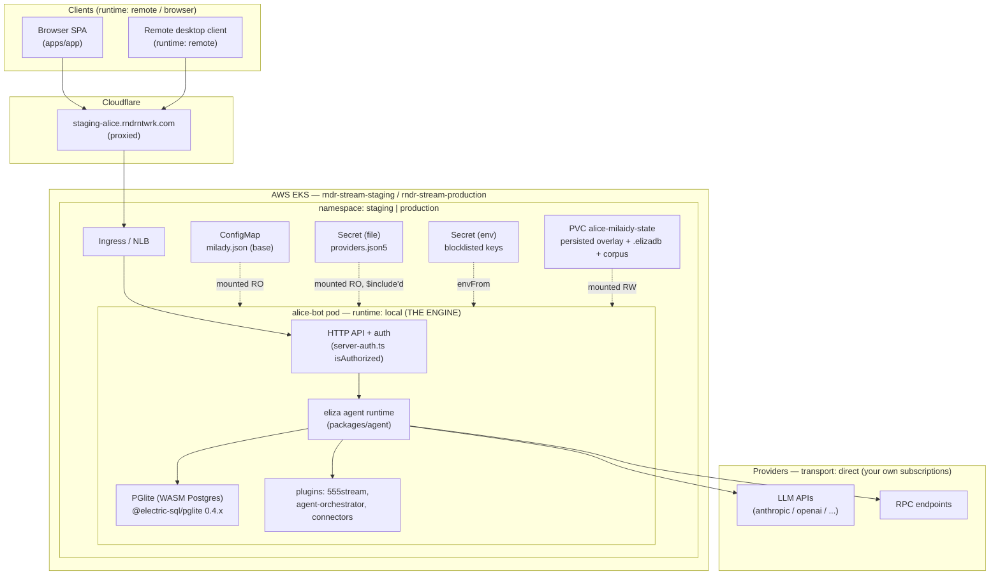
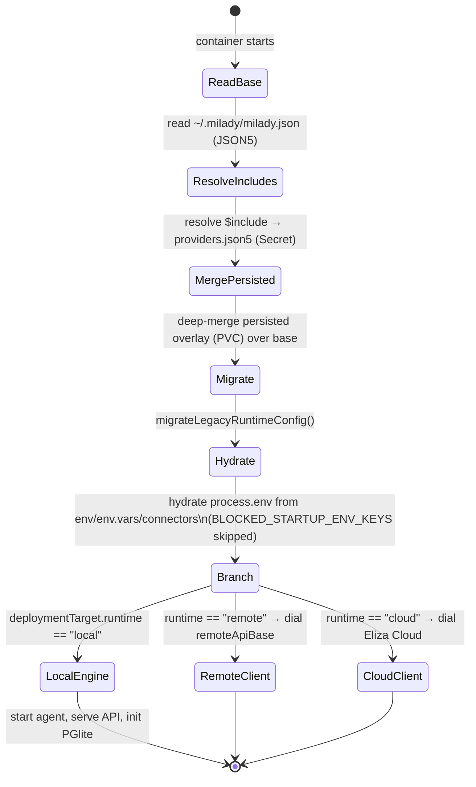
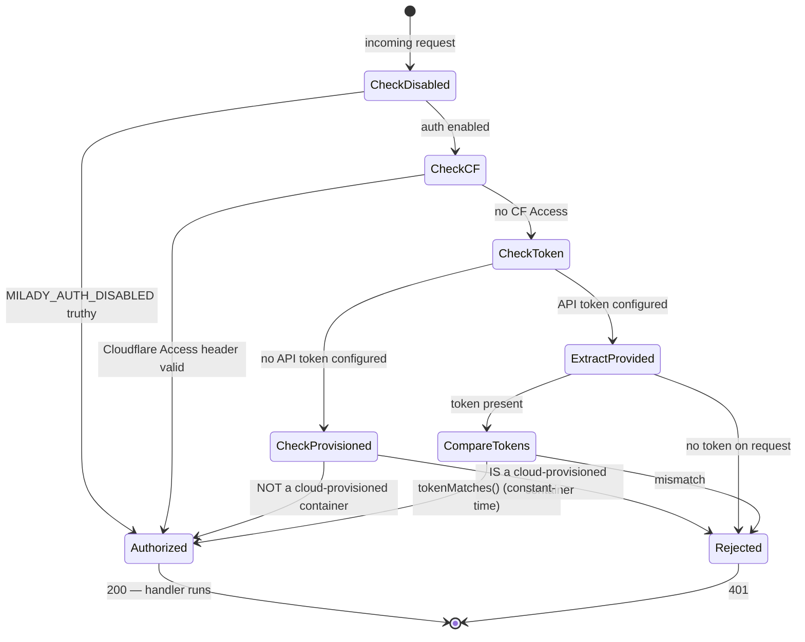
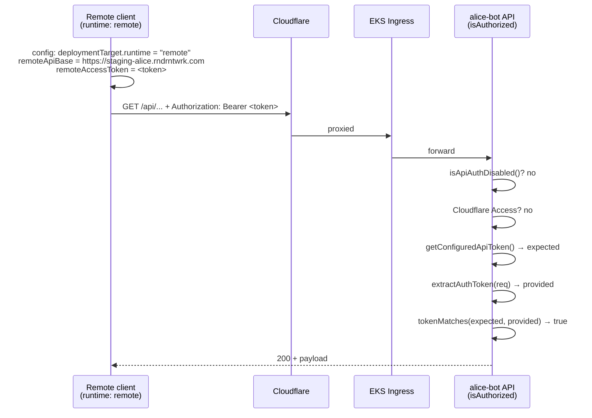
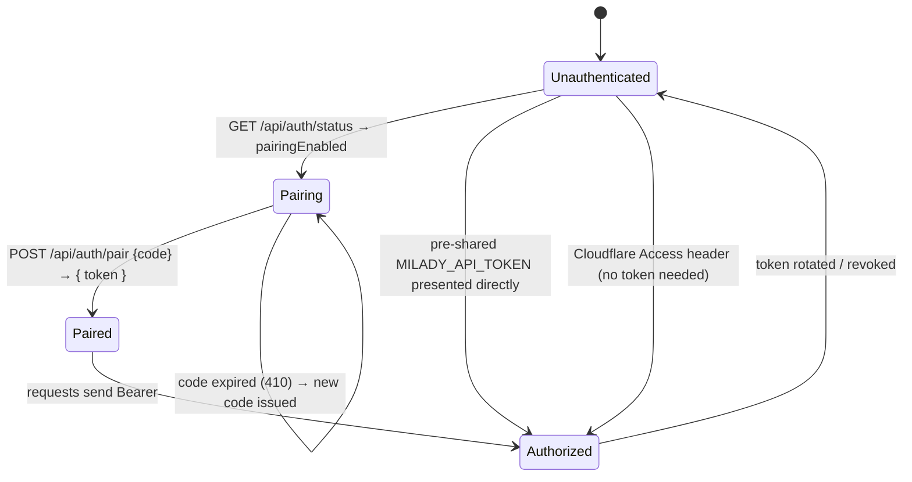

# Alice self-hosted on AWS — eliza "engine" config-model catch-up

| | |
|---|---|
| **Status** | DRAFT — design, pending user review |
| **Date** | 2026-05-14 |
| **Author** | Alice runtime |
| **Type** | Target-state design (the *what*). Migration is a follow-up implementation plan (the *how*). |
| **Scope** | All four config surfaces — engine/runtime mode, remote access & auth, providers & service routing, knowledge & connectors — for Alice self-hosted on AWS EKS. Staging and production. |
| **Supersedes** | Nothing. This is the first canonical config-model design for the self-hosted AWS deployment. |
| **Related** | `internal-ops-docs/operations/2026-05-14-alice-staging-deployment-freeze-and-new-strategy-runbook.md` · `milaidy/PROTECTED_DIVERGENCES.md` (milaidy PR #198) · `555-bot/alice_knowledge/50_operations/CI_CD_PIPELINE.md` |

---

## 0. Summary

Milady/eliza upstream introduced a typed **"engine" config model**: a deployment declares a `runtime` mode (`local` / `cloud` / `remote`), and the new onboarding screen ("WELCOME TO MILADY → I WANT TO RUN IT MYSELF") is just the UI front-end of that model. Alice's self-hosted AWS deployment predates this model — it is driven by ~150 loose environment variables and carries no `milady.json`.

This document specifies the **target state**: Alice running on AWS EKS as a canonical `runtime: "local"` engine, configured through the typed config model the way upstream intends, with **zero regression of Alice functionality**.

It does **not** change any deployment. Per the agreed approach (*"#1 target + #3 process"*): this doc is the target; the migration to reach it is a separate `writing-plans` implementation plan that executes only after this doc is approved **and** after the active staging deployment freeze downgrades (see §1).

The key finding that makes this a clean, no-hack design: eliza's config loader (`packages/agent/src/config/config.ts → loadElizaConfig()`) is **config-file-first** — the file is the source of truth and *hydrates* `process.env`, not the reverse. It supports layered files (`$include` directives + a base/persisted merge) and enforces a hard security boundary (`BLOCKED_STARTUP_ENV_KEYS`). Those three mechanisms map exactly onto Kubernetes-native primitives (ConfigMap, Secret-as-file, Secret-as-env, PVC) with no templating hacks, no init-container string-munging, and no env-var sprawl.

---

## 1. Constraints & sequencing — the deployment freeze

**There is an active deployment freeze on Alice staging**, declared 2026-05-14 (`internal-ops-docs/operations/2026-05-14-alice-staging-deployment-freeze-and-new-strategy-runbook.md`). It freezes exactly the surfaces this migration would touch:

- New image deploys to `alice-bot` in the `staging` namespace.
- Trigger commits to `Render-Network-OS/555-bot:alice`.
- Merges to `rndrntwrk/milaidy:alice` changing `package.json`, the eliza submodule pointer, `apply-alice-eliza-runtime-patches.mjs`, or `apps/app/vite.config.ts`.
- Merges to `Render-Network-OS/stream:staging` changing `deploy-555-bot-staging.sh` or `deploy/webhook/*`.

The freeze lifts when its 7 exit criteria close (worlds/tasks query classified ✅, pglite `overrides` ✅, Protected Divergences Registry ⏳ PR #198, pre-sync CI gate ⛔, baseline snapshot ⏳, 48 h soak ⛔, PR #197 deployed & proven ⏳).

**What this means for this design:**

| Item | Frozen? | Consequence |
|---|---|---|
| **This design document** | No — *"non-deploy docs are not frozen"* (runbook §1.1) | Can be written, reviewed, committed, and merged now. |
| **The config-model migration** (env-vars → `milady.json` + ConfigMap/Secrets) | **Yes** — it changes deploy manifests, runtime config wiring, and requires new image builds + trigger commits | The `writing-plans` migration plan is **sequenced behind the freeze downgrade**. It does not start until exit criteria 1–7 close, or proceeds only under the runbook's break-glass procedure if genuinely urgent. |
| **Production** | Out of scope of the staging freeze runbook entirely (*"Prod is separate. Do not apply any of it to production without a separate plan."* — runbook §8) | This doc's prod track is explicitly its own plan. |

This freeze does not weaken the design — it **validates the chosen approach**. "Spec the target as a document now; implement later through disciplined PRs" is exactly what the freeze and its new-strategy pillars (dedicated PRs, pre-sync gate, Protected Divergences Registry) require. The config-model migration is itself a significant `milaidy:alice` change and will be governed by those pillars.

---

## 2. The reframe — runtime modes are roles, not products

The new onboarding's three choices are **roles a process can play**, not three different products:

| `runtime` | What the process is | Alice's relationship |
|---|---|---|
| **`local`** | **This process *is* the engine.** It runs the agent, serves the API, owns the database, calls providers directly. | **This is Alice on AWS.** "I WANT TO RUN IT MYSELF" = `runtime: "local"`. |
| `remote` | A thin client. It runs no engine; it dials a `local` engine elsewhere over HTTP. | A laptop/desktop client pointed at the AWS engine. Covered in §6. |
| `cloud` | A client that dials Eliza Cloud's hosted engine. | Not used for the self-hosted deployment. |

The new model does **not** replace self-hosting — it **names** it and gives it a typed config surface. Alice's `alice-bot` pod stays exactly what it is today: the engine. Nothing about the compute, the cluster, or the workload moves. What changes is *how the engine is configured* — from ~150 loose env vars to the typed `deploymentTarget` / `serviceRouting` / `linkedAccounts` / `connectors` model.

Verified in code: `migrateLegacyRuntimeConfig()` (`packages/shared/src/contracts/onboarding.ts:1068`) resolves a `DeploymentTargetConfig` from either an explicit `deploymentTarget` key or legacy `cloud.*` fields, and **defaults to `{ runtime: "local" }`** when nothing else is present. A config with no runtime declaration *is already* a local engine. We are formalizing what is already true.

---

## 3. Architecture — Alice on AWS as a `local`-mode engine



The engine is unchanged. The four config-delivery boxes (`ConfigMap`, two `Secret`s, `PVC`) are what this design introduces — they replace the env-var sprawl. They are detailed in §4 and §11.

---

## 4. The config delivery model — the no-hack core

### 4.1 How the loader actually works (verified)

`loadElizaConfig()` (`packages/agent/src/config/config.ts:94`):

1. Resolves the **base config path** — `MILADY_CONFIG_PATH` env, else `~/.{namespace}/{namespace}.json` (namespace defaults to `milady`, so `~/.milady/milady.json`).
2. Resolves the **persisted config path** — `MILADY_PERSIST_CONFIG_PATH` env, else same as base.
3. Reads each as **JSON5** (comments allowed), resolving `$include` directives (`includes.ts`).
4. **Deep-merges** base ← persisted (`mergeConfigRecords`) — persisted overlays base.
5. Runs `migrateLegacyRuntimeConfig()` — upgrades legacy shapes, prunes legacy `cloud.*` routing fields.
6. **Hydrates `process.env`** from `config.env` / `config.env.vars` and from `config.connectors` (via `CONNECTOR_ENV_MAP`) — *"Saved config is the source of truth for settings… it should override any stale value that arrived from .env or the parent shell."*

The config file is the source of truth. Env vars are an **output** of config loading, not the input. That is the entire reason this design is clean.

### 4.2 The hard security boundary (verified)

`packages/agent/src/config/env-vars.ts` defines `BLOCKED_STARTUP_ENV_KEYS`. The loader **refuses** to hydrate these from the config file *by design* — defense-in-depth so a writable config file cannot smuggle process-critical credentials:

```
LD_PRELOAD, NODE_OPTIONS, NODE_PATH, HTTP(S)_PROXY, PATH, HOME, SHELL,
MILADY_API_TOKEN, ELIZA_API_TOKEN, MILADY_WALLET_EXPORT_TOKEN, ELIZA_WALLET_EXPORT_TOKEN,
MILADY_TERMINAL_RUN_TOKEN, ELIZA_TERMINAL_RUN_TOKEN, HYPERSCAPE_AUTH_TOKEN,
EVM_PRIVATE_KEY, SOLANA_PRIVATE_KEY, GITHUB_TOKEN, DATABASE_URL, POSTGRES_URL
```

These **must** arrive as real process environment variables. That is not a limitation to work around — honoring the split *is* the correct design.

### 4.3 The four layers → four Kubernetes primitives

| # | Layer | Source on disk | K8s primitive | Mutability | Contents |
|---|---|---|---|---|---|
| 1 | **Base config** | `~/.milady/milady.json` | **ConfigMap**, mounted read-only | Immutable; rebuilt per release | `deploymentTarget`, `serviceRouting` topology, `connectors` (non-secret fields), `knowledge`, `logging`, `alice` operating policy, the `$include` pointer |
| 2 | **Provider secrets** | `/etc/milady/secrets/providers.json5`, pulled in via `$include` | **Secret**, mounted read-only as a file | Rotated independently of releases | Provider API keys, connector tokens — i.e. the `env.vars` block and secret connector fields. **Non-blocklisted** secrets only. |
| 3 | **Process-critical secrets** | real `process.env` | **Secret**, projected via `envFrom` | Rotated independently of releases | The `BLOCKED_STARTUP_ENV_KEYS` set: `MILADY_API_TOKEN`, `DATABASE_URL` (if used), `EVM_PRIVATE_KEY`, `SOLANA_PRIVATE_KEY`, `GITHUB_TOKEN`, wallet/terminal export tokens |
| 4 | **Runtime overrides** | `MILADY_PERSIST_CONFIG_PATH` on the PVC | **PVC** (`alice-milaidy-state`, already exists) | App-editable; survives restarts | Settings edited through the UI at runtime; deep-merged *over* the base config |

### 4.4 Why `$include` is the right tool (verified)

`includes.ts` implements `{ "$include": "/abs/path.json5" }` (or an array). It is:
- **Deep-merge** aware — included content merges with sibling keys.
- **Circular-safe** — `CircularIncludeError`, `MAX_INCLUDE_DEPTH = 10`.
- **Prototype-pollution-guarded** — `__proto__` / `constructor` / `prototype` blocked.
- **Absolute-path capable** — so it can point straight at a Secret mount path.

This is purpose-built for "immutable base config that pulls in an independently-rotated secret file." No custom tooling needed.

### 4.5 Boot-time config resolution



Alice on AWS always takes the `LocalEngine` branch.

---

## 5. Config surface 1 — Engine & runtime mode

**Type** (`packages/shared/src/contracts/service-routing.ts:74`):

```ts
type DeploymentTargetConfig = {
  runtime: "local" | "cloud" | "remote";
  provider?: "elizacloud" | "remote";
  remoteApiBase?: string;
  remoteAccessToken?: string;
};
```

**Target value for Alice on AWS:**

```json5
{
  // Surface 1 — Engine & runtime mode.
  // Alice IS the engine. No provider, no remoteApiBase — a local engine serves itself.
  "deploymentTarget": {
    "runtime": "local"
  }
}
```

**Note on implicitness:** `migrateLegacyRuntimeConfig()` keeps a `local` default *implicit* for brand-new configs (to avoid churn). It is therefore valid to omit `deploymentTarget` entirely. **This design recommends declaring it explicitly anyway** — a production config should state its runtime mode with zero ambiguity, and `hasExplicitCanonicalRuntimeConfig()` only returns `true` when one of `deploymentTarget` / `linkedAccounts` / `serviceRouting` is explicitly present.

---

## 6. Config surface 2 — Remote access & auth

A `local` engine still exposes its HTTP API. Auth is enforced by `isAuthorized()` (`packages/agent/src/api/server-auth.ts:149`). This surface is mostly **environment + behavior**, not a large config block — but it is the surface the user explicitly asked for "state diagrams and sequences" on.

### 6.1 The auth decision tree (verified — `server-auth.ts:149`)



This is why the staging 401s on `/api/config`, `/api/status`, etc. are **correct behavior** — an API token is configured, the browser had not yet completed pairing, so `extractAuthToken(req)` returned nothing → `401`. The fix is to complete the pairing flow (§6.3), not to disable auth.

### 6.2 Sequence — `remote`-mode client → `local` AWS engine (token auth)



### 6.3 Sequence — pairing-code flow (browser client, no pre-shared token)

Verified against `packages/agent/src/api/auth-routes.ts`:

```mermaid
sequenceDiagram
    participant UI as Browser SPA
    participant API as alice-bot API
    participant LOG as Pod logs
    UI->>API: GET /api/auth/status
    API->>API: ensurePairingCode()
    API->>LOG: pairing code written to server logs
    API-->>UI: { required: true, pairingEnabled: true, expiresAt }
    Note over UI: operator reads the code from `kubectl logs`
    UI->>API: POST /api/auth/pair { code }
    API->>API: rate-limit by IP → ok
    API->>API: code not expired → ok
    API->>API: crypto.timingSafeEqual(expected, provided) → ok
    API->>API: clearPairing()
    API-->>UI: { token }
    Note over UI: UI stores token; subsequent requests send Authorization: Bearer <token>
    UI->>API: GET /api/config + Authorization: Bearer <token>
    API-->>UI: 200
```

`POST /api/auth/pair` returns `403`/`400` if pairing is disabled, the container is cloud-provisioned, Cloudflare Access is active, or no token is configured; `429` on rate-limit; `410` on an expired code.

### 6.4 Auth state machine (client perspective)



### 6.5 Auth configuration — where each value lives

| Value | Env var | Delivery layer (§4.3) | Notes |
|---|---|---|---|
| Inbound API token | `MILADY_API_TOKEN` (alias `ELIZA_API_TOKEN`) | **Layer 3** — Secret via `envFrom` (blocklisted) | The long-lived service token. Never in the config file. |
| API bind host | `MILADY_API_BIND` (alias `ELIZA_API_BIND`) | Layer 1 — base config `env.vars`, or K8s env | A non-loopback bind with no token logs a warning and auto-generates a temporary per-process token — set `MILADY_API_TOKEN` explicitly so the token is stable and known. |
| Auth disable switch | `MILADY_AUTH_DISABLED` / `MILAIDY_AUTH_DISABLED` | — | **Never set in production.** Listed only so the migration plan explicitly asserts it is absent. |
| Cloudflare Access | (header-based; `cloudflare-access-auth.ts`) | Ingress / Cloudflare config | Alternative to token auth for the public endpoint. |

**Recommended production posture:** Cloudflare Access in front of the public endpoint **and** `MILADY_API_TOKEN` set for programmatic/`remote`-client access. `MILADY_AUTH_DISABLED` absent.

---

## 7. Config surface 3 — Providers & service routing

**Types** (`packages/shared/src/contracts/service-routing.ts`):

```ts
type ServiceCapability = "llmText" | "tts" | "media" | "embeddings" | "rpc";
type ServiceTransport  = "direct" | "cloud-proxy" | "remote";

type ServiceRouteConfig = {
  backend?: string;            // provider id, e.g. "anthropic", "openai", "elizacloud"
  transport?: ServiceTransport;
  accountId?: string;          // references a key in linkedAccounts
  primaryModel?: string;
  nanoModel?: string; smallModel?: string; mediumModel?: string;
  largeModel?: string; megaModel?: string;
  remoteApiBase?: string;
  // per-step pipeline overrides:
  responseHandlerModel?: string; shouldRespondModel?: string;
  actionPlannerModel?: string; plannerModel?: string;
  responseModel?: string; mediaDescriptionModel?: string;
};

type ServiceRoutingConfig = Partial<Record<ServiceCapability, ServiceRouteConfig>>;

type LinkedAccountConfig = {
  status?: "linked" | "unlinked";
  source?: "api-key" | "oauth" | "credentials" | "subscription";
  userId?: string;
  organizationId?: string;
};
type LinkedAccountsConfig = Record<string, LinkedAccountConfig>;
```

### 7.1 The principle for a self-hosted `local` engine

For `runtime: "local"`, **every capability routes `transport: "direct"`** — the engine calls each provider directly with *your own* credentials. `transport: "cloud-proxy"` (route through Eliza Cloud) and `transport: "remote"` (route through another engine) are for the `cloud` / `remote` roles. This is the technical meaning of "using our old subscriptions": your existing provider subscriptions become `direct` routes whose keys live in the `$include`'d provider secret, referenced by `linkedAccounts`.

### 7.2 Provider catalog (verified — `onboarding.ts:208 ONBOARDING_PROVIDER_CATALOG`)

The `backend` value for an `llmText` route is one of these provider ids; each has a known env key for its API key:

| `backend` id | API-key env var | Plugin |
|---|---|---|
| `anthropic` | `ANTHROPIC_API_KEY` | `@elizaos/plugin-anthropic` |
| `openai` | `OPENAI_API_KEY` | `@elizaos/plugin-openai` |
| `openrouter` | `OPENROUTER_API_KEY` | `@elizaos/plugin-openrouter` |
| `gemini` | `GOOGLE_GENERATIVE_AI_API_KEY` | `@elizaos/plugin-google-genai` |
| `grok` | `XAI_API_KEY` | `@elizaos/plugin-xai` |
| `groq` | `GROQ_API_KEY` | `@elizaos/plugin-groq` |
| `deepseek` | `DEEPSEEK_API_KEY` | `@elizaos/plugin-deepseek` |
| `mistral` | `MISTRAL_API_KEY` | `@elizaos/plugin-mistral` |
| `together` | `TOGETHER_API_KEY` | `@elizaos/plugin-together` |
| `zai` | `ZAI_API_KEY` | `@homunculuslabs/plugin-zai` |
| `ollama` | (none — local) | `@elizaos/plugin-ollama` |
| `anthropic-subscription` | (none — OAuth) | `@elizaos/plugin-anthropic` |
| `openai-subscription` | (none — OAuth) | `@elizaos/plugin-openai` |
| `elizacloud` | (none) | `@elizaos/plugin-elizacloud` |

### 7.3 Target value (illustrative — actual `backend`/model ids set during migration from the live deployment)

```json5
{
  // Surface 3 — Providers & service routing.
  // Every route is transport:"direct" — this engine calls providers itself.
  "serviceRouting": {
    "llmText": {
      "backend": "anthropic",          // ← set from the live deployment's configured provider
      "transport": "direct",
      "accountId": "anthropic-primary", // ← references linkedAccounts below
      "smallModel": "claude-haiku-4-5",  // ← actual model ids confirmed during migration
      "largeModel": "claude-opus-4-7"
    },
    "embeddings": { "backend": "openai", "transport": "direct", "accountId": "openai-primary" },
    "tts":        { "backend": "openai", "transport": "direct", "accountId": "openai-primary" },
    "media":      { "backend": "openai", "transport": "direct", "accountId": "openai-primary" },
    "rpc":        { "backend": "<rpc-provider>", "transport": "direct", "accountId": "<rpc-account>" }
  },

  // linkedAccounts records WHICH accounts exist and how they authenticate.
  // The actual KEY VALUES live in the $include'd provider secret (§10), keyed by env var.
  "linkedAccounts": {
    "anthropic-primary": { "status": "linked", "source": "subscription" },
    "openai-primary":    { "status": "linked", "source": "api-key" }
  }
}
```

`linkedAccounts` is metadata (status/source/owner); it does **not** hold secret values. The keys themselves are in Layer 2 (the provider secret), addressed by the provider's env var from §7.2.

---

## 8. Config surface 4 — Knowledge & connectors

### 8.1 Knowledge

Alice's corpus lives in `555-bot/alice_knowledge/` and is loaded by `seed-knowledge.ts`, which streams NDJSON to `POST /api/knowledge/documents/bulk`.

**Target model:** knowledge seeding is a **post-deploy Kubernetes Job**, not a runtime env-var toggle. The Job runs `seed-knowledge.ts` against the freshly-rolled engine once it is healthy.

The `SKIP_KNOWLEDGE_SEED` / `ALICE_KNOWLEDGE_SEED_ENABLED` environment variables are **dead code** — they appear nowhere in the runtime. The migration deletes them rather than carrying them forward.

The `ElizaConfig.knowledge` block (`KnowledgeConfig`) carries non-secret knowledge settings (e.g. `contextualEnrichment`, `docsPath`) and belongs in Layer 1 (base config). The "seed back our knowledge" request resolves to: **run the knowledge Job after the migration deploy**.

### 8.2 Connectors

**Type** (`packages/agent/src/config/types.eliza.ts:669`): `ConnectorConfig = { [key: string]: ConnectorFieldValue }`, under `ElizaConfig.connectors: Record<string, ConnectorConfig>`.

Connectors are configured in object form. `collectConnectorEnvVars()` + `CONNECTOR_ENV_MAP` (`env-vars.ts`) auto-derive the plugin env vars from the structured config — you do **not** hand-set `DISCORD_API_TOKEN` etc.; you set `connectors.discord.token` and the loader derives it.

```json5
{
  // Surface 4 — Connectors. Object form; loader auto-derives plugin env vars.
  // managed:false → self-hosted runs its own connectors (not Eliza-Cloud-managed).
  "connectors": {
    "discord": {
      "enabled": true,
      "managed": false,
      "token": "${see providers.json5}"   // secret field → lives in the $include'd secret
    }
    // telegram, slack, etc. follow the same shape
  }
}
```

Non-secret connector fields (`enabled`, `managed`, policy fields) live in Layer 1. Secret connector fields (`token`, `botToken`, `apiKey`, passwords) live in Layer 2 (`providers.json5`), merged in by `$include`.

`CONNECTOR_ENV_MAP` currently covers: `bluebubbles`, `discord`, `discordLocal`, `telegram`, `telegramAccount`, `slack`, `signal`, `imessage`, `whatsapp`, `msteams`, `mattermost`, `googlechat`, `blooio`.

The bundled Alice streaming/arcade plugin `@rndrntwrk/plugin-555stream` is **not** a connector in this map — it is a core bundled plugin and is preserved as-is (see §14).

---

## 9. The complete canonical `milady.json` (base config — Layer 1)

This is the assembled base config — what ships in the ConfigMap. Secret values are **not** here; they arrive via `$include` (Layer 2) and `envFrom` (Layer 3). Model ids, the exact provider, and connector list are finalized during migration from the live deployment's actual settings (§12).

> `meta` (`onboardingComplete`, `lastTouchedVersion`, `lastTouchedAt`) is **runtime-managed** — the engine writes it via `saveElizaConfig()` into the persisted overlay (Layer 4). It is intentionally absent from this base ConfigMap.

```json5
{
  // ── Surface 1 — Engine & runtime mode ──────────────────────────────
  "deploymentTarget": { "runtime": "local" },

  // ── Surface 3 — Providers & service routing ────────────────────────
  "serviceRouting": {
    "llmText":    { "backend": "anthropic", "transport": "direct", "accountId": "anthropic-primary",
                    "smallModel": "<model>", "largeModel": "<model>" },
    "embeddings": { "backend": "openai",    "transport": "direct", "accountId": "openai-primary" },
    "tts":        { "backend": "openai",    "transport": "direct", "accountId": "openai-primary" },
    "media":      { "backend": "openai",    "transport": "direct", "accountId": "openai-primary" },
    "rpc":        { "backend": "<rpc>",     "transport": "direct", "accountId": "<rpc-account>" }
  },
  "linkedAccounts": {
    "anthropic-primary": { "status": "linked", "source": "subscription" },
    "openai-primary":    { "status": "linked", "source": "api-key" }
  },

  // ── Surface 4 — Knowledge & connectors ─────────────────────────────
  "knowledge": {
    // non-secret knowledge settings (KnowledgeConfig); corpus itself is seeded by the post-deploy Job
  },
  "connectors": {
    // non-secret connector fields only; secret fields come from providers.json5 via $include
    // "discord": { "enabled": true, "managed": false }
  },

  // ── Alice operating policy (Alice-specific divergence — PRESERVE) ───
  "alice": {
    "ingest":  { "enabled": true, "sources": ["github", "discord", "telegram", "slack", "gmail", "ops", "stream555"],
                 "knowledgeProjection": true },
    "corpus":  { "enabled": true },
    "coding":  { "stagingDeploys": "approval", "productionDeploys": "approval", "deployRail": "webhook" }
  },

  // ── Non-secret env + the secret include ────────────────────────────
  "env": {
    "vars": {
      // non-secret process env only (e.g. MILADY_API_BIND, log levels).
      // Anything in BLOCKED_STARTUP_ENV_KEYS is intentionally absent here — see Layer 3.
    }
  },

  "logging": { "level": "info" },

  // Pull in the independently-rotated provider secret (Layer 2).
  // Absolute path = the Secret mount. Deep-merged into this config at load.
  "$include": "/etc/milady/secrets/providers.json5"
}
```

---

## 10. The secret files

### 10.1 Layer 2 — `providers.json5` (`$include`'d; K8s Secret mounted as a file)

Contains only **non-blocklisted** secrets — provider API keys and connector tokens. Merged into the base config by `$include`. The loader hydrates these into `process.env` because they are *not* in `BLOCKED_STARTUP_ENV_KEYS`.

```json5
{
  "env": {
    "vars": {
      "ANTHROPIC_API_KEY": "sk-ant-...",
      "OPENAI_API_KEY": "sk-...",
      "OPENROUTER_API_KEY": "sk-or-..."
      // ...one entry per provider in serviceRouting
    }
  },
  "connectors": {
    // secret connector fields only
    // "discord": { "token": "..." }
  }
}
```

### 10.2 Layer 3 — blocklisted secrets (K8s Secret projected via `envFrom`)

These **cannot** travel through the config file (`BLOCKED_STARTUP_ENV_KEYS`). They are real process env, set by the Deployment's `envFrom`:

```
MILADY_API_TOKEN              # inbound API auth token (§6)
DATABASE_URL / POSTGRES_URL   # only if Alice ever uses external Postgres instead of PGlite
EVM_PRIVATE_KEY               # wallet
SOLANA_PRIVATE_KEY            # wallet
GITHUB_TOKEN                  # alice.coding repos access
MILADY_WALLET_EXPORT_TOKEN    # if wallet export is enabled
MILADY_TERMINAL_RUN_TOKEN     # if terminal-run is enabled
```

---

## 11. AWS delivery — Kubernetes manifest shapes

Illustrative shapes. The migration plan produces the real manifests (as a `kustomize` overlay consistent with the existing staging deploy).

```yaml
# ConfigMap — Layer 1 (base config). Rebuilt per release.
apiVersion: v1
kind: ConfigMap
metadata: { name: alice-milady-config, namespace: staging }
data:
  milady.json: |
    { /* the §9 base config */ }
---
# Secret — Layer 2 (provider secrets, $include'd as a file).
apiVersion: v1
kind: Secret
metadata: { name: alice-provider-secrets, namespace: staging }
type: Opaque
stringData:
  providers.json5: |
    { /* the §10.1 provider secret */ }
---
# Secret — Layer 3 (blocklisted, projected as real env).
apiVersion: v1
kind: Secret
metadata: { name: alice-process-secrets, namespace: staging }
type: Opaque
stringData:
  MILADY_API_TOKEN: "..."
  EVM_PRIVATE_KEY: "..."
  # ...the §10.2 set
---
# Deployment — wiring (excerpt)
spec:
  template:
    spec:
      containers:
        - name: alice-bot
          env:
            - { name: MILADY_CONFIG_PATH,         value: /etc/milady/config/milady.json }
            - { name: MILADY_PERSIST_CONFIG_PATH, value: /milaidy/workspace/.milady/milady.json }  # on the PVC
          envFrom:
            - secretRef: { name: alice-process-secrets }      # Layer 3
          volumeMounts:
            - { name: milady-config,   mountPath: /etc/milady/config,  readOnly: true }   # Layer 1
            - { name: provider-secret, mountPath: /etc/milady/secrets, readOnly: true }   # Layer 2
            - { name: milady-state,    mountPath: /milaidy }                              # Layer 4 (PVC)
      volumes:
        - { name: milady-config,   configMap: { name: alice-milady-config } }
        - { name: provider-secret, secret:    { secretName: alice-provider-secrets } }
        - { name: milady-state,    persistentVolumeClaim: { claimName: alice-milaidy-state } }
```

Both clusters (`rndr-stream-staging`, `rndr-stream-production`) have private-only API endpoints — all `kubectl` goes through the deployer EC2 over SSM, exactly as the deploy pipeline already does. This design changes *what* is applied, not *how* it is applied.

---

## 12. The env-var → config migration map ("the entire configs for the old setup")

The current deployment has no committed `milady.json`; it is driven by ~150 environment variables set on the Deployment. The exact list can only be enumerated from the live Deployment manifest — **this is the migration plan's first task** (read the live `alice-bot` Deployment env, via the deploy manifest or a break-glass read). This design provides the **deterministic mapping rules** that turn that list into the typed config:

| Env var pattern | Destination | Layer | Rule |
|---|---|---|---|
| `BLOCKED_STARTUP_ENV_KEYS` (e.g. `MILADY_API_TOKEN`, `EVM_PRIVATE_KEY`, `SOLANA_PRIVATE_KEY`, `GITHUB_TOKEN`, `DATABASE_URL`) | `alice-process-secrets` Secret | **3** | Stays a real env var — never enters the config file. |
| Provider API keys (`ANTHROPIC_API_KEY`, `OPENAI_API_KEY`, … per §7.2) | `providers.json5` → `env.vars` | **2** | Plus a `serviceRouting` route + `linkedAccounts` entry referencing it. |
| Connector secrets (`DISCORD_API_TOKEN`, `TELEGRAM_BOT_TOKEN`, `SLACK_BOT_TOKEN`, … per `CONNECTOR_ENV_MAP`) | `providers.json5` → `connectors.<name>.<field>` | **2** | Loader re-derives the env var via `CONNECTOR_ENV_MAP`. |
| Connector non-secret fields (`*_ENABLED`, `*_DM_POLICY`, URLs, …) | base `milady.json` → `connectors.<name>` | **1** | Structured connector config. |
| Path / namespace (`MILADY_CONFIG_PATH`, `MILADY_PERSIST_CONFIG_PATH`, `MILADY_STATE_DIR`, `MILADY_NAMESPACE`) | Deployment `env:` | K8s | These *locate* the config; they cannot live *in* it. Keep as plain Deployment env. |
| API bind / non-secret runtime flags (`MILADY_API_BIND`, log levels) | base `milady.json` → `env.vars` | **1** | Non-secret process env. |
| Dead vars (`SKIP_KNOWLEDGE_SEED`, `ALICE_KNOWLEDGE_SEED_ENABLED`) | — | — | **Deleted.** Confirmed dead code — referenced nowhere in the runtime. |
| Legacy `cloud.*` derived vars | — | — | `migrateLegacyRuntimeConfig()` prunes legacy `cloud.*` routing; re-express as `deploymentTarget` / `serviceRouting`. |

The output of applying these rules to the live env list is the concrete §9 + §10 files. The mapping is mechanical; the only non-mechanical input is the live env list itself.

---

## 13. Gap audit — staging & production

### 13.1 Staging — `rndr-stream-staging` / `staging` / `alice-bot`

| | |
|---|---|
| **Status** | ✅ LIVE & healthy. Image `sha-e1d1b5a-milaidy-1e9e5db`; `{"database":"ok","agentState":"running"}`. PGlite version-skew + stale-lock both fixed (PRs #195/#196/#197). |
| **Config** | ⚠️ ~150 loose env vars; no `milady.json`. Not yet on the typed model. |
| **Knowledge** | ⚠️ Needs re-seed. |
| **Gap to target** | Migrate env-var sprawl → ConfigMap + 2 Secrets + PVC overlay (§4); run the knowledge Job (§8.1). |
| **Blocker** | The active freeze (§1). Migration sequences behind freeze downgrade. |

### 13.2 Production — `rndr-stream-production`

| | |
|---|---|
| **Cluster** | ✅ ACTIVE — created 2026-04-30, 4 node groups (`app`/`gpu`/`media`/`system`), private-only API, **separate VPC** (not reachable from the staging deployer EC2). |
| **Alice workload** | ❌ **Not deployed.** No `alice` deployment found; deployer EC2 cannot reach the prod cluster API. |
| **Deploy path** | ❌ Scaffold only — `deploy-555-bot-production.sh` is a 668-byte stub; `bot-aws-production-webhook-deployer.service` exists as a repo file but is **not installed** as a systemd unit. |
| **Gap to target** | The bulk of prod work: (a) establish kube access to the private prod cluster (a deployer/bastion inside the prod VPC); (b) wire the prod deploy path (install the prod webhook deployer or a CI-driven deploy); (c) port the staging manifests to a `production` kustomize overlay; (d) deliver the prod config layers (§9–§11) with prod secrets; (e) deploy alice; (f) run the knowledge Job. |
| **Blocker** | Needs its own plan — the staging freeze runbook explicitly excludes prod (§8 of the runbook). |

---

## 14. Non-regression guarantees — "don't lose any Alice functionality"

The authoritative non-regression source is **`milaidy/PROTECTED_DIVERGENCES.md`** (milaidy PR #198) — the machine-verifiable registry of every intentional alice-vs-upstream divergence. This design **does not restate it**; it **defers to it**. The migration plan must not touch any surface that registry protects without registering the change.

Beyond that registry, this config-model migration must explicitly preserve:

| Surface | Why it must survive |
|---|---|
| `@elizaos/plugin-agent-orchestrator` in `CORE_PLUGINS` | Alice divergence (upstream comments it out as opt-in). PR #197's `agent-orchestrator-compat.ts` `require()` fix depends on it loading. |
| `@rndrntwrk/plugin-555stream` bundled | Alice's streaming/arcade plugin — core functionality. |
| The `alice` config block (`AliceOperationalConfig` — `ingest` / `corpus` / `coding`) | Alice's production operating policy: cross-channel ingest sources, corpus roots, and coding/deploy autonomy. Carried into the base config (§9). |
| The eliza source-main patch chain (`apply-alice-eliza-runtime-patches.mjs`) | PRs #127–#197; protected by `PROTECTED_DIVERGENCES.md` Category 4. |
| PGlite self-heal (`cleanStalePgliteClientLock`) + `0.4.x` pins | PRs #195/#196/#197; `PROTECTED_DIVERGENCES.md` Categories 1 & 2. |
| The alice knowledge corpus | Re-seeded by the §8.1 Job — **migrated, not dropped**. |

**This migration introduces NEW intentional divergences** that the migration PR must add to `PROTECTED_DIVERGENCES.md` in the same PR (per that registry's rule #4):

1. The ConfigMap/Secret/PVC config-delivery model (the move off env-var sprawl).
2. The `$include: /etc/milady/secrets/providers.json5` convention.
3. The `MILADY_PERSIST_CONFIG_PATH`-on-PVC overlay layer.

---

## 15. What this design produces

Per the agreed approach (**#1 target + #3 process**):

- **This document is the target.** The canonical `local`-mode self-hosted AWS deployment: the config-delivery model, the four config surfaces with verified JSON shapes, the remote-access diagrams, the env-var migration map, and the staging + prod gap audit.
- **The migration is a follow-up `writing-plans` implementation plan**, with two tracks:
  - **Track A — Staging.** Read the live env list (§12 first task) → produce the concrete §9/§10 files → build the ConfigMap + 2 Secrets + PVC overlay → cut over the `alice-bot` Deployment → run the knowledge Job → verify per the freeze runbook §5. **Sequenced behind the freeze downgrade.**
  - **Track B — Production.** The §13.2 gap list — kube access, deploy-path wiring, `production` overlay, prod config layers, first deploy, knowledge Job. **Its own plan; prod is excluded from the staging freeze runbook.**
  - Track A de-risks Track B: the config model is proven on staging before prod's deploy path is even wired.
- **Nothing deploys from this document.** It is a design. The migration plan, reviewed and approved separately, is what changes infrastructure — and only when the freeze allows.

---

## 16. Open decisions for the migration plan

These are genuine choices the migration plan must settle (they depend on operational preference or live-system facts not determinable from the repos):

1. **Live env-var inventory.** The exact ~150-var list — obtainable only from the live `alice-bot` Deployment. First task of Track A.
2. **Secret backend.** Plain K8s Secrets vs. External Secrets Operator / AWS Secrets Manager. This design assumes plain K8s Secrets; an ESO-backed approach is a clean extension (Layers 2 & 3 become `ExternalSecret`s) and may be preferred for rotation.
3. **`kustomize` layout.** Whether the new ConfigMap/Secrets become a new base + `staging`/`production` overlays, or extend the existing staging deploy structure. Depends on the current `stream:staging` deploy layout.
4. **Public-endpoint auth posture for prod.** Cloudflare Access + token (recommended, §6.5) vs. token-only — an ops decision.
5. **Knowledge Job trigger.** Post-deploy Job run manually vs. a Helm/kustomize post-install hook vs. an idempotent init step. Depends on how re-seeds should behave on every roll.
