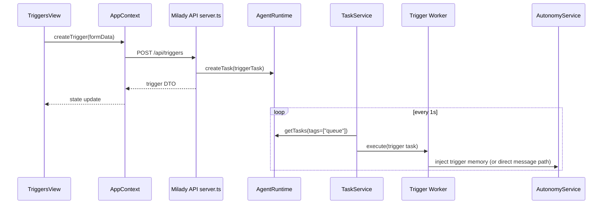

# Current System Control-Flow Map (Ground Truth)

This document maps the current control flow that trigger implementation must fit into.

It focuses on:

- Eliza task scheduling and action execution internals
- Autonomy runtime behavior
- Milady runtime/plugin boot path
- Milady API server request dispatch
- Milady frontend routing and data loading

---

## 1) Runtime Boot Path: Milady vs Core Assumptions

## 1.1 Milady startup path (`milady/src/runtime/eliza.ts`)

Current high-level flow:

1. Load config and apply environment propagation.
2. Force runtime compatibility guardrails (including bootstrap bypass):
   - `IGNORE_BOOTSTRAP=true`
3. Resolve plugin list (core + optional + installed + drop-in).
4. Build `AgentRuntime` with:
   - `createMiladyPlugin(...)`
   - resolved plugin instances
5. Pre-register critical plugins (`plugin-sql`, `plugin-local-embedding`) to avoid startup race.
6. Call `runtime.initialize()`.
7. In headless mode: return runtime to API server.
8. In non-headless mode: start API server and CLI loop.

### Practical trigger implication

The trigger plan cannot assume "core bootstrap plugin path only." Milady startup intentionally diverges from that path.

---

## 1.2 Core capability composition (`eliza/packages/typescript/src`)

There are two overlapping capability structures in current code:

- `bootstrap/*` capability stack
- `basic-capabilities/*` + `advanced-capabilities/*` stack

Both expose actions/providers/services patterns. Trigger implementation must choose a canonical insertion point and verify Milady runtime actually surfaces it.

---

## 2) Task Scheduling Control Flow

## 2.1 TaskService tick loop (`services/task.ts`)

TaskService behavior today:

1. Timer ticks every 1000ms.
2. Calls `runtime.getTasks({ tags: ["queue"] })`.
3. Validates each task:
   - has id
   - worker exists
   - optional worker `validate(...)` passes
4. For each validated task:
   - if no `repeat` tag: execute immediately then delete
   - if `repeat`:
     - evaluate interval elapsed from `updatedAt` fields
     - enforce optional `blocking` semantics
5. `executeTask(...)`:
   - mark task id in `executingTasks` set
   - for repeating tasks, update `metadata.updatedAt` before worker call
   - run worker `execute(...)`
   - delete one-off task after execute
   - clear executing marker in finally

### Important reality constraints

- `dueAt` is not part of current due logic.
- `executingTasks` lock is process-local only.
- worker exceptions do not auto-delete task; repeat scheduling behavior depends on metadata state.

---

## 2.2 Runtime task primitives (`runtime.ts`, adapter interfaces)

Task methods are pass-through to adapter:

- `createTask(...)` (defaults `worldId` to `agentId` when absent)
- `getTasks(...)`
- `getTask(...)`
- `updateTask(...)`
- `deleteTask(...)`
- task workers managed by runtime `registerTaskWorker(...)` + `getTaskWorker(...)`

### Adapter semantics (current in-memory adapter reference)

- `getTasks({ tags })` uses AND semantics for tags.
- no default sort ordering guarantee.

---

## 3) Action Control Flow (Selection -> Execution)

## 3.1 Prompt-time action filtering

`ACTIONS` provider path:

1. Retrieve candidates from `ActionFilterService` or full action list.
2. Run `action.validate(...)` in provider stage.
3. Build prompt sections:
   - names
   - descriptions
   - examples
   - call examples

### Consequence

Validation here shapes prompt candidates, but does not alone guarantee execution safety.

---

## 3.2 Runtime execution (`runtime.processActions(...)`)

Execution path:

1. Parse model-selected `actions` and optional `<params>`.
2. Resolve action by name/simile/fuzzy matching.
3. Build handler options and optional param validation diagnostics.
4. Emit `ACTION_STARTED`.
5. Execute action handler.
6. Normalize result to `ActionResult`.
7. Merge `values`/`data` into accumulated state.
8. Emit `ACTION_COMPLETED`.
9. Store action memory + adapter log.

### Critical nuance

`processActions` does not re-run `action.validate(...)` before handler call.  
Therefore handler-level guardrails are mandatory for trigger-creation actions.

---

## 4) Autonomy Control Flow

## 4.1 Service lifecycle (`autonomy/service.ts`)

Autonomy service flow:

1. Register autonomy task worker (name: `AUTONOMY_THINK`).
2. Ensure autonomous context objects exist (world/room/entity).
3. If autonomy enabled:
   - create recurring autonomy task (`queue + repeat + autonomy`)
4. On each scheduled execution:
   - run autonomous think pipeline
   - create autonomous memory message
   - process via normal runtime message pipeline

### Trigger relevance

Triggers that inject into autonomy must preserve:

- room/entity invariants
- autonomous prompt shaping and continuity
- circuit breaker/backoff behavior

---

## 4.2 Pause/Resume interactions

Milady API pause/resume endpoints call autonomy service enable/disable methods.  
A trigger design that "wakes autonomy" must avoid conflicting with user pause/resume intent.

---

## 5) Milady API Server Control Flow

## 5.1 Request dispatch model (`milady/src/api/server.ts`)

`handleRequest(...)` is a single ordered chain of `if (method/pathname)` blocks.

Dispatch characteristics:

- order-dependent matching
- mix of exact matches and `pathname.startsWith(...)`
- request auth/cors checks before endpoint logic

### Trigger endpoint implication

Route placement and parsing order are correctness-critical; shadowing bugs are easy to introduce.

---

## 5.2 Existing agent control route flow

Current `/api/agent/*` routes:

- `start`: state update + `autonomy.enableAutonomy()`
- `pause`: state update + `autonomy.disableAutonomy()`
- `resume`: state update + `autonomy.enableAutonomy()`
- `stop`: state update + `autonomy.disableAutonomy()`

These are the strongest existing API examples for trigger-autonomy interaction behavior.

---

## 5.3 Runtime availability checks

Multiple endpoints (for example workbench routes) return `503` if `state.runtime` is unavailable.  
Trigger routes should follow the same contract.

---

## 6) Milady Frontend Control Flow

## 6.1 Navigation and routing

Files:

- `apps/app/src/navigation.ts`
- `apps/app/src/components/Nav.tsx`
- `apps/app/src/App.tsx`

Current behavior:

- tab union + tab-to-path map in `navigation.ts`
- `Nav.tsx` applies additional `validTabs` filtering
- `App.tsx` routes non-chat tabs via `ViewRouter`

### Trigger page implication

Adding a tab requires changes in all three places plus any tab-conditional preloads in AppContext.

---

## 6.2 App state lifecycle (`AppContext.tsx`)

Startup path in `useEffect`:

1. auth/onboarding bootstrap with retry
2. conversation load
3. workbench load
4. websocket connect (`client.connectWs()`)
5. status event subscription (`onWsEvent("status", ...)`)
6. load status + wallet + cloud polling
7. load current tab from URL and run tab-specific preload hooks

### Trigger page implication

Trigger state requires:

- new state slots in AppContext
- load/create/update/delete/execute handlers
- tab init preload and optional interval polling

---

## 6.3 API client flow (`api-client.ts`)

Client behavior:

- typed `fetch(...)` wrapper
- WS event multiplexer by event type string
- methods organized by domain (`/api/skills`, `/api/plugins`, etc.)

Trigger API methods should follow this pattern for consistency and testability.

---

## 7) End-to-End Control Flow for the Proposed Trigger Lifecycle (Current Constraints)

Below is the required flow shape implied by current architecture.

---

## 8) Coupling and Breakpoint Map

These are the key coupling edges where trigger work can fail:

1. **Capability registration edge**
   - action implemented but not reachable in Milady runtime due capability path mismatch.

2. **Task scheduling edge**
   - trigger data model uses fields TaskService does not read.

3. **Route dispatch edge**
   - trigger route shadowed by broader route block.

4. **Frontend synchronization edge**
   - trigger state stale after background execution.

5. **Autonomy injection edge**
   - trigger message injected without explicit policy for busy/autonomy-paused states.

---

## 9) Invariants Any Trigger Implementation Must Preserve

1. Existing `/api/agent/*` pause/resume semantics remain authoritative.
2. TaskService one-off vs repeating semantics remain deterministic.
3. Action handler hard constraints do not rely only on prompt-time filtering.
4. Trigger API route ordering is deterministic and covered by tests.
5. Frontend trigger state has a defined consistency model (polling or push).

---

## 10) Summary

Current architecture is capable of supporting triggers, but only if the implementation explicitly respects:

- Milady's runtime boot/capability path,
- TaskService's actual due semantics,
- action execution realities,
- API route ordering,
- frontend consistency strategy.

The next phase docs define implementation steps under these constraints.

