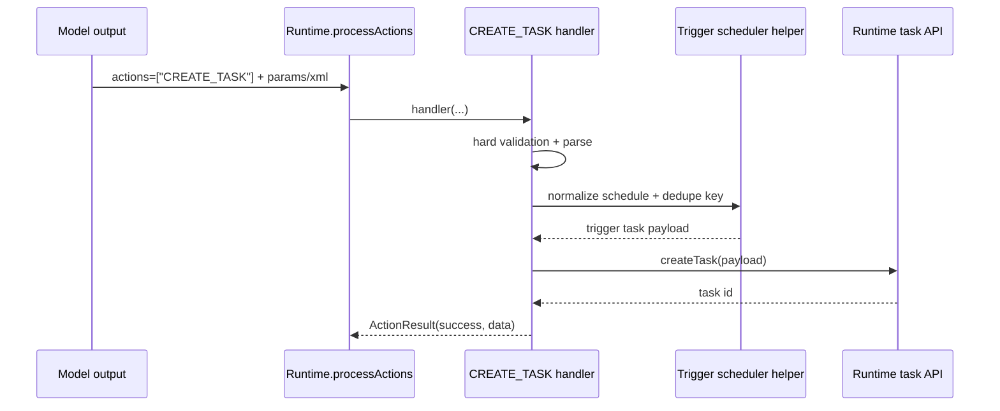

# Phase 2: Capability + Action Layer (`CREATE_TASK` / `CREATE_TRIGGER`)

Phase 2 exposes trigger creation to the model and chat UX safely.

It is intentionally separated from Phase 1 runtime work because action-layer failures are mostly policy/safety failures, while runtime failures are execution/scheduling failures.

---

## 1) Phase Goal

Enable conversational trigger creation with strong guardrails:

- user asks the agent to create a recurring/one-off/scheduled autonomous task
- model selects action
- handler validates and normalizes schedule
- handler creates idempotent trigger task
- action response confirms created trigger

---

## 2) Key Architectural Reality: Capability Path Ambiguity

There are at least two capability wiring paths in core:

- `bootstrap/*`
- `basic-capabilities/*` + `advanced-capabilities/*`

Milady startup also explicitly sets `IGNORE_BOOTSTRAP=true`, and relies on plugin-driven capability composition.

### Implication

A bootstrap-only action implementation is likely insufficient for Milady.

---

## 3) Action Placement Options

## Option A: Bootstrap-only action

Files:

- `packages/typescript/src/bootstrap/actions/createTask.ts`
- `packages/typescript/src/bootstrap/actions/index.ts`
- `packages/typescript/src/bootstrap/index.ts`

Pros:

- minimal code footprint.

Cons:

- high risk of no-op in Milady due runtime plugin path divergence.

---

## Option B: Advanced-capabilities action (recommended baseline)

Files:

- `packages/typescript/src/advanced-capabilities/actions/createTask.ts`
- `packages/typescript/src/advanced-capabilities/actions/index.ts`
- `packages/typescript/src/advanced-capabilities/index.ts`

Pros:

- aligns with modern capability stack where scheduling-related actions already exist (`scheduleFollowUp`).

Cons:

- still requires verifying Milady plugin path surfaces this action set.

---

## Option C: Dedicated trigger plugin action (most robust for Milady)

Files:

- new plugin package (or Milady-local plugin) that registers:
  - trigger worker service
  - trigger creation action
  - trigger providers

Pros:

- explicit runtime inclusion for Milady.
- reduced ambiguity around capability path.

Cons:

- more setup and packaging effort.

---

## Recommendation

Use **B + C progressive path**:

1. implement in core advanced capabilities for upstream consistency;
2. if Milady runtime path does not expose it reliably, add explicit trigger plugin wiring in Milady.

---

## 4) Action Naming Strategy

User intent asks for "Create Task" action, while feature semantics are "trigger creation."

Recommended action API:

- canonical action name: `CREATE_TASK`
- trigger-focused similes:
  - `CREATE_TRIGGER`
  - `SCHEDULE_TRIGGER`
  - `SET_AUTONOMOUS_TASK`
  - `SET_TIMER_TASK`

Rationale:

- satisfies requested naming
- preserves discoverability for trigger language
- avoids adding two nearly-identical handlers

---

## 5) Action Control Flow Requirements

## 5.1 Validate-phase checks (prompt shaping)

`validate(...)` should return true only when:

1. autonomy is enabled or available for this runtime path;
2. message context appears to request scheduling behavior;
3. per-room/per-user rate limits are not already exceeded.

Note: validate is not a hard boundary; it only shapes candidate actions.

## 5.2 Handler-phase checks (hard safety boundary)

Inside handler, enforce again:

1. autonomy service/task worker availability
2. scheduling parse validity
3. schedule lower/upper bounds
4. dedupe policy
5. quota policy
6. permission policy (owner/admin or equivalent)

---

## 6) Extraction and Parsing Design

## 6.1 Structured extraction schema

Use an XML response contract similar to `scheduleFollowUp` patterns:

```xml
<response>
  <displayName>Daily market scan</displayName>
  <instructions>Check overnight market moves and summarize key changes.</instructions>
  <triggerType>interval</triggerType>
  <intervalMs>43200000</intervalMs>
  <scheduledAtIso></scheduledAtIso>
  <cronExpression></cronExpression>
  <timezone>UTC</timezone>
  <wakeMode>inject_now</wakeMode>
</response>
```

## 6.2 Parsing and normalization steps

1. parse XML response
2. normalize trigger type enum
3. normalize schedule values by type
4. fill defaults:
   - `timezone = UTC` when omitted
   - `wakeMode = next_autonomy_cycle` if absent
5. validate bounded ranges:
   - interval minimum (for example 60 seconds)
   - interval maximum
   - scheduled time not in invalid range
6. generate deterministic dedupe key

---

## 7) Dedupe, Quota, and Abuse Controls

## 7.1 Dedupe key

Use stable hash over:

- normalized instructions
- trigger type
- normalized schedule
- room scope

If active trigger with same dedupe key exists:

- return "already exists" action result instead of creating new task.

## 7.2 Quotas

Per room/user:

- max active triggers
- max creations per time window
- extra restriction for high-frequency intervals

## 7.3 Confirmation gates

For risky schedules (for example sub-5-minute intervals), force explicit confirmation response or reject by policy.

---

## 8) File-by-File Planned Changes

## 8.1 Core action files

Primary path:

- `advanced-capabilities/actions/createTask.ts` (new)
- `advanced-capabilities/actions/index.ts` (export)
- `advanced-capabilities/index.ts` (register in `advancedActions`)

Compatibility path (optional):

- `bootstrap/actions/createTask.ts` (new)
- `bootstrap/actions/index.ts` (export)
- `bootstrap/index.ts` (register in `extended.actions` and optionally autonomy set)

## 8.2 Shared prompt/template utilities

If common prompt string is required:

- add in existing prompts module with strong response format instructions and examples.

## 8.3 Optional provider additions

Consider a lightweight provider exposing trigger stats to improve action selection quality:

- recent trigger count
- active trigger count
- last creation failure reason

---

## 9) Handler Return Contract

Action should return explicit machine-usable fields:

```ts
type CreateTaskActionData = {
  actionName: "CREATE_TASK";
  created: boolean;
  existingTriggerId?: string;
  triggerId?: string;
  dedupeKey: string;
  reason?: string;
};
```

This improves stateful planning and future multi-action chaining.

---

## 10) Failure Cases and Expected Action Responses

1. **Invalid schedule parse**
   - `success=false`, `error="INVALID_SCHEDULE"`

2. **Quota exceeded**
   - `success=false`, `error="TRIGGER_QUOTA_EXCEEDED"`

3. **Duplicate trigger**
   - `success=true`, `created=false`, `existingTriggerId=...`

4. **Autonomy unavailable**
   - `success=false`, `error="AUTONOMY_UNAVAILABLE"`

5. **Permission denied**
   - `success=false`, `error="PERMISSION_DENIED"`

---

## 11) Control Flow Diagram: Action to Task Creation



---

## 12) Testing Plan for Phase 2

## 12.1 Unit tests

- validate true/false matrix
- schedule parsing matrix by trigger type
- dedupe behavior
- quota enforcement
- permission gates

## 12.2 Integration tests

- action invocation creates trigger task with expected metadata
- duplicate requests return existing trigger id
- invalid parse does not create task

## 12.3 Safety regression tests

- action unavailable when autonomy capability is disabled
- handler still blocks creation even if action is selected incorrectly by model

---

## 13) Exit Criteria

Phase 2 is complete when:

1. conversational creation works end-to-end in runtime path used by Milady;
2. invalid/abusive requests are reliably rejected;
3. created tasks match phase 1 trigger metadata contract;
4. unit + integration tests pass.

Phase 3 can then expose these triggers over API.

