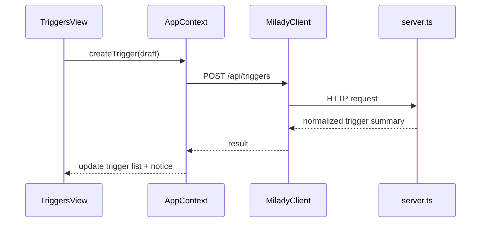

# Phase 4: Milady Frontend Layer (Triggers Page + State + Client)

Phase 4 adds a dedicated Triggers UX to Milady and connects it to trigger APIs.

Scope:

- `navigation.ts`
- `Nav.tsx`
- `App.tsx`
- `api-client.ts`
- `AppContext.tsx`
- new `components/TriggersView.tsx`

---

## 1) Phase Goal

Users must be able to:

1. see all triggers and current status
2. create/edit/delete triggers
3. run trigger now
4. pause/resume trigger
5. inspect recent run outcomes

And do all of this with clear state transitions, predictable errors, and stale-state mitigation.

---

## 2) Current Frontend Control Flow (Relevant Baseline)

Current app behavior in `AppContext.tsx`:

- startup `useEffect` initializes onboarding/auth/conversations/status/ws
- tab loaded from URL drives conditional preloads (`features`, `skills`, `config`, `inventory`)
- websocket currently subscribes to `"status"` only

Current routing in:

- `navigation.ts`: tab model + path mapping
- `Nav.tsx`: extra `validTabs` filter
- `App.tsx`: `ViewRouter` switch by tab

### Trigger implication

Trigger integration must add state and preload hooks in AppContext, not only a visual component.

---

## 3) Data and State Model

## 3.1 AppContext state additions

Add:

- `triggers: TriggerSummary[]`
- `triggersLoading: boolean`
- `triggerActionLoading: string` (trigger id or operation key)
- `triggerRunsById: Record<string, TriggerRun[]>`
- `triggerFormOpen: boolean`
- `triggerFormMode: "create" | "edit"`
- `triggerFormDraft: TriggerFormDraft`

Recommended draft type:

```ts
type TriggerFormDraft = {
  id?: string;
  displayName: string;
  instructions: string;
  triggerType: "interval" | "once" | "cron";
  intervalValue: string;
  intervalUnit: "minutes" | "hours" | "days";
  scheduledAtLocal: string;
  cronExpression: string;
  timezone: string;
  wakeMode: "inject_now" | "next_autonomy_cycle";
  enabled: boolean;
};
```

## 3.2 AppContext actions

Add handlers:

- `loadTriggers()`
- `createTrigger(draft)`
- `updateTrigger(id, patch)`
- `deleteTrigger(id)`
- `executeTrigger(id)`
- `loadTriggerRuns(id)`
- `pauseTrigger(id)` / `resumeTrigger(id)` (or a single `setTriggerEnabled`)

---

## 4) API Client Extensions (`api-client.ts`)

Add methods:

- `getTriggers(): Promise<{ triggers: TriggerSummary[] }>`
- `getTrigger(id: string): Promise<{ trigger: TriggerSummary }>`
- `createTrigger(body: CreateTriggerRequest): Promise<{ trigger: TriggerSummary }>`
- `updateTrigger(id: string, body: UpdateTriggerRequest): Promise<{ trigger: TriggerSummary }>`
- `deleteTrigger(id: string): Promise<{ ok: boolean }>`
- `executeTrigger(id: string): Promise<{ ok: boolean; run?: TriggerRun }>`
- `getTriggerRuns(id: string): Promise<{ runs: TriggerRun[] }>`

Pattern should match existing domain methods in the client.

---

## 5) Navigation and Routing Changes

## 5.1 `navigation.ts`

Required edits:

1. add `"triggers"` to `Tab` union
2. add path mapping:
   - `triggers: "/triggers"`
3. add to `TAB_GROUPS` (recommended under Manage)
4. add `titleForTab("triggers") -> "Triggers"`

## 5.2 `Nav.tsx`

Add `"triggers"` to `validTabs` list or tab will remain hidden even after `navigation.ts` edits.

## 5.3 `App.tsx`

Add import and router case:

- `case "triggers": return <TriggersView />`

---

## 6) `TriggersView.tsx` Component Architecture

## 6.1 Recommended layout sections

1. header and create button
2. active filter/search controls
3. trigger list cards
4. run-history drawer/panel per selected trigger
5. create/edit form modal

## 6.2 Trigger card controls

Per card:

- enable/disable toggle
- edit
- run now
- delete
- view runs

Display fields:

- name
- schedule summary
- status badge
- last run status + timestamp
- run count

## 6.3 Form validation UX

Validation should be both local and server-backed:

- local precheck for required fields by trigger type
- server error rendering for schedule parse and policy errors

Use explicit inline errors, not only toast notices.

---

## 7) State Synchronization Strategy

Current WS channel does not include trigger events, so phase 4 should use:

### Baseline

- load triggers on tab entry
- manual refresh button

### Recommended enhancement

- poll `loadTriggers()` every 20-30 seconds while tab is active
- pause polling when tab changes away

This provides acceptable consistency before trigger-specific websocket events are added.

---

## 8) Optimistic vs Confirmed Updates

For trigger mutations, use **server-confirmed updates** by default.

Why:

- schedule normalization and dedupe happen server-side
- optimistic updates can misrepresent final state

Pattern:

1. set operation loading id
2. call API
3. merge returned trigger summary
4. clear loading state
5. show action notice

---

## 9) Control Flow: UI Mutation Lifecycle



---

## 10) Error Handling UX Contract

Map API errors to actionable UI messages:

- `INVALID_SCHEDULE`: show field-level error
- `TRIGGER_QUOTA_EXCEEDED`: show quota-focused error with remediation hint
- `RUNTIME_UNAVAILABLE`: show banner "Agent runtime is unavailable"
- `TRIGGER_NOT_FOUND`: refresh list and show stale-item warning

Do not collapse all errors into generic toasts.

---

## 11) Accessibility and Interaction Constraints

1. keyboard navigable controls for all trigger actions
2. focus trap in create/edit modal
3. aria labels for toggles and run-now buttons
4. color + text status indicators (not color-only)

---

## 12) File-by-File Change Checklist

## `apps/app/src/navigation.ts`

- tab union update
- path map update
- title update
- group update

## `apps/app/src/components/Nav.tsx`

- include `triggers` in valid tab filter

## `apps/app/src/App.tsx`

- import `TriggersView`
- add case in `ViewRouter`

## `apps/app/src/api-client.ts`

- add trigger DTO types
- add trigger methods

## `apps/app/src/AppContext.tsx`

- state additions
- trigger handlers
- active-tab preload logic
- optional active-tab polling lifecycle

## `apps/app/src/components/TriggersView.tsx` (new)

- list + controls + modal form + run history

---

## 13) Test Plan for Phase 4

## 13.1 Component tests

- render trigger cards
- form validation by trigger type
- button disabled/loading states

## 13.2 Context tests

- `loadTriggers` success/failure
- create/update/delete execution flow
- tab activation triggers load/poll lifecycle

## 13.3 Integration/E2E

- navigate to `/triggers`
- create trigger
- edit trigger
- run now
- pause/resume
- delete trigger

---

## 14) Exit Criteria

Phase 4 completes when:

1. Triggers tab is visible and routable.
2. Trigger CRUD and run-now controls work end-to-end.
3. Errors are actionable and field-specific where appropriate.
4. Stale state is mitigated by refresh/polling strategy.

Phase 5 then adds operational visibility, governance controls, and runbooks.

