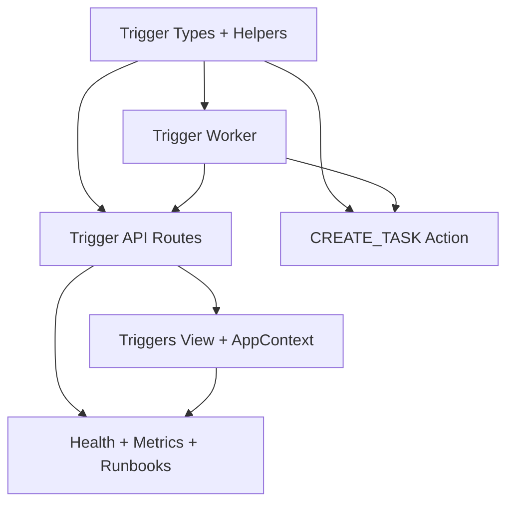

# Master Implementation Roadmap

This roadmap converts the dossier into a practical execution plan.

---

## 1) Workstreams

Run these workstreams in parallel where possible:

1. Core runtime trigger substrate (Phase 1)
2. Action/capability integration (Phase 2)
3. API contracts and routes (Phase 3)
4. Frontend integration (Phase 4)
5. Ops hardening and rollout controls (Phase 5)

---

## 2) Milestone Plan

## Milestone A — Core substrate complete

Deliverables:

- trigger metadata type contract
- trigger scheduling helpers
- trigger worker execution path
- autonomy injection helper

Gate:

- core unit/integration tests passing

## Milestone B — Conversational creation complete

Deliverables:

- `CREATE_TASK` action with schedule extraction + hard validation
- dedupe and quota controls
- capability registration verified in Milady runtime

Gate:

- action path tested in runtime used by Milady

## Milestone C — API complete

Deliverables:

- full `/api/triggers` suite
- strict validation and stable error codes
- run-now and run-history support

Gate:

- route-order and contract tests passing

## Milestone D — UI complete

Deliverables:

- Triggers tab + view + forms + run controls
- context-state integration
- refresh/polling consistency strategy

Gate:

- E2E smoke tests pass

## Milestone E — Operational readiness

Deliverables:

- metrics and run records
- governance controls and feature flags
- runbooks and backout controls

Gate:

- staged rollout dry run and kill-switch validation

---

## 3) Suggested Implementation Sequence (Low-Risk Order)

1. implement shared trigger types + helpers
2. implement worker and runtime tests
3. implement API routes against helper layer
4. implement action using same helper layer
5. implement frontend against API contract
6. add observability and governance controls
7. execute staged rollout

This order avoids a common failure mode: shipping a UI before runtime semantics are stable.

---

## 4) Dependency Graph

---

## 5) Risks by Milestone

## A Risks

- incorrect schedule mapping to TaskService semantics
- worker not registered early enough

## B Risks

- capability path mismatch in Milady
- excessive false-positive action selection

## C Risks

- route collision and parsing bugs
- inconsistent error contract

## D Risks

- stale state and racey mutation UX
- missing tab wiring across navigation/router/filter points

## E Risks

- missing kill switches
- insufficient run telemetry for incident response

---

## 6) Exit Criteria for Full Project

Project is complete when:

1. trigger creation works via both API and conversation,
2. trigger execution reliably injects autonomy instructions,
3. users can manage triggers in the UI,
4. run outcomes are observable and auditable,
5. operations can pause and recover safely during incidents.

