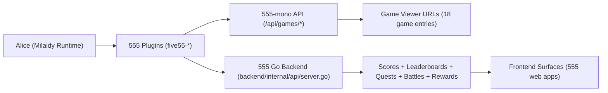

# 555 Architecture Canonical

## Scope

This document defines the current executable architecture for:

1. 555 games discovery/play,
2. score capture and leaderboard surfaces,
3. quests and battles,
4. social interactions and rewards,
5. admin controls used by Alice.

## System Topology

## Plugin Activation Gate

In Milaidy runtime, every 555 plugin is disabled unless explicitly enabled with env vars:

1. `FIVE55_GAMES_PLUGIN_ENABLED`
2. `FIVE55_SCORE_CAPTURE_PLUGIN_ENABLED`
3. `FIVE55_LEADERBOARD_PLUGIN_ENABLED`
4. `FIVE55_QUESTS_PLUGIN_ENABLED`
5. `FIVE55_BATTLES_PLUGIN_ENABLED`
6. `FIVE55_ADMIN_PLUGIN_ENABLED`
7. `FIVE55_SOCIAL_PLUGIN_ENABLED`
8. `FIVE55_REWARDS_PLUGIN_ENABLED`

Reference: `/Volumes/OWC Envoy Pro FX/desktop_dump/new/Work/555/milaidy/src/runtime/eliza.ts`.

## Game Catalog Baseline

`/Volumes/OWC Envoy Pro FX/desktop_dump/new/Work/555/555-mono/apps/web/lib/games-config.ts` currently defines 18 game IDs.

Games API endpoints:

1. `POST/GET /api/games/catalog`
2. `POST /api/games/play`

These are correctly consumed by `five55-games` when dialect is `five55-web`.

## Action Coverage Matrix (Plugin Contract vs Backend Reality)

| Surface | Plugin Action | Plugin Endpoint | Backend/Service Reality | Status |
|---|---|---|---|---|
| Games | `FIVE55_GAMES_CATALOG` | `/api/games/catalog` or `/api/five55/games/catalog` | Exists in 555-mono and Milaidy proxy bridge | aligned |
| Games | `FIVE55_GAMES_PLAY` | `/api/games/play` or `/api/five55/games/play` | Exists in 555-mono and Milaidy proxy bridge | aligned |
| Score | `FIVE55_SCORE_CAPTURE_READ` | `/v1/score-capture/read` | No matching route in Go backend | gap |
| Score | `FIVE55_SCORE_CAPTURE_SUBMIT` | `/v1/score-capture/submit` | Closest routes are `/arcade/score` and `/game/{id}/record` | adapter required |
| Leaderboard | `FIVE55_LEADERBOARD_READ` | `/v1/leaderboard/read` | Actual read routes are `/leaderboard/global`, `/game/{id}/leaderboard` | adapter required |
| Leaderboard | `FIVE55_LEADERBOARD_WRITE` | `/v1/leaderboard/write` | No direct write route; updates flow through score submission | gap |
| Quests | `FIVE55_QUESTS_READ` | `/v1/quests/read` | Actual routes `/quests`, `/me/quests` | adapter required |
| Quests | `FIVE55_QUESTS_CREATE` | `/v1/quests/create` | Actual route `POST /quests` (admin token) | adapter required |
| Quests | `FIVE55_QUESTS_COMPLETE` | `/v1/quests/complete` | Actual route `POST /admin/quests/{id}/complete` | adapter required |
| Battles | `FIVE55_BATTLES_READ` | `/v1/battles/read` | Actual read route `GET /battle/active` | adapter required |
| Battles | `FIVE55_BATTLES_CREATE` | default `/battle/create` | Route exists and matches default plugin endpoint | aligned |
| Battles | `FIVE55_BATTLES_RESOLVE` | `/v1/battles/resolve` | No matching public route found | gap |
| Admin | `FIVE55_THEME_SET` | `/admin/theme` | Route exists | aligned |
| Admin | `FIVE55_EVENT_TRIGGER` | `/admin/event` | Route exists | aligned |
| Admin | `FIVE55_CABINET_POSSESS` | `/admin/cabinet/possess` | Route exists | aligned |
| Admin | `FIVE55_CABINET_RELEASE` | `/admin/cabinet/release` | Route exists | aligned |
| Social | `FIVE55_SOCIAL_MONITOR` | `/v1/social/monitor` | Available data routes are `/social/latest`, `/social/round/{id}` | adapter required |
| Social | `FIVE55_SOCIAL_ASSIGN_POINTS` | `/v1/social/assign-points` | No direct route found | gap |
| Rewards | `FIVE55_REWARDS_PROJECT` | `/v1/rewards/project` | Closest route `/api/rewards/wallet/{wallet}/projected` | adapter required |
| Rewards | `FIVE55_REWARDS_ALLOCATE` | `/v1/rewards/allocate` | No direct route; settlement endpoints differ | gap |

## Integrity Rules (Operational)

1. Alice merit on leaderboard must come from real score submission routes only.
2. Static or hardcoded score values are forbidden.
3. Human and agent scoring must converge to one canonical write path.
4. Quest completion and reward assignment must be auditable by API events, not inferred by chat text.

## Priority Remediation Plan

### P0

1. Add 555 compatibility adapter service mapping `v1/*` plugin contracts to existing Go backend routes.
2. Normalize score write path for both humans and Alice (`/arcade/score` vs `/game/{id}/record`) and define one canonical contract.
3. Implement `battles resolve` API endpoint or remove action until supported.

### P1

1. Implement direct `social assign points` endpoint with auth, idempotency, and event audit.
2. Implement direct `rewards project` and `rewards allocate` endpoints matching plugin contracts.

### P2

1. Add API conformance tests for every `five55-*` action.
2. Add per-game score capture contract tests for all 18 configured game IDs.

## Test Requirements Before "Alice by Merit" Claim

1. For each game in catalog: one Alice session, one human session, both produce score writes.
2. Per-game leaderboard shows Alice using dynamic session-derived score.
3. Global leaderboard includes Alice from aggregated score events, no manual insertion.
4. Quest completion points and rewards projection reflect those same score events.
