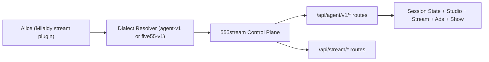

# 555 Stream Architecture Canonical

## Scope

This document is the source of truth for Alice stream control across:

1. agent API (`/api/agent/v1/*`),
2. legacy stream API expectations (`/v1/stream/*`),
3. UI go-live and autonomy preview paths,
4. authentication and authorization boundaries.

## Topology

## Runtime Contract

### Stream Plugin Actions

1. `STREAM_STATUS`
2. `STREAM_CONTROL`
3. `STREAM_SCHEDULE`

References: `/Volumes/OWC Envoy Pro FX/desktop_dump/new/Work/555/milaidy/src/plugins/stream/index.ts`.

### Dialect Behavior

1. `agent-v1` is selected if `STREAM555_BASE_URL` and `STREAM555_AGENT_TOKEN` are present.
2. Otherwise plugin falls back to legacy `five55-v1`.
3. `agent-v1` bootstraps a session with `POST /api/agent/v1/sessions` and caches `sessionId`.

## Endpoint Parity Matrix

| Action | agent-v1 path | five55-v1 path | Control-plane reality | Status |
|---|---|---|---|---|
| `STREAM_STATUS` | `GET /api/agent/v1/sessions/:id/stream/status` | `POST /v1/stream/status` | agent path exists; legacy path not in control-plane | partial |
| `STREAM_CONTROL` (start/stop) | `POST /api/agent/v1/sessions/:id/stream/start` or `/stop` | `POST /v1/stream/control` | agent paths exist; legacy path missing | partial |
| `STREAM_CONTROL` (scene) | `POST /api/agent/v1/sessions/:id/studio/scene/active` | `POST /v1/stream/control` | agent path exists; legacy path missing | partial |
| `STREAM_SCHEDULE` | `POST /api/agent/v1/sessions/:id/schedule` | `POST /v1/stream/schedule` | agent path exists; legacy path missing | partial |

## Auth and Security Model

Agent API is mounted at:

1. `/api/agent/v1` in `/Volumes/OWC Envoy Pro FX/desktop_dump/new/Work/555/555stream/services/control-plane/src/index.js`.

Auth enforcement:

1. Bearer token required (`requireAgentAuth`).
2. JWT validation requires `JWT_SECRET`.
3. Revocation check performed via Redis (`agent:revoked:jti:*` keys).
4. Scope checks enforce operation-level permissions.
5. Policy context checks can deny stale actor policy (`POLICY_STALE`).

## Required UX/Capability Outcomes

To support your target workflow ("chat -> go live -> optional autonomous gameplay"):

1. Chat UI must expose `Go Live` action that calls `STREAM_CONTROL` with `start`.
2. Chat UI must expose `Play Games` action that calls `FIVE55_GAMES_PLAY` and binds session/spectator context.
3. Agent should confirm runtime estimate before autonomous stream start:
   1. mode,
   2. duration,
   3. credit estimate,
   4. available balance.
4. Action execution must be available across text chat, Discord, and Telegram surfaces through the same runtime actions.

## Known Gaps

1. Legacy `five55-v1` paths used by stream plugin are not provided by current control-plane (`/api/stream/*` and `/api/agent/v1/*` are provided instead).
2. If agent token lacks scope alignment, stream actions fail despite valid auth.
3. Chat/UI coupling for go-live and play-games nudges is not yet standardized in one contract doc and test suite.

## Priority Remediation Plan

### P0

1. Force `agent-v1` as default in production (`STREAM_API_DIALECT=agent-v1`) and fail fast if token/base missing.
2. Add startup health check that verifies:
   1. session bootstrap,
   2. stream status read,
   3. schedule write dry-run.
3. Add contract tests for all stream actions against `/api/agent/v1`.

### P1

1. Define and implement shared UI action schema for:
   1. go live,
   2. stop stream,
   3. play games,
   4. autonomy preview and confirm.
2. Add social-surface parity tests (web, Discord, Telegram) to prove action execution consistency.

### P2

1. Remove or deprecate legacy `/v1/stream/*` plugin paths once migration complete.
2. Add operator dashboard panel showing action-level auth/scope failures in real time.
