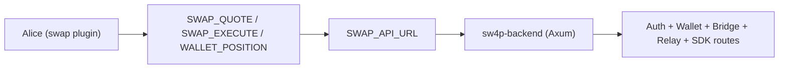

# sw4p Architecture Canonical

## Scope

This document defines the current compatibility between:

1. Milaidy `swap` plugin action contract,
2. sw4p backend route reality,
3. wallet and transfer policy requirements.

## Topology

## Plugin Contract (Current)

From `/Volumes/OWC Envoy Pro FX/desktop_dump/new/Work/555/milaidy/src/plugins/swap/index.ts`:

1. `SWAP_QUOTE` -> `POST /v1/sw4p/quote`
2. `SWAP_EXECUTE` -> `POST /v1/sw4p/execute`
3. `WALLET_POSITION` -> `POST /v1/wallet/position`

Capability gates:

1. quote and position require `wallet.read_balance`,
2. execute requires `wallet.prepare_transfer` (denied in prelaunch policy profile).

## sw4p Backend Route Reality

From `/Volumes/OWC Envoy Pro FX/desktop_dump/new/Work/555/sw4p/sw4p-backend/src/lib.rs`, route families include:

1. `POST /sdk/v1/transfer`, `POST /sdk/v1/estimate`, `GET /sdk/v1/pairs`, `GET /sdk/v1/limits`
2. `POST /v1/waas/swap-555`, `POST /v1/waas/swap-555/quote`
3. `POST /v1/wallet/balances`
4. `POST /v1/project/wallet`
5. `POST /v1/tx/*`, `POST /v1/bridge/*`, `POST /v1/jupiter/swap`

## Compatibility Matrix

| Plugin Action | Plugin Endpoint | Closest sw4p Route | Status |
|---|---|---|---|
| `SWAP_QUOTE` | `/v1/sw4p/quote` | `/v1/waas/swap-555/quote` or `/sdk/v1/estimate` | mismatch |
| `SWAP_EXECUTE` | `/v1/sw4p/execute` | `/v1/waas/swap-555` or `/sdk/v1/transfer` | mismatch |
| `WALLET_POSITION` | `/v1/wallet/position` | `/v1/wallet/balances` | mismatch |

## Consequence

Without an adapter, Alice swap actions can validate locally but fail at transport time due to nonexistent upstream routes.

## Required Remediation

### Option A (Preferred): Adapter Layer

Create a thin compatibility adapter service for Alice:

1. expose expected plugin routes:
   1. `/v1/sw4p/quote`,
   2. `/v1/sw4p/execute`,
   3. `/v1/wallet/position`.
2. translate requests to current sw4p backend:
   1. quote -> `/v1/waas/swap-555/quote`,
   2. execute -> `/v1/waas/swap-555`,
   3. position -> `/v1/wallet/balances`.
3. normalize response schema back to plugin envelope.

### Option B: Repoint Plugin

Directly update Milaidy `swap` plugin endpoints to sw4p route reality. This is faster but couples Milaidy runtime directly to sw4p internals and removes stable contract abstraction.

## Security and Policy Requirements

1. Keep `SWAP_EXECUTE` blocked while launch profile denies `wallet.prepare_transfer`.
2. Require authenticated wallet subject binding before execute operations.
3. Enforce idempotency key generation for execute operations.
4. Add per-action audit trail: requester, actor, session, quote id, tx id.

## Priority Plan

### P0

1. Implement adapter and run contract tests for all three swap actions.
2. Add dry-run mode for execute to validate policy path without value transfer.

### P1

1. Add quote-to-execute TTL and stale quote rejection rules.
2. Add balance snapshot schema to support rewards projection pipelines.

### P2

1. Add failure taxonomy mapping (`E_UPSTREAM_4XX`, `E_UPSTREAM_TIMEOUT`, etc.) into operator dashboard.
2. Add multi-chain settlement analytics to support product/public investor reporting.
